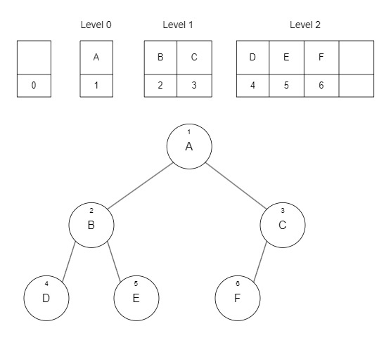
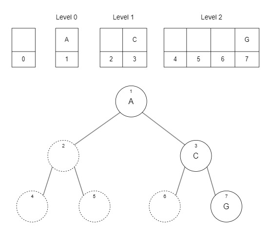
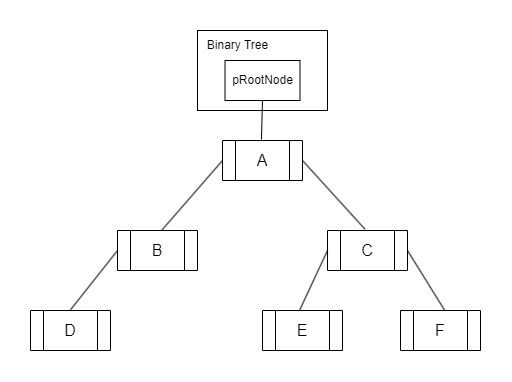
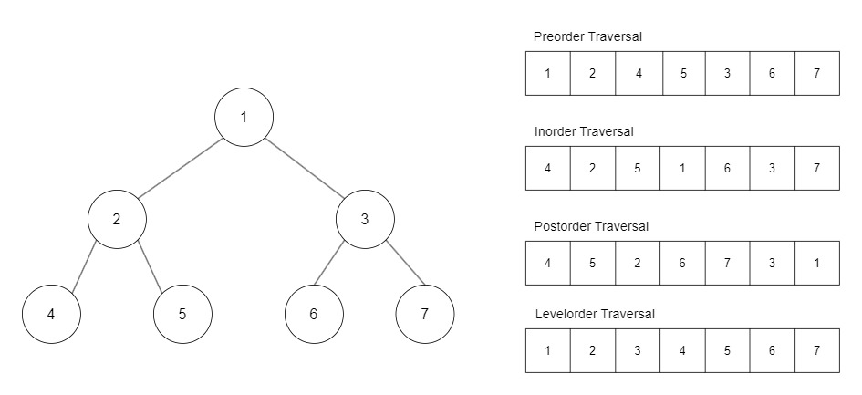
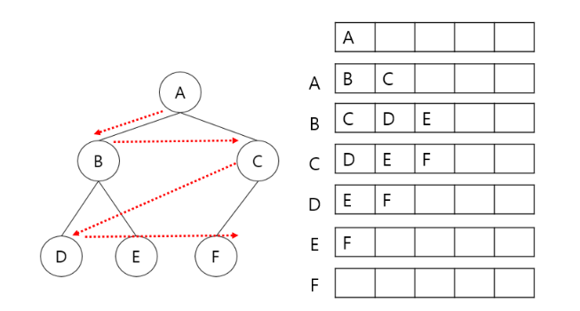

# Binary Tree in C++

There are two ways to code a binary tree: one is to implement it with an array, and the other is with pointers. Using an array makes accessing nodes easy with an index, but it can lead to memory wastage. On the other hand, using pointers for a linked binary tree is more memory efficient, but searching for nodes and managing memory is more challenging.

## Arrary Tree

&nbsp;


<!--  -->

When representing a binary tree with an array, nodes are arranged in level order, meaning each level of the tree is filled from left to right in the array. Typically, the first index of the array remains empty for easier calculations. The index of each node in the array corresponds to its position in the binary tree, following a specific pattern: the first index of each level is 2^n. This fixed mapping of nodes to array indices results in empty spaces within the array when nodes are missing.

&nbsp;


<!--  -->

&nbsp;

However, this approach poses efficiency challenges, particularly with skewed trees where memory usage becomes inefficient. In such cases, the array contains empty slots, as depicted in the illustration. The array's size is determined by the formula (2^h), where h is the height of the tree, yet the number of actual nodes is determined by the height (h). Therefore, using an array for a binary tree is most efficient when the tree is perfect or complete.

&nbsp;

## Linked Binary Tree

A linked binary tree, illustrated below, is implemented using a binary tree class with a node structure as a member variable. The class holds the address of the root node. Each node structure can store data and the addresses of its left and right child nodes.

&nbsp;


<!--  -->

&nbsp;

### Node

```cpp
struct BTNode {
	int data;
	BTNode* pLeftChild = nullptr;
	BTNode* pRightChild = nullptr;
};
```

&nbsp;

### Binary Tree Class

```cpp
class BinaryTree {
private:
	BTNode* pRootNode = nullptr;
public:
    // member function...
```

&nbsp;

### createNode

This function dynamically allocates memory to create a new node and initializes it with the given data. Then, it returns a pointer to the newly created node.

```cpp
BTNode* createNode(int data) {
	BTNode* newNode = new BTNode;
	newNode->data = data;
	return newNode;
}
```

&nbsp;

### Constructor

By using constructor, create a binary tree and a root node at the same time.

```cpp
BinaryTree(int data) {
	pRootNode = createNode(data);
}
```

&nbsp;

### addChildNode

This member function requires a parent node as an argument and the data that the user wants to add. First, it checks whether the parent node is null or not. Additionally, it verifies if there are already child nodes attached to the parent node. If everything is in order, it creates a new node and returns it.

```cpp
BTNode* addLeftChildNode(BTNode* pParentNode, int data) {

	BTNode* pReturn = nullptr;
	if (pParentNode != nullptr) {
		if (pParentNode->pLeftChild == nullptr) {
			pParentNode->pLeftChild = createNode(data);
			pReturn = pParentNode->pLeftChild;
		}
		else {
			std::cout << "Error! A node already exists.\n";
		}
	}
	return pReturn;
}

BTNode* addRightChildNode(BTNode* pParentNode, int data) {

	BTNode* pReturn = nullptr;
	if (pParentNode != nullptr) {
		if (pParentNode->pRightChild == nullptr) {
			pParentNode->pRightChild = createNode(data);
			pReturn = pParentNode->pRightChild;
		}
		else {
			std::cout << "Error! A node already exists.\n";
		}
	}
	return pReturn;
}
```

&nbsp;

### getRootNode

```cpp
BTNode* getRootNode() {

	BTNode* pReturn = nullptr;
	if (this->pRootNode != nullptr) {
		pReturn = this->pRootNode;
	}

	return pReturn;
}
```

&nbsp;

### deleteTree

To delete a tree, we utilize recursion. When the node passed as an argument is null, the function returns immediately, serving as the base case. In the recursive case, the function is called on the child nodes of the current node, gradually reducing the scope of the task. This recursive function descends the tree until it reaches a leaf node. Once it encounters a leaf node, it begins deleting nodes upwards.

```cpp
void deleteBTNode(BTNode* pNode) {
	if (pNode != NULL) {
		deleteBTNode(pNode->pLeftChild);
		deleteBTNode(pNode->pRightChild);
		delete pNode;
	}
}

void deleteTree() {
	deleteBTNode(this->pRootNode);
}
```

&nbsp;

## Output

```cpp
int main() {

	BTNode* pNodeA = nullptr;
	BTNode* pNodeB = nullptr;
	BTNode* pNodeC = nullptr;
	BTNode* pNodeD = nullptr;
	BTNode* pNodeE = nullptr;
	BTNode* pNodeF = nullptr;
	BTNode* pNodeG = nullptr;

	BinaryTree treeA{ 1 };
	pNodeA = treeA.getRootNode();

	pNodeB = treeA.addLeftChildNode(pNodeA, 2);
	pNodeC = treeA.addRightChildNode(pNodeA, 3);

	pNodeD = treeA.addLeftChildNode(pNodeB, 4);
	pNodeE = treeA.addRightChildNode(pNodeB, 5);

	pNodeF = treeA.addLeftChildNode(pNodeC, 6);
	pNodeG = treeA.addRightChildNode(pNodeC, 7);

	std::cout << pNodeA->data << std::endl;
	std::cout << pNodeB->data << std::endl;
	std::cout << pNodeC->data << std::endl;
	std::cout << pNodeD->data << std::endl;
	std::cout << pNodeE->data << std::endl;
	std::cout << pNodeF->data << std::endl;

	treeA.deleteTree();

	return 0;
}
```

```sh
1
2
3
4
5
6
```

&nbsp;

## Tree Traversal

I coded to print out each node of the tree one by one. Acturally, this is not recommended way to print out the node of a tree. Traversing a tree means visiting each node in a specific order and performing some operation, such as printing its data. There are four common traversal methods, each with its own order of visiting nodes:

1. **Preorder Traversal**: Visit the current node, then traverse the left subtree, followed by the right subtree.
2. **Inorder Traversal**: Traverse the left subtree, visit the current node, and then traverse the right subtree.
3. **Postorder Traversal**: Traverse the left subtree, then the right subtree, and finally visit the current node.
4. **Levelorder Traversal**: Visit nodes level by level, starting from the root and moving down each level before moving to the next.

In the case of preorder traversal, the process starts with the root node becoming the current node. The value of the root node is then printed out. The traversal then moves to the left subtree. Node '2' becomes the new current node, and its value is printed out. Continuing further left, node '4' becomes the current node, and its value is printed. Since there are no more nodes to the left, the traversal moves to the right subtree, but since there are no nodes there either, it moves back up.

Node '2' is now the current node again. The right subtree of node '2' has not been visited yet, so node '5' is visited next. This process continues until all nodes have been visited and their values printed out.

Implementing code for preorder, inorder, and postorder traversal is pretty simple and easy to understand when you use recursion.

&nbsp;


<!--  -->

&nbsp;

### Preorder Traversal

```cpp
void preorderNodeR(BTNode* pNode) {
	if (pNode != nullptr) {
		std::cout << pNode->data << " "; // current
		preorderNodeR(pNode->pLeftChild); // L
		preorderNodeR(pNode->pRightChild); // R
	}
}


void preorderR(BinaryTree* tree) {
	if (tree != NULL) {
		BTNode* rootNode = tree->getRootNode();
		preorderNodeR(rootNode);
		printf("\n");
	}
}
```

&nbsp;

### Inorder Traversal

```cpp
void inorderNodeR(BTNode* pNode) {
	if (pNode != nullptr) {
		inorderNodeR(pNode->pLeftChild); // L
		std::cout << pNode->data << " "; // current
		inorderNodeR(pNode->pRightChild); // R
	}
}

void inorderR(BinaryTree* tree) {
	if (tree != NULL) {
		BTNode* rootNode = tree->getRootNode();
		inorderNodeR(rootNode);
		printf("\n");
	}
}
```

&nbsp;

### Post Traversal

```cpp
void postorderNodeR(BTNode* pNode) {
	if (pNode != nullptr) {
		postorderNodeR(pNode->pLeftChild); // L
		postorderNodeR(pNode->pRightChild); // R
		std::cout << pNode->data << " "; // current
	}
}

void postoderR(BinaryTree* tree) {
	if (tree != NULL) {
		BTNode* rootNode = tree->getRootNode();
		postorderNodeR(rootNode);
		printf("\n");
	}
}
```

&nbsp;

### Levelorder Traversal

For level-order traversal, utilizing the queue data structure proves effective due to its First-In-First-Out (FIFO) nature, aligning well with the traversal's requirements. The process begins by creating a queue and enqueueing the root node. Subsequently, the algorithm iteratively dequeues nodes from the front of the queue, processes them, and enqueues their child nodes.

&nbsp;


<!--  -->

&nbsp;

```cpp
#include <queue>

void levelorder(BinaryTree* tree) {
    std::queue<BTNode*> q;
    BTNode* pNode = tree->getRootNode();

    // Check for empty tree or invalid root node
    if (tree == NULL || pNode == nullptr) return;

    // Enqueue the root node
    q.push(pNode);

    // Continue traversal while the queue is not empty
    while (!q.empty()) {
        // Dequeue the current node
        pNode = q.front();
        q.pop();

        // Process the current node
        std::cout << pNode->data << " ";

        // Enqueue the left child if it exists
        if (pNode->pLeftChild != nullptr) {
            q.push(pNode->pLeftChild);
        }

        // Enqueue the right child if it exists
        if (pNode->pRightChild != nullptr) {
            q.push(pNode->pRightChild);
        }
    }
}
```

### Output

```cpp
int main(){
////
	preorderR(&treeA);
	inorderR(&treeA);
	postoderR(&treeA);
	levelorder(&treeA);
}
```

```sh
1 2 4 5 3 6 7
4 2 5 1 6 3 7
4 5 2 6 7 3 1
1 2 3 4 5 6 7
```
