# Graph

A graph is a data structure that consists of nodes (or vertices) and edges. Unlike trees, which are a type of graph with a strict parent-child relationship, graphs have no limit on the number of connections a node can have.

&nbsp;


<!-- 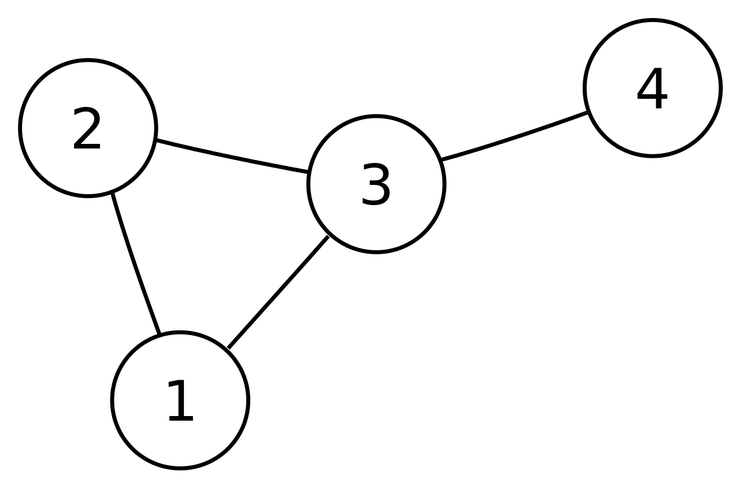 -->

&nbsp;

## Directed vs. Undirected Graphs

There are two main types of graphs:

- **Directed Graph (Digraph)**: In a directed graph, each edge has a direction, indicated by an arrow pointing from one node to another. This represents a one-way relationship.
- **Undirected Graph**: In an undirected graph, edges do not have a specific direction, meaning the relationship between nodes is bidirectional. There is no parent-child concept in undirected graphs, as connections are mutual.


<!-- 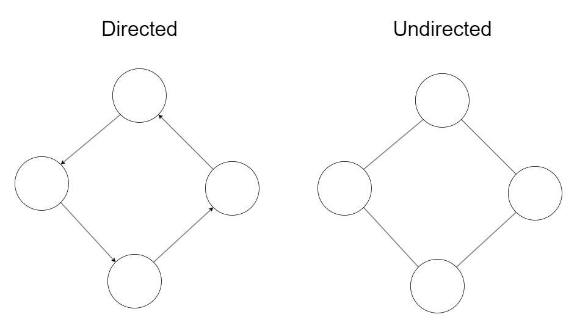 -->

&nbsp;

## Representation of a Graph

If we have a graph 'A' with nodes 'B' and 'C', it can be represented as follows, where V stands for vertex:

```
A = { (V(B), V(C)) } or simply { (B, C) }
```

### Directed Graph

In a directed graph, if there is a direction from B to C, the edge can be expressed as:

```
<B, C>
```

### Undirected Graph

In an undirected graph, the edge is represented without direction:

```
(B, C)
```

&nbsp;

## Weighted Graph

In a weighted graph, edges have associated weights representing the cost or distance between nodes. If the graph is undirected, it is called an undirected weighted graph. If directed, it is known as a directed weighted graph or a network.


<!-- 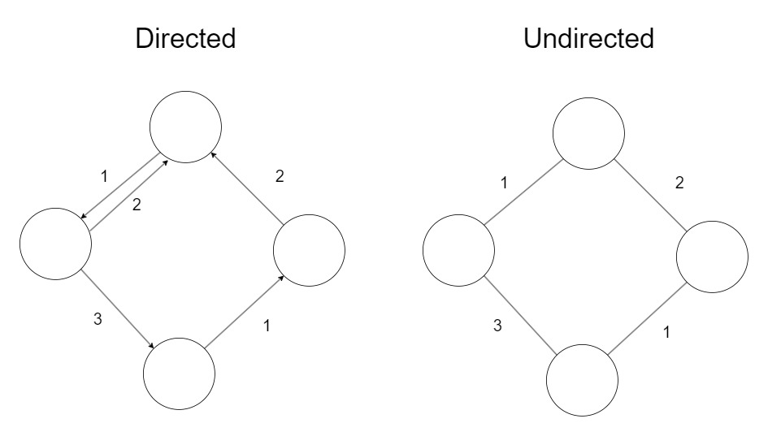 -->

&nbsp;

## Complete Graph vs. Subgraph vs. Multigraph

### Complete Graph

In a complete graph, every pair of nodes is connected by an edge. There are no additional nodes left to connect.

The number of edges in a graph with 'n' nodes is:

```
Undirected Graph: m = n(n-1) / 2
Directed Graph: m = n(n-1)
```


<!-- 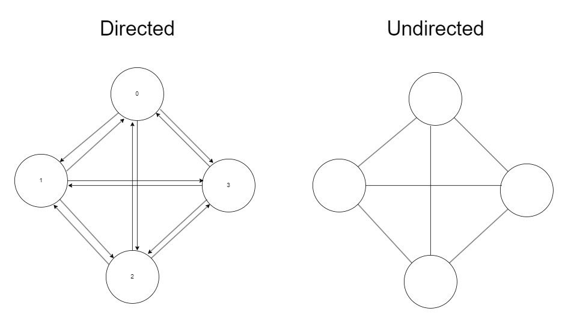 -->

&nbsp;

### Subgraph

A subgraph is derived by removing some edges and nodes from an original graph. It is a subset of the original graph's nodes and edges.

### Multigraph

A multigraph is a graph in which nodes can have multiple edges between them, allowing for more than one edge connecting the same pair of nodes.


<!-- 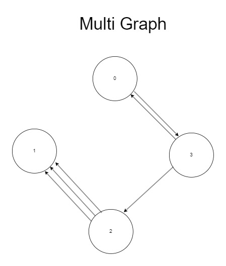 -->

&nbsp;

## Terms for Graphs

- **Adjacent**: Two nodes are adjacent if there is an edge connecting them.
- **Incident**: An edge is incident to a node if it connects to that node.
- **Degree**: The number of edges connected to a node. In an undirected graph, each edge counts as one for the degree of both connected nodes. In a directed graph, the degree is split into in-degree (number of edges coming into a node) and out-degree (number of edges going out from a node).
- **Path**: A sequence of nodes where each pair of consecutive nodes is connected by an edge. The number of edges in the path is called the path length. A path with no repeated nodes is called a simple path.
- **Isomorphic Graph**: Two graphs are isomorphic if they contain the same set of nodes connected in the same way, even if they appear different visually.
- **Loop**: An edge that connects a node to itself.

&nbsp;

## How to Build a Graph

There are two common methods to implement a graph:

### Adjacency Matrix

This method uses a 2-D array to represent the graph. Each node is assigned to a row and a column. If there is an edge connecting two nodes, the corresponding cell in the matrix is marked as 1; otherwise, it is marked as 0.

```cpp
adj[i][j] = 0 or 1;
```

For example, consider a graph with three nodes (0, 1, and 2):

```
   0 1 2
0  0 1 0
1  1 0 1
2  0 1 0
```

Here, node 0 is connected to node 1, node 1 is connected to nodes 0 and 2, and node 2 is connected to node 1. The diagonal elements are 0, indicating no self-loops.

&nbsp;


<!-- 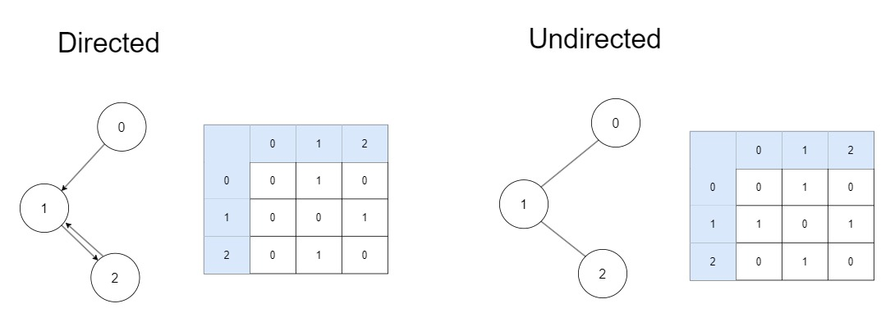 -->

The adjacency matrix has the advantage of O(1) time complexity for edge lookups, making it very fast to find if an edge exists between two nodes. However, this method is memory-inefficient, especially for sparse graphs. If there are nnodes, the matrix requires (n x n) elements, leading to significant wasted space when there are few edges.

&nbsp;

### Adjacency List

This method uses linked lists to represent edges. An array is created where each index corresponds to a node in the graph. Each element in the array points to a linked list containing all the nodes connected by edges to that particular node. This method is memory-efficient, especially for sparse graphs, but it requires more time to search for specific edges, as you may need to traverse the linked list.


<!-- 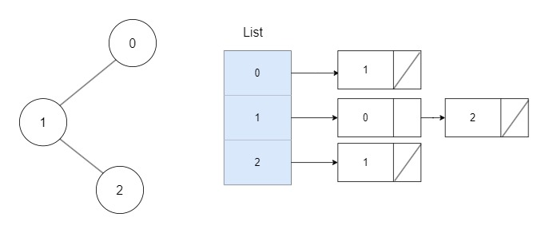 -->

&nbsp;

## Adjacency matrix in C++

&nbsp;

### Array Graph Class

The 'ArrayGraph' class uses a pointer to a 2D array to represent the graph. It also includes a 'graphType' variable to distinguish between directed and undirected graphs.

```cpp
#define DIRECT 0
#define UNDIRECT 1

class ArrayGraph {
private:
    int graphType;
    int nodeCount = 0;
    int** ppEdge = nullptr;

    // Member functions...
}
```

&nbsp;

### Constructor

The constructor initializes the 2D array for the graph. It dynamically allocates memory for the pointer array, then allocates memory for each index of the pointer array, and finally sets all elements to 0.

```cpp
ArrayGraph(int nodeCount, int graphType)
    : nodeCount{ nodeCount }, graphType{ graphType } {
    ppEdge = new int*[nodeCount];

    for (int i = 0; i < nodeCount; i++) {
        ppEdge[i] = new int[nodeCount];
        memset(this->ppEdge[i], 0, sizeof(int) * this->nodeCount);
    }
}
```

&nbsp;

### checkVertexValid

```cpp
bool checkVertexValid(int node) {
	if (this->ppEdge != nullptr && node < this->nodeCount && node >= 0) {
		return true;
	}
	else {
		return false;
	}
}
```

&nbsp;

### Add Edge

The 'addEdge' function adds an edge between two nodes in the graph. It first checks if the graph's adjacency matrix is not null and if the provided nodes are valid. If these conditions are met, it marks the position in the matrix to indicate an edge. For undirected graphs, it also marks the corresponding position for the reverse edge.

```cpp
void addEdge(int fromNode, int toNode) {
    if (this->ppEdge != nullptr && checkVertexValid(fromNode) && checkVertexValid(toNode)) {
        // Mark the position as 1
        this->ppEdge[fromNode][toNode] = 1;

        // If the graph is undirected, mark the reverse edge as well
        if (UNDIRECT == this->graphType) {
            this->ppEdge[toNode][fromNode] = 1;
        }
    } else {
        std::cout << "Failed to add an edge" << std::endl;
    }
}
```

&nbsp;

### Remove Edage

```cpp
void removeEdge(int fromNode, int toNode) {
	if (this->ppEdge != nullptr && checkVertexValid(fromNode) && checkVertexValid(toNode))
	{
		// mark the position as 0;
		this->ppEdge[fromNode][toNode] = 0;

		// if the graph is undirected graph, the othere node aslo should be marked as 0;
		if (UNDIRECT == this->graphType) {
			this->ppEdge[toNode][fromNode] = 0;
		}
	}
	else {
		std::cout << "failed to remove the edge" << std::endl;
	}
}
```

&nbsp;

### get edage

```cpp
int getEdge(int fromNode, int toNode) {
	int ret = 0;
	if (this->ppEdge != nullptr && checkVertexValid(fromNode) && checkVertexValid(toNode)) {
		ret = this->ppEdge[fromNode][toNode];
	}

	return ret;
}
```

&nbsp;

### print

This member function displays the 2-d array.

```cpp
void print() {
	if (this->ppEdge != nullptr) {
		int count = this->nodeCount;
		for (int i = 0; i < count; i++) {
			for (int j = 0; j < count; j++) {
				std::cout << getEdge(i, j) << " ";
			}
			printf("\n");
		}
	}
}
```

&nbsp;

### Delete Graph

It is essential to delete 2-d array to prevent memory leak.

```cpp
void deleteGraph() {
	if (this->ppEdge != nullptr) {
		for (int i = 0; i < this->nodeCount; i++) {
			delete this->ppEdge[i];
		}
		delete this->ppEdge;
	}
}

~ArrayGraph() {
	deleteGraph();
}
```

&nbsp;

### Result

```cpp
int main() {
	int nodeCount = 6;

	ArrayGraph graph{ nodeCount, UNDIRECT };

	graph.addEdge(0, 1);
	graph.addEdge(1, 2);
	graph.addEdge(2, 0);
	graph.addEdge(2, 3);
	graph.addEdge(3, 2);
	graph.addEdge(3, 4);
	graph.addEdge(4, 5);
	graph.addEdge(5, 3);

	graph.print();

	return 0;
}
```

```cpp
0 1 1 0 0 0
1 0 1 0 0 0
1 1 0 1 0 0
0 0 1 0 1 1
0 0 0 1 0 1
0 0 0 1 1 0
```

&nbsp;

## Adjacency list in C++

### Linked Graph Class

The Linked Graph class uses less memory compared to the Array Graph class. However, its time complexity for finding a desired index is O(n), which can take longer. Implementing a linked graph can be simplified using vectors in C++, but in this implementation, I used an actual linked list.

```cpp
#include <list>
#define DIRECT 0
#define UNDIRECT 1

class LinkedGraph {
private:
	int graphType;
	int nodeCount;
	std::list<int>* list;
public:
// member function
}
```

&nbsp;

### Constructor

```cpp
LinkedGraph(int nodeCount, int graphType)
	: nodeCount{ nodeCount }, graphType{ graphType } {

	// Dynamic allocation of an array to hold linked lists.
    // Each element of the array will contain an independent linked list of integers.
    // The index of the array represents the nodes of the graph.
	list = new std::list<int>[nodeCount];
}
```

&nbsp;

### checkVertexValid

```cpp
bool checkVertexValid(int node) {
	if (this->list != nullptr && node < this->nodeCount && node >= 0) {
		return true;
	}
	else {
		return false;
	}
}
```

&nbsp;

### Add Edge

To ensure that the edge being added is not already present in the list, we employ the 'isThereSame' function. This function checks whether the new node already exists in the list. If not, the new node is added to the list using 'push_back'.

```cpp
bool isThereSame(int fromNode, int toNode) {
	bool ret = false;
	for (auto iter = this->list[fromNode].begin(); iter != this->list[fromNode].end(); iter++) {
		if (*iter == toNode) {
			ret = true;
			break;
		}
	}
	return ret;
}

void addEdge(int fromNode, int toNode) {
	if (checkVertexValid(fromNode) && checkVertexValid(toNode)) {

		if (!isThereSame(fromNode, toNode)) // prevent to put same node in the list
		{
			this->list[fromNode].push_back(toNode);
			if (this->graphType == UNDIRECT) {
				list[toNode].push_back(fromNode);
			}
		}
	}
	else {
		std::cout << "failed to add an edge" << std::endl;
	}
}
```

&nbsp;

### Remove edage

```cpp
void removeEdge(int fromNode, int toNode) {
	if (checkVertexValid(fromNode) && checkVertexValid(toNode)) // check the vaild node
	{
		 // this is for undirected graph, if one edage is sucessfully removed, it turns to true
		bool ret = false;

		// remove desinated edage
		// O(N) to find the index
		for (auto iter = this->list[fromNode].begin(); iter != this->list[fromNode].end(); iter++) {
			if (*iter == toNode) {
				this->list[fromNode].remove(toNode);
				ret = true;
				break;
			}
		}

		// If the graph is undirected, switch the indexs and remove
		if (ret == true && this->graphType == UNDIRECT) {
			for (auto iter = this->list[toNode].begin(); iter != this->list[toNode].end(); iter++) {
				if (*iter == fromNode) {
					this->list[toNode].remove(fromNode);
					ret = true;
					break;
				}
			}
		}
		else if (ret == false) {
			std::cout << "can find the node\n";
		}

	}
	else {
		std::cout << "failed to remove the edge" << std::endl;
	}
}
```

&nbsp;

### print

```cpp
void print() {
	for (int i = 0; i < this->nodeCount; i++) {
		std::cout << i << " - ";
		for (auto iter = this->list[i].begin(); iter != this->list[i].end(); iter++) {
			std::cout << *iter << " ";
		}
		printf("\n");
	}
}
```

&nbsp;

### Destructor

```cpp
~LinkedGraph() {
	delete[] this->list;
}
```

&nbsp;

### Result

```cpp
int main() {

	LinkedGraph graph{ 4, UNDIRECT };

	graph.addEdge(0, 1);
	graph.addEdge(0, 2);
	graph.addEdge(1, 3);
	graph.print();

	printf("\n");

	LinkedGraph a{ 9, UNDIRECT };

	a.addEdge(0, 1);
	a.addEdge(1, 2);
	a.addEdge(1, 3);
	a.addEdge(2, 3);
	a.addEdge(2, 4);
	a.addEdge(3, 4);
	a.addEdge(3, 5);
	a.addEdge(5, 6);
	a.addEdge(5, 7);
	a.addEdge(6, 8);
	a.print();

	return 0;
}
```

```cpp
0 - 1 2
1 - 0 3
2 - 0
3 - 1

0 - 1
1 - 0 2 3
2 - 1 3 4
3 - 1 2 4 5
4 - 2 3
5 - 3 6 7
6 - 5 8
7 - 5
8 - 6
```

&nbsp;

## DFS & BFS

DFS (Depth First Search) and BFS (Breadth First Search) are two common graph traversal algorithms.

### DFS

- **DFS** stands for Depth First Search.
- It traverses the graph by exploring as far as possible along each branch before backtracking.
- It can be compared to the traversal methods in trees such as inorder, preorder, and postorder.
- It can be implemented using a stack or recursion.

### BFS

- **BFS** stands for Breadth First Search.
- It explores the graph level by level, visiting all the nodes at the present depth before moving on to the nodes at the next depth.
- Similar to the level-order traversal method in trees, BFS searches nodes level by level.
- It uses a queue data structure for efficient traversal.

&nbsp;


<!-- 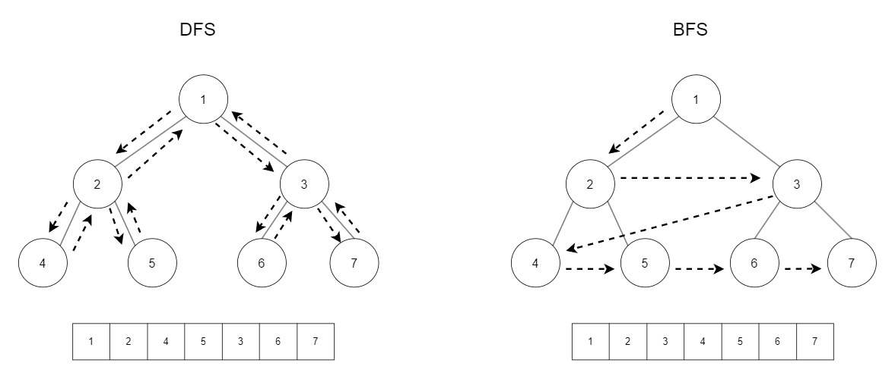 -->

&nbsp;

## DFS in C++

DFS can be easily implemented with stack.

1. put the start node in the stack
2. execute pop and print the node
3. put adjecent nodes to the node that is poped out
4. repeat this process until the stack is empty

&nbsp;


<!-- 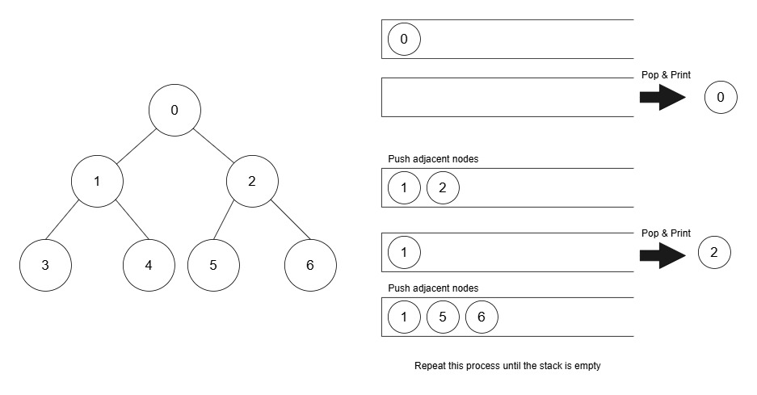 -->

&nbsp;

I use stack in the linked graph. The feature of stack is Last-In-First-Out. This feature make traversal goes to deeper level.

```cpp
void DFS(int startNode) {

	// To prevent a node from being added to the stack multiple times, we can use an array with the size equal to the number of nodes in the graph. This array is used to mark whether a node has been visited or not.
	int* pVisited = new int[this->nodeCount];
	memset(pVisited, 0, sizeof(int) * this->nodeCount);

	// create a stack
	std::stack<int> stack;

	// put the start node into the stack
	stack.push(startNode);

	// mark the index as 1;
	pVisited[startNode] = 1;


	int value;
	for (int i = 0; i < this->nodeCount; i++) {
		// pop the top node in the stack
		value = stack.top();
		stack.pop();
		// print
		std::cout << value << " ";

		// find adjacent nodes
		for (auto iter = this->list[value].begin(); iter != this->list[value].end(); iter++) {

			// if adjacent node is not visited yet, put into the stack
			if (pVisited[*iter] == 0) {
				stack.push(*iter);
				pVisited[*iter] = 1;
			}
		}
	}
	printf("\n");
	delete[] pVisited;
}
```

&nbsp;

#### Result

```cpp
int main() {

	LinkedGraph graph{ 4, UNDIRECT };

	graph.addEdge(0, 1);
	graph.addEdge(0, 2);
	graph.addEdge(1, 3);
	graph.DFS(0);

	printf("\n");

	LinkedGraph a{ 9, UNDIRECT };

	a.addEdge(0, 1);
	a.addEdge(1, 2);
	a.addEdge(1, 3);
	a.addEdge(2, 3);
	a.addEdge(2, 4);
	a.addEdge(3, 4);
	a.addEdge(3, 5);
	a.addEdge(5, 6);
	a.addEdge(5, 7);
	a.addEdge(6, 8);
	a.DFS(0);

	return 0;
}
```

```cpp
0 2 1 3
0 1 3 5 7 6 8 4 2
```

&nbsp;

DFS also can be implemented with recursion. I implemented this with matrix graph.


<!-- 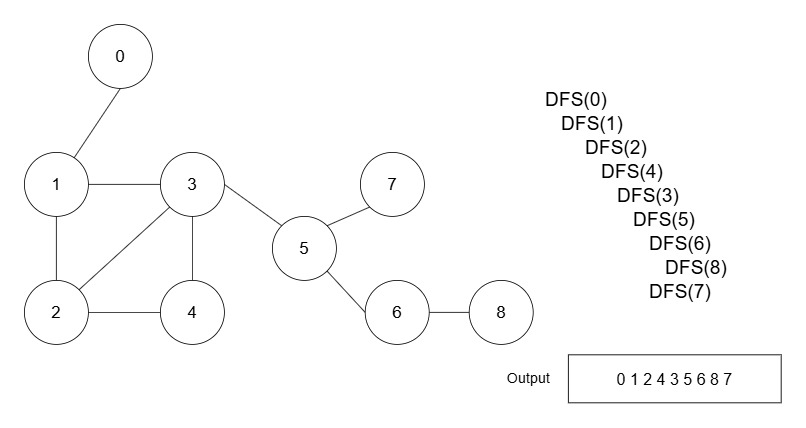 -->

```cpp
void recursiveDFS(int startNode, int* pVisited) {
	// mark the index for vistied node
	pVisited[startNode] = 1;

	// print
	std::cout << startNode << " ";

	// visit all nodes
	for (int i = 0; i < this->nodeCount; i++) {

		// except itself
		if (i != startNode) {

			// check wether other nodes are connected to the current node. if connected getEdage returns 1.
			if (0 != getEdge(startNode, i)) {

				// the connected node had not been visited yet, execute another recursion.
				if (0 == pVisited[i]) {
					recursiveDFS(i, pVisited);
				}
			}
		}
	}
}

void DFS() {

	// an array to mark visited node
	int* pVisited = new int[this->nodeCount];
	memset(pVisited, 0, sizeof(int) * this->nodeCount);

	// start recursion
	recursiveDFS(0, pVisited);
	printf("\n");
	delete[] pVisited;
}
```

&nbsp;

#### Result

```cpp
int main() {
	int nodeCount = 6;

	ArrayGraph graph{ nodeCount, UNDIRECT };

	graph.addEdge(0, 1);
	graph.addEdge(1, 2);
	graph.addEdge(2, 0);
	graph.addEdge(2, 3);
	graph.addEdge(3, 2);
	graph.addEdge(3, 4);
	graph.addEdge(4, 5);
	graph.addEdge(5, 3);

	graph.DFS();

	return 0;
}
```

```cpp
0 1 2 3 4 5
```

&nbsp;

## BFS in C++

Using a queue is ideal for implementing BFS because of its first-in-first-out (FIFO) behavior. This ensures that the nodes are processed in a level-order manner, where nodes at the current level are processed before moving to the next level.

1. put the start node in the queue
2. execute dequeue and print the node
3. put adjecent nodes to the node that is came out
4. repeat this process until the stack is empty


<!-- 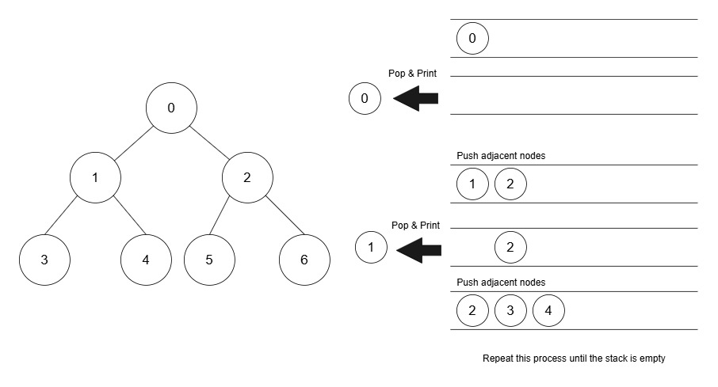 -->

```cpp
void BFS(int startNode) {
	// an array to mark visited node
	int* pVisited = new int[this->nodeCount];
	memset(pVisited, 0, sizeof(int) * this->nodeCount);

	// create queue
	std::queue<int> queue;

	// put start node into the queue
	queue.push(startNode);

	// mark the start node as visited
	pVisited[startNode] = 1;

	int value;
	while (!queue.empty()) {

		// take out the first node in the queue
		value = queue.front();
		queue.pop();

		// print
		std::cout << value << " ";

		// find adjacent nodes
		for (auto iter = this->list[value].begin(); iter != this->list[value].end(); iter++) {

			// if adjacent node has not been visited yet, push into the queue
			if (pVisited[*iter] == 0) {
				queue.push(*iter);
				pVisited[*iter] = 1;
			}
		}
	}
	printf("\n");
	delete[] pVisited;
}
```

&nbsp;

#### Result

```cpp
int main() {

	LinkedGraph graph{ 4, UNDIRECT };

	graph.addEdge(0, 1);
	graph.addEdge(0, 2);
	graph.addEdge(1, 3);
	graph.BFS(0);

	printf("\n");

	LinkedGraph a{ 9, UNDIRECT };

	a.addEdge(0, 1);
	a.addEdge(1, 2);
	a.addEdge(1, 3);
	a.addEdge(2, 3);
	a.addEdge(2, 4);
	a.addEdge(3, 4);
	a.addEdge(3, 5);
	a.addEdge(5, 6);
	a.addEdge(5, 7);
	a.addEdge(6, 8);
	a.BFS(0);

	return 0;
}
```

```cpp
0 1 2 3
0 1 2 3 4 5 6 7 8
```
