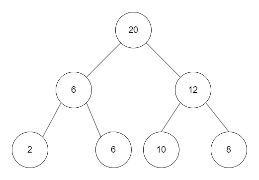
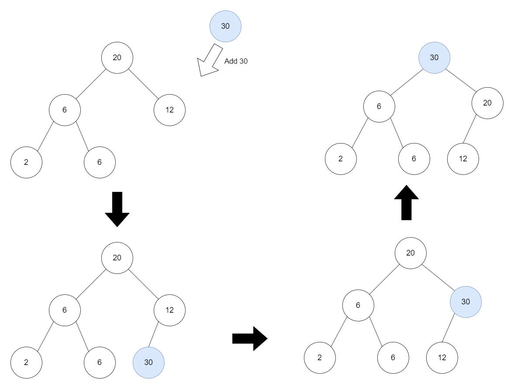
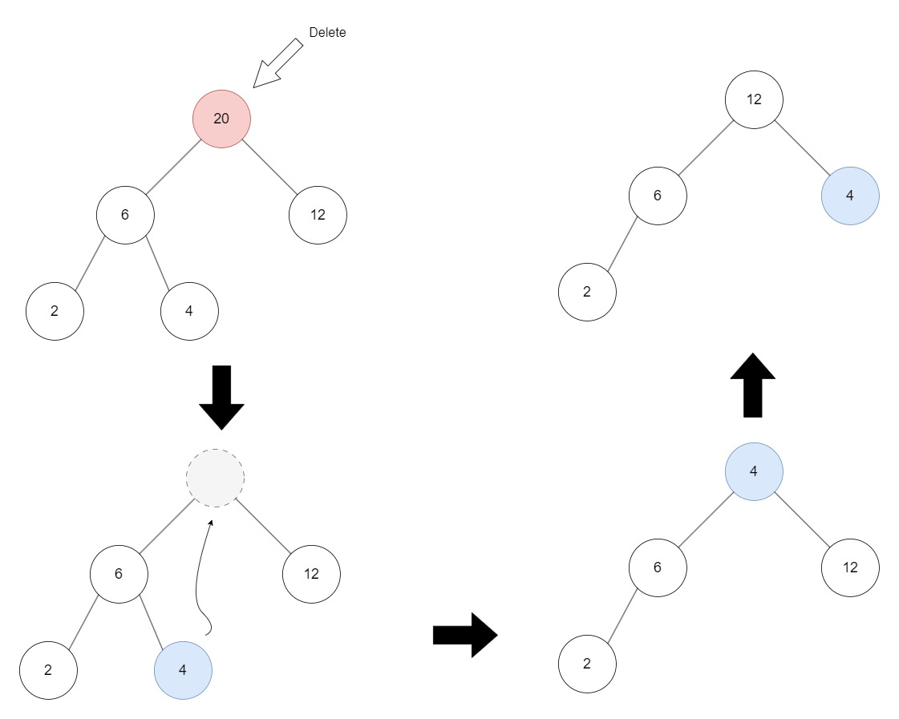
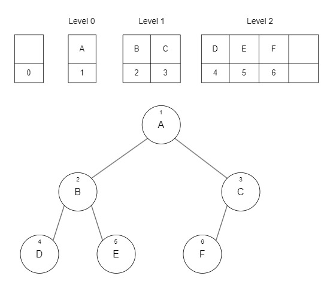

# Heap

- **Complete Binary Tree**: A heap is a complete binary tree, meaning all levels are fully filled except possibly the last level, which is filled from left to right.
- **Root Node Value**: The root node of a heap always holds the maximum or minimum value, depending on the type of heap.
- **Max Heap**: In a max heap, the root node contains the maximum value, and this property is maintained for all subtrees within the heap.
- **Min Heap**: In a min heap, the root node contains the minimum value, and this property is maintained for all subtrees within the heap.

&nbsp;

A max heap is a type of binary tree where each parent node has a value greater than or equal to its child nodes. This ensures that the root node holds the maximum value in the heap. However, this does not mean that every node at a higher level is necessarily greater than every node at a lower level. For example, consider a max heap where level 1 has parent nodes with values 6 and 12. The node with value 6 is greater than or equal to its children, but it may not be greater than nodes 10 and 8, which are children of the node with value 12. This characteristic is known as a weak heap.


<!--  -->

&nbsp;

# Applications of a Heap Structure

- **Priority Queues**: Heaps are ideal for implementing priority queues, which need to efficiently return the highest or lowest priority element. The heap structure ensures that these operations are performed quickly. Its time complexity is O(logn).
- **Heapsort**: This comparison-based sorting algorithm uses the heap data structure. Heapsort can sort data in ascending or descending order with a time complexity of O(nlog n).

&nbsp;

# Insertion in a Heap

The process of inserting a new node into a heap involves the following steps:

1. **Add the New Node**: Insert the new node at the last position of the heap, which means adding it to the lowest level. If the lowest level is full, create a new level and add the new node to the leftmost position.
2. **Compare with Parent Node**: Compare the value of the new node with its parent node.
3. **Swap if Necessary**: If the value of the new node is greater than its parent's value (in the case of a max heap), swap their positions.
4. **Repeat**: Continue this process, also known as "heapifying up," until the new node is either less than or equal to its parent node or it becomes the root.

Time complexity is O(logn).


<!--  -->

&nbsp;

# Deletion in a Heap

In a max heap, deletion involves removing the maximum value, while in a min heap, it involves removing the minimum value. This is because the heap structure always returns and deletes the root node, which contains the maximum or minimum value, respectively.

The process of deleting a node in a heap involves the following steps:

1. **Delete the Root Node**: Remove the root node, which contains the maximum value in a max heap or the minimum value in a min heap.
2. **Replace with Last Node**: Move the last node in the heap to the root position.
3. **Heapify Down**: Compare the new root with its child nodes. Swap it with the larger child in a max heap or the smaller child in a min heap if necessary.
4. **Repeat**: Continue this "heapifying down" process until the node is greater than or equal to its child nodes in a max heap or less than or equal to its child nodes in a min heap, ensuring the heap property is maintained.

Time complexity is O(logn).


<!--  -->

&nbsp;

# Max heap in C++

A heap can be implemented using pointers in a linked tree structure. However, implementing a heap using an array is generally more efficient and faster. The primary advantages of an array-based implementation are:

1. **Direct Access**: Arrays allow direct access to nodes using their indices, enabling faster retrieval and manipulation compared to traversing pointers in a linked structure.
2. **Memory Efficiency**: Since heaps are complete binary trees, using an array minimizes memory waste. Every level of the tree is fully populated except possibly the last level, ensuring efficient use of space.
3. **Simpler Navigation**: In an array, the parent and child relationships are easily maintained with simple arithmetic operations.

For node at index i:

1. its parent node index is = i/2 but i > 1
2. it left child node index = 2 x i
3. its right child node index = (2 x i) + 1

&nbsp;


<!--  -->

&nbsp;

### Heap Node

```cpp
struct HeapNode {
	int data;
};
```

&nbsp;

### Heap Class

```cpp
class Heap {
private:
	int maxCount = 0;
	int currentCount = 0;
	HeapNode* pData;
public:
// member functions
}
```

&nbsp;

### Creation of a Heap

When creating a new heap, it is necessary to specify the size of the underlying array. An important detail is to increase the array size by one because the array for the heap is typically indexed starting from 1.

```cpp
Heap(int maxCount)
	:maxCount{ maxCount }
{
	this->pData = new HeapNode[maxCount+1];
}
```

&nbsp;

### Inserting New Data into the Heap

Key points of the insertion process:

1. **Check if the Heap is Full**: Before inserting, the function checks if the heap is already at its maximum capacity.
2. **Assign the Last Index**: The new data is initially placed at the end of the heap.
3. **Heapify Up**: The function compares the new node with its parent node. If the new node is greater than its parent, it swaps their positions. This process continues until the correct position is found, maintaining the heap property.
4. **Insert the New Node**: Finally, the new node is placed in its correct position within the heap.

```cpp
void insert(int data) {
    // Check if the heap is full
    if (this->currentCount == this->maxCount) {
        std::cout << "Heap is full!" << std::endl;
        return;
    }

    // Increment the current count and assign the new node to the last position
    this->currentCount++;
    int index = this->currentCount;

    // Heapify up: compare the new node with its parent and swap if necessary
    while ((index != 1) && (data > this->pData[index / 2].data)) {
        this->pData[index].data = this->pData[index / 2].data;
        index /= 2;
    }

    // Insert the new node at the correct position
    this->pData[index].data = data;
}
```

&nbsp;

### Deletion data

```cpp
HeapNode* remove() {
    HeapNode* pReturn = nullptr;
    HeapNode* pTemp = nullptr;
    int parent = 1, child = 2;

    // Check if the heap is empty
    if (this->pData != nullptr && this->currentCount > 0) {
        pReturn = new HeapNode;
        // Save the root node's data
        pReturn->data = this->pData[1].data;

        // Point to the last node in the heap
        pTemp = &(this->pData[this->currentCount]);
        this->currentCount--;

        // Heapify down
        while (child <= this->currentCount) {
            // If the right child exists and is greater than the left child, use the right child
            if (child < this->currentCount && this->pData[child].data < this->pData[child + 1].data) {
                child++;
            }

            // If the last node's data is greater than or equal to the larger child, break the loop
            if (pTemp->data >= this->pData[child].data) {
                break;
            }

            // Move the larger child up
            this->pData[parent] = this->pData[child];
            parent = child;
            child *= 2;
        }

        // Place the last node's data in the correct position
        this->pData[parent] = *pTemp;
    }
    return pReturn;
}
```

&nbsp;

### Pint and Destruction

```cpp
void print() {

	for (int i = 1; i <= this->currentCount; i++) {
		std::cout << i << ": " << this->pData[i].data << std::endl;
	}
}

~Heap() {
	delete this->pData;

}
```

&nbsp;

### Result

```cpp
int main() {

	Heap heap{ 20 };

	heap.insert(90);
	heap.insert(85);
	heap.insert(80);
	heap.insert(75);
	heap.insert(70);
	heap.insert(65);
	heap.insert(60);
	heap.insert(55);
	heap.insert(50);
	heap.insert(45);
	heap.insert(40);
	heap.insert(35);
	heap.insert(30);

	heap.print();

	heap.insert(99);
	std::cout << "\nafter insertion 99" << std::endl;
	heap.print();

	HeapNode* pNode = heap.remove();

	std::cout << "\nafter remove" << std::endl;
	std::cout << "Max value: " << pNode->data << std::endl;
	heap.print();
	delete pNode;

	return 0;
}
```

```
1: 90
2: 85
3: 80
4: 75
5: 70
6: 65
7: 60
8: 55
9: 50
10: 45
11: 40
12: 35
13: 30

after insertion 99
1: 99
2: 85
3: 90
4: 75
5: 70
6: 65
7: 80
8: 55
9: 50
10: 45
11: 40
12: 35
13: 30
14: 60

after remove
Max value: 99
1: 90
2: 85
3: 80
4: 75
5: 70
6: 65
7: 60
8: 55
9: 50
10: 45
11: 40
12: 35
13: 30
```

&nbsp;
