# Publishing an App on the Play Store with Flutter

This post is a tutorial for publishing an app on the Google Play Store using Flutter. For more detailed information, you can refer to the official documentation on the Flutter website:

[Flutter Android Deployment Documentation](https://docs.flutter.dev/deployment/android)

### The Process of Publishing an App

1. Develop an app to publish
2. Change the app icon
3. Create an upload keystore
4. Review the app manifest
5. Review the Gradle build configuration
6. Build an app bundle
7. Use the Play Store console

&nbsp;

## 1. Develop an App

To publish an app, you need to develop one first. I have already created a simple app that shows the numbers and winning prize for the Korean lottery.


<!-- 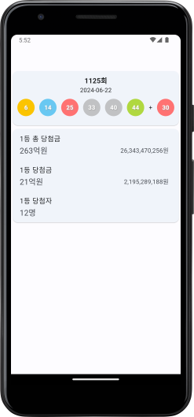 -->

&nbsp;

## 2. Change the App Icon

If you haven't modified the icon settings, Flutter will provide a default icon for your app. We'll change this to a custom icon of your choice.

### Icon Image Requirements

- **Format:** PNG file
- **Size:** 1024x1024 pixels for the best results
- **Attributes:** Flattened with no transparency

Place your custom icon image in the `assets/icons` folder. You can choose any folder name and path that you prefer.


<!--  -->

&nbsp;

To change the default Flutter app icon to a custom icon, you can either use a package or do it manually. Here are the steps for both methods:

### 1. Using package

#### 1-1. Install the package

Using the "flutter_launcher_icons" package makes it easy to add an icon to your project. Install this package with the following command:


<!-- 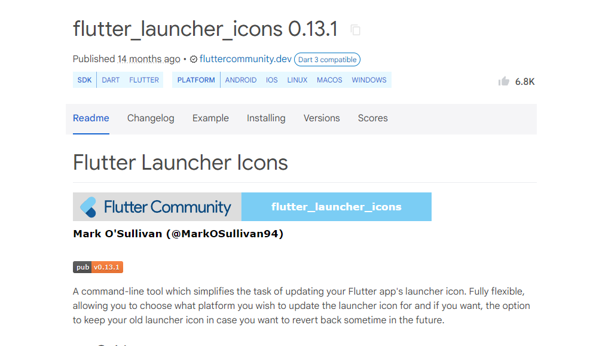 -->

```
flutter pub add flutter_launcher_icons
```

&nbsp;

#### 1-2. Congiguration on puspect.yaml

After installing the package, go to your pubspec.yaml file. You should see a line like this:

```yaml
dependencies:
  flutter_launcher_icons: ^0.13.1
```

Add the following configuration under this line. Adjust the configuration based on the platforms your app supports, and specify the path to your icon image.

```yaml
flutter_launcher_icons:
  android: "lucky_lotto"
  ios: true
  image_path: "assets/icons/lucky_lotto.png"
  min_sdk_android: 21 # android min sdk min:16, default 21
```


<!-- 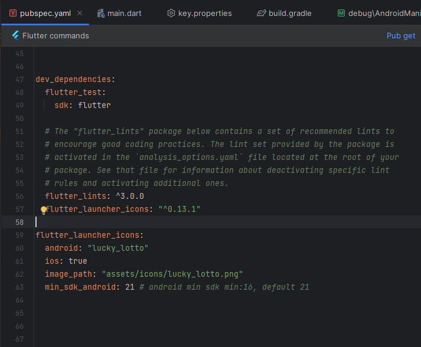 -->

&nbsp;

#### 1-3. Run the package after configuration

After configuring, run the following commands to apply the changes:

```
flutter pub get
flutter pub run flutter_launcher_icons
```

&nbsp;

#### 1-4 Check the result

If the package runs successfully, the terminal will display "Successfully generated launcher icons". You can see the icon images in the project under the path android/app/src/main/res. There will be several folders named starting with "mipmap". Your icon image will be placed in these folders.


<!-- 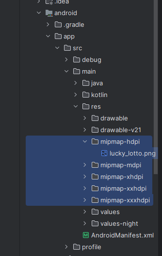 -->

&nbsp;

You can also see the updated icon file name in the AndroidManifest.xml file.


<!-- 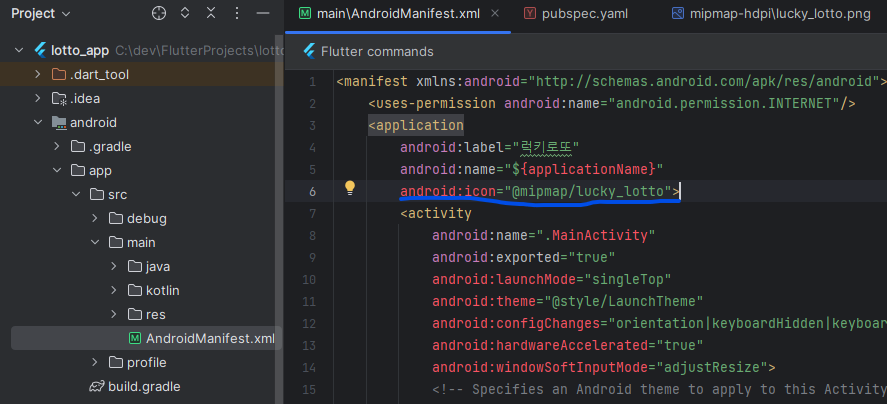 -->

&nbsp;

### 2. Manual

You can manually add an icon image to your project. Here are the steps:

1. Generate Icon Images: Use a website like [appicon.co](https://www.appicon.co/) to generate all the required icon sizes. Upload your image and select the necessary icon sizes.


<!--  -->

&nbsp;

2. Download and Unzip: Click the generate button to download a ZIP file. After unzipping it, you will find an 'android' folder. Inside, you will see familiar folders starting with "mipmap". Replace these folders in your project.

Update 'AndroidManifest.xml': Update the 'android:icon' attribute in the application tag of your 'AndroidManifest.xml' file to point to your new icon.


<!--  -->


<!-- 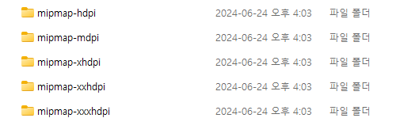 -->

&nbsp;

## 3. Create an upload keystore

To publish your app on the Play Store, you need to provide a digital signature that proves the ownership of the app. This is done using a key, which is a digital signature. There are two types of keys:

- **Development Key**: FUsed for other app stores. When a user downloads the APK file, the development key is included.
- **Upload Key**: Recommended by Google. When a user downloads an app from the Play Store, the upload key is included.


<!-- 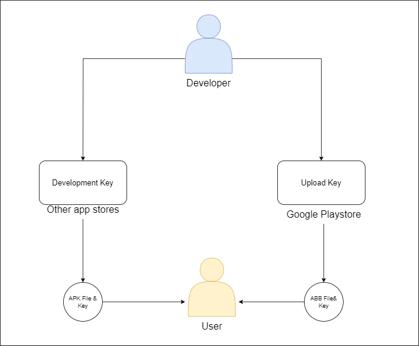 -->

&nbsp;

### How to create

### 3-1 Run the command

There are two ways to create upload key.

1. Using Android Studio key generation (GUI way)

   - https://developer.android.com/studio/publish/app-signing#generate-key

2. Run the following command at the command line

On macOS or Linux, use the following command:

```
keytool -genkey -v -keystore ~/upload-keystore.jks -keyalg RSA \
        -keysize 2048 -validity 10000 -alias upload
```

On Windows, use the following command in PowerShell:

```
keytool -genkey -v -keystore $env:USERPROFILE\upload-keystore.jks `
        -storetype JKS -keyalg RSA -keysize 2048 -validity 10000 `
        -alias upload
```

#### Command does not work!!!

The keytool command might not be executed. You need to run powershell as **administrator**.

Also, the keytool command might not be in your path—it's part of Java, which is installed as part of Android Studio. In my case, I excuted the command under the C:\Program Files\Android\Android Studio\jbr\bin

Official document from Flutter describes possible erorrs as following:

- For the concrete path, run flutter doctor -v and locate the path printed after 'Java binary at:'. Then use that fully qualified path replacing java (at the end) with keytool. If your path includes space-separated names, such as Program Files, use platform-appropriate notation for the names. For example, on Mac/Linux use Program\ Files, and on Windows use "Program Files".

- The -storetype JKS tag is only required for Java 9 or newer. As of the Java 9 release, the keystore type defaults to PKS12.

&nbsp;

### 3-2 Type your information

After running the keytool command successfully, you will be prompted to enter your personal information, such as your name, company name, address, etc. Additionally, you will need to create passwords for both the keystore and the key. If you prefer not to remember two different passwords, you can use the same password for both. Once this process is complete, the 'upload-keystore.jks' file will be created.

Now, to use your keystore file in your project, you need two more process.

&nbsp;

### 3-3 Reference the keystore from the app

Create a file named 'key.properties' in the '[project]/android 'directory. This file will contain references to your keystore. Use the actual values instead of the placeholders (indicated by angle brackets '< >').

```properties
storePassword=<password-from-previous-step>
keyPassword=<password-from-previous-step>
keyAlias=upload
storeFile=<keystore-file-location>
```

&nbsp;

### 3-4 Configure signing in gradle

When building your app in release mode, configure gradle to use your upload key. To configure gradle, edit the '<project>/android/app/build.gradle' file.

1. Add the keystore information from your properties file before the android block:

```
+   def keystoreProperties = new Properties()
+   def keystorePropertiesFile = rootProject.file('key.properties')
+   if (keystorePropertiesFile.exists()) {
+       keystoreProperties.load(new FileInputStream(keystorePropertiesFile))
+   }
+
   android {
      ...
   }
```

2. Load the key.properties file into the keystoreProperties object.
3. Add the signing configuration before the buildTypes block:

```
+   signingConfigs {
+       release {
+           keyAlias keystoreProperties['keyAlias']
+           keyPassword keystoreProperties['keyPassword']
+           storeFile keystoreProperties['storeFile'] ? file(keystoreProperties['storeFile']) : null
+           storePassword keystoreProperties['storePassword']
+       }
+   }
   buildTypes {
      release {
         // TODO: Add your own signing config for the release build.
         // Signing with the debug keys for now,
         // so `flutter run --release` works.
-           signingConfig signingConfigs.debug
+           signingConfig signingConfigs.release
      }
   }
```

You might need to run flutter clean after changing the gradle file. This prevents cached builds from affecting the signing process.

&nbsp;

## 4. Review the app manifest

Go to AndroidManifest.xml located in [project]/android/app/src/main.

#### Internet Permission

If your app needs Internet acceess. This is mandatory. Add following tag right above <application\> tag:

```xml
<uses-permission android:name="android.permission.INTERNET"/>
```

#### Application name

In the application tag, edit **android:label** which reflcts the final name of the app.


<!--  -->

&nbsp;

## 5. Review the Gradle build configuration

## 5. Review the Gradle Build Configuration

Next, review the default Gradle build file located at `[project]/android/app/build.gradle`.

Within the `defaultConfig` block, pay attention to the following parameters:

- **minSdkVersion**: Specifies the minimum API level on which your app can run. Devices with an OS version lower than this will not be able to install the app.
- **targetSdkVersion**: Specifies the target API level on which you designed the app to run.
- **versionCode**: A positive integer used as an internal version number. This can be found in the 'pubspec.yaml' file after the '+' sign in the 'version' field. This number must be higher than the previous version code when uploading to the Google Play Store.
- **versionName**: A string representing the version number shown to users. This can also be found in the 'pubspec.yaml' file before the '+' sign in the 'version' field.


<!-- 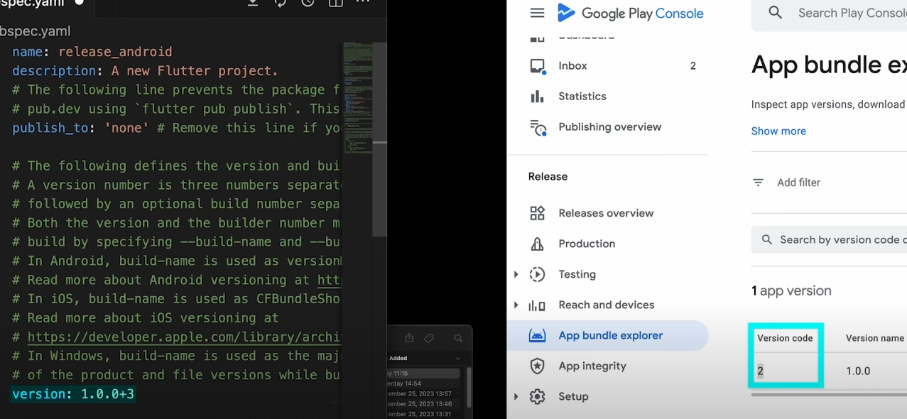 -->

- **applicationId**: The final, unique application ID that identifies your app. If this id is not unique, uploading your app can be rejected.

#### Change application ID

There are two ways to change this id. One is maual and another one is to use package. I recommend using package which posibly causes less error.

The package name is change_app_package_name
https://pub.dev/packages/change_app_package_name


<!-- 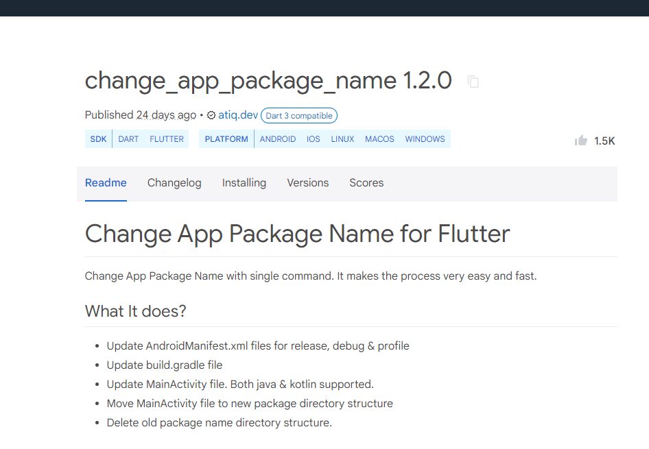 -->

Install this pcakage with following line.

```
flutter pub add change_app_package_name
```

Run this command to change the package name.

```
flutter pub run change_app_package_name:main com.new.package.name
```

&nbsp;

## 6. Build an app bundle

From the command line where your project is:

- Run
  ```
  flutter build appbundle
  ```
  (Running flutter build defaults to a release build.)

The release bundle for your app is created at [project]/build/app/outputs/bundle/release/app.aab.

&nbsp;

## 7. Playstore console

### 7-1. Create developer account

Now, you need to sign in to the Play Store Console. It is not hard; just answer some questions.


<!--  -->

### 7-2. pay developer registraion fee

After answering the questions, you have to pay the developer registration fee. This is a one-time payment.

### 7-3. Verification

Even after you pay the fee, the process is not complete. You have to send a document that proves your identity. It should not be a digital file; you need to take a picture of the actual paper document and send that picture. You will have to wait until this process is completed.


<!-- 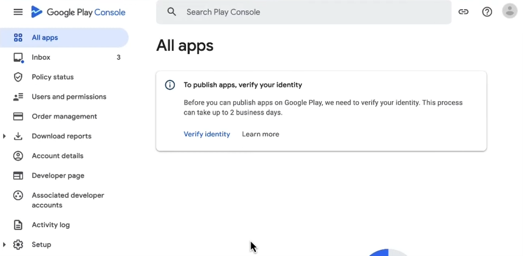 -->


<!-- 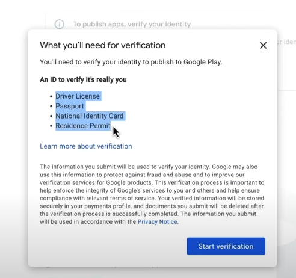 -->

### 7-4. Create an app

Now, you can create an app. Put fundemental information about your app.


<!-- 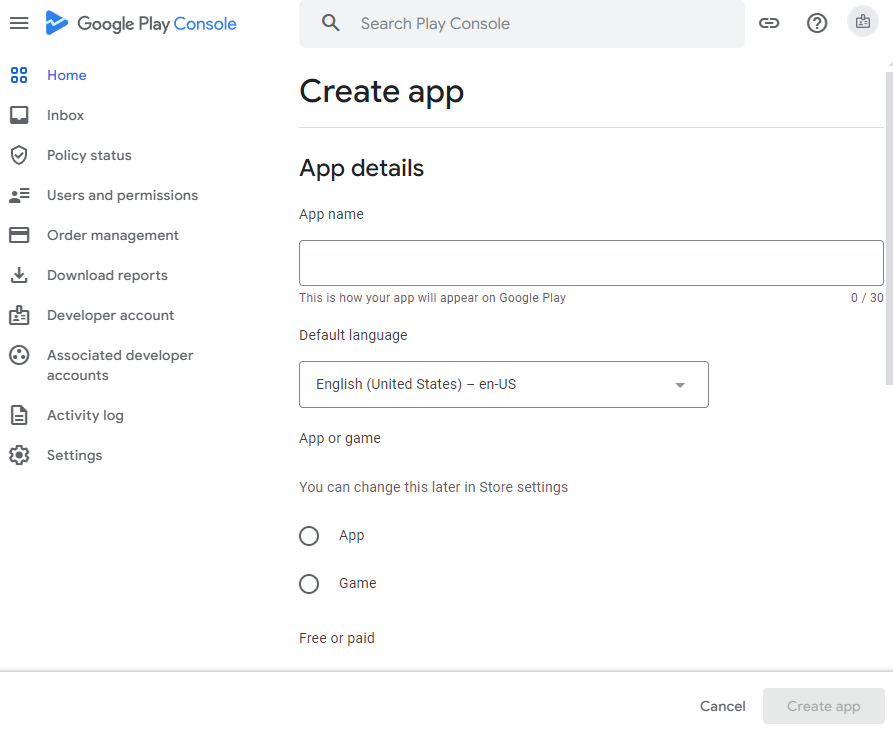 -->

### 7-5. Testing

Although you have created an app, you cannot release it immediately. Developers must test their app before publishing. The Google Play Store Console provides several testing modes, including:

- **Open testing**: Allows users to sign up to test new versions of your app on Google Play.
- **Closed testing**: Enables you to test pre-release versions of your app with specific groups of testers.
- **Internal testing**: Allows you to create and manage internal testing releases, making your app available to up to 100 internal testers.
- **Pre-registration testing**: Lets users pre-register for your app, which can generate interest and feedback before the official release.

Choosing the right testing mode can be confusing. Here's a simplified guide:

- **Internal testing**: Use this to ensure there are no critical errors within your development team before broader testing. This mode is great for quick feedback from a small group.
- **Closed testing**: This is essential for broader testing with real users before the official release. It involves inviting a larger group of testers to install, use, and review your app. Note that you will need at least 20 testers who must install and review the app for a minimum of 14 days.

Closed testing is often considered the most challenging part of the process, as it requires coordination and active participation from a significant number of testers.

### Create new relase

#### Go to Colsed testing and click the 'create new realese'


<!-- 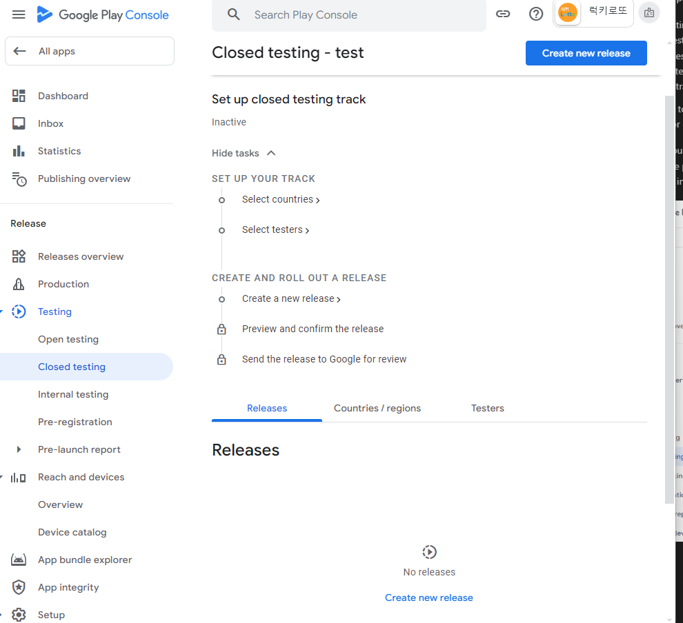 -->

#### Upload your app bundle


<!-- 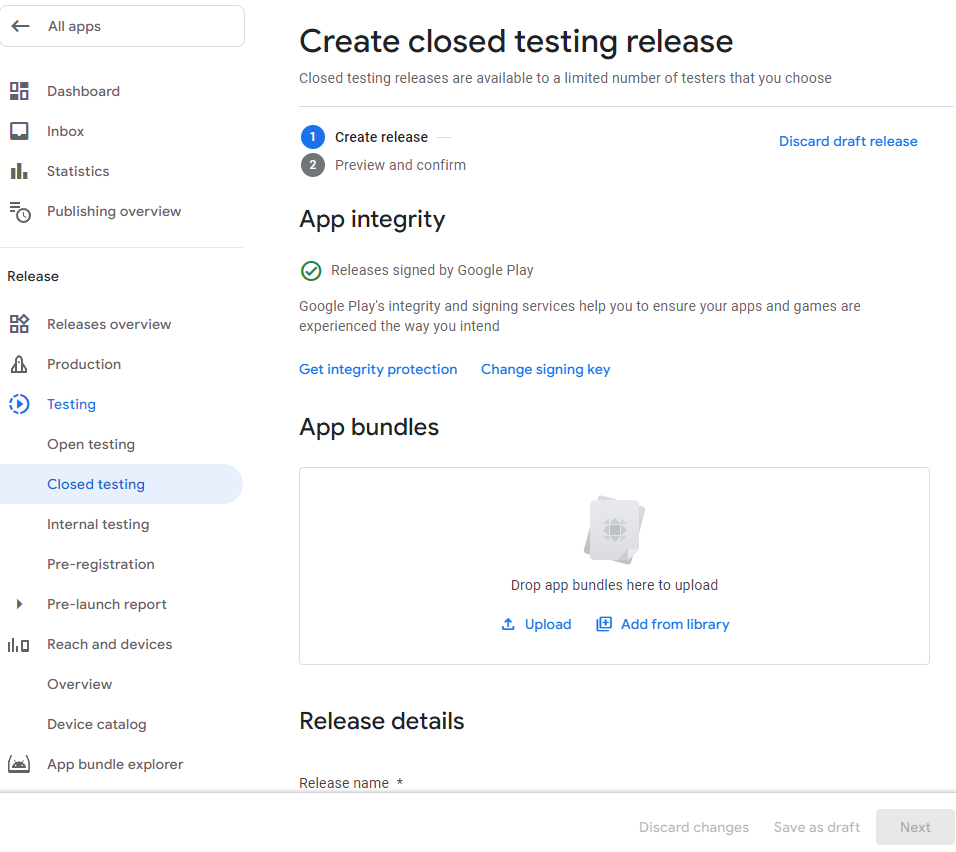 -->

#### Provide information about your app

After uploading your app bundle, you will encounter several prompts and potential error messages. Google will ask you various questions about your app to ensure it meets their guidelines and policies. Some of these questions might include:

- **Who is your app's target audience?**
- **Does your app contain advertisements?**
- **Does your app handle sensitive user data?**

Answer these questions carefully and accurately. Providing detailed and honest responses helps Google assess your app and ensure it complies with their standards. This step is crucial for a smooth review process and eventual approval for publication on the Google Play Store.


<!-- 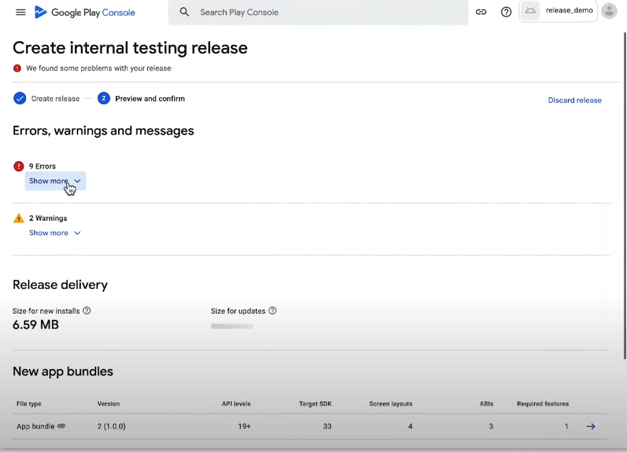 -->


<!--  -->

The most challenging part is creating the privacy policy. You need to write a comprehensive document outlining your app's privacy practices and provide it as a webpage. Fortunately, there are online services that can help you generate a privacy policy. Once you have the document, you can create a website using Google Sites and paste your privacy policy there. This ensures that users and Google have easy access to your privacy policy, which is a crucial requirement for publishing on the Play Store.


<!--  -->


<!-- 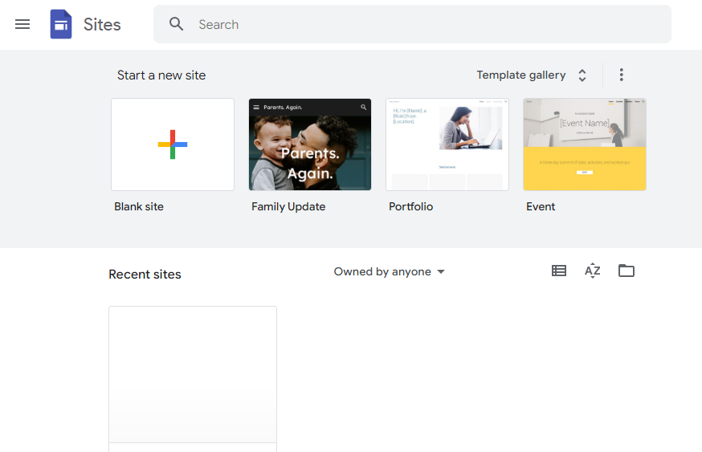 -->

#### Main Store Listing

After answering the initial questions, you need to provide key information such as the app name, description, and icon image that will be displayed on the Play Store. This information, along with any accompanying images, will be visible to users, so it's essential to create them carefully and thoughtfully to attract and inform potential users effectively.


<!-- 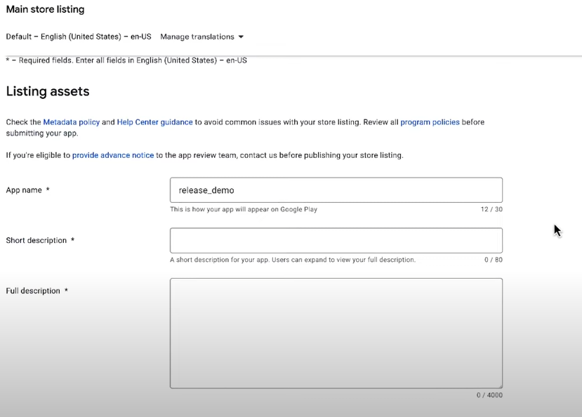 -->


<!-- 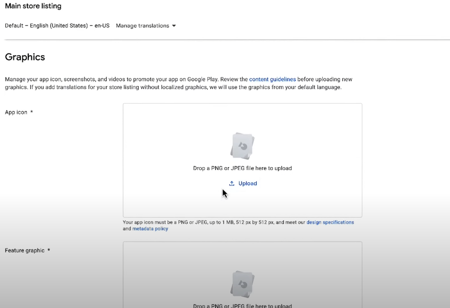 -->

#### Regist Testers

Now, this is the hardest part. If you are in a company or team, this is not a big problem. However, solo developers like me may struggle to gather at least 20 testers. Additionally, this process takes the most time during development.

You can create new tester's email list and add emails.


<!-- 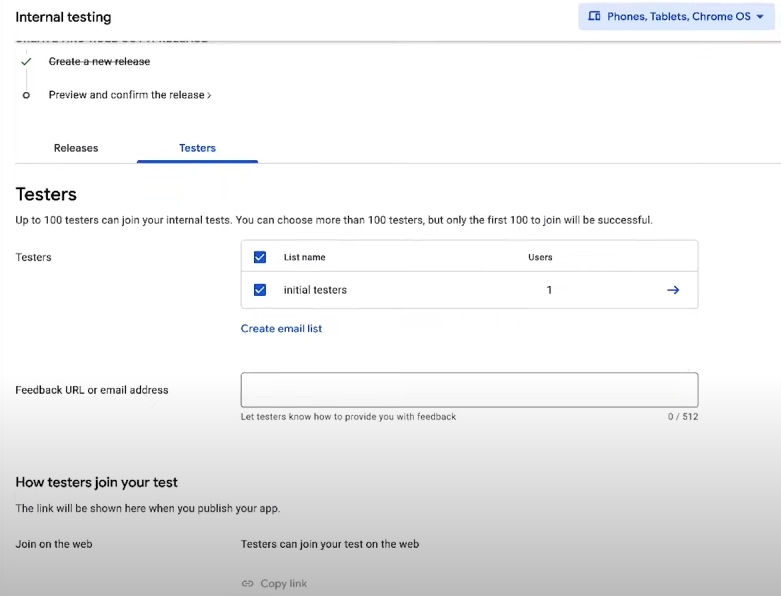 -->


<!-- 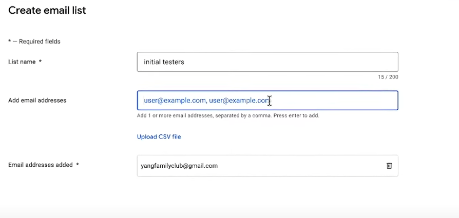 -->

- **Paid Services**: You can find paid services online that provide 20 testers for a fee. These services will test your app for 14 days and provide feedback.
- **Family and Friends**: Ask your family and friends to help you test the app.
- **Community**: Join communities where members help each other with testing.

#### Tips for Testing

- **Start Your Test Early**: The testing phase takes at least 14 days. If Google rejects your test, you'll need to start a new 14-day testing period. To avoid delays, start testing with a prototype or sketch of your app while you continue development. If the test is successful, you can update the Play Store listing with the final version of your app. Early testing ensures your app is ready for launch and avoids potential delays.
- **Expect Initial Rejection**: Many new developers experience rejection on their first app submission, especially with newly created Play Console accounts. This may be due to incomplete or inaccurate responses to Google's survey questions. After the 14-day testing period, carefully answer all survey questions to increase the chances of approval.

#### Send changes to Goolge

If you change something in your app console, you have to send the changes to Google for review. If you create a new release or a new email list, you must send this change to Google and wait for approval.


<!--  -->

#### Survey

After 14 days, there is only one step left. You need to answer the questions Google asks. These questions will be about how the test went. Do not answer them too simply, as you may get rejected.


<!-- 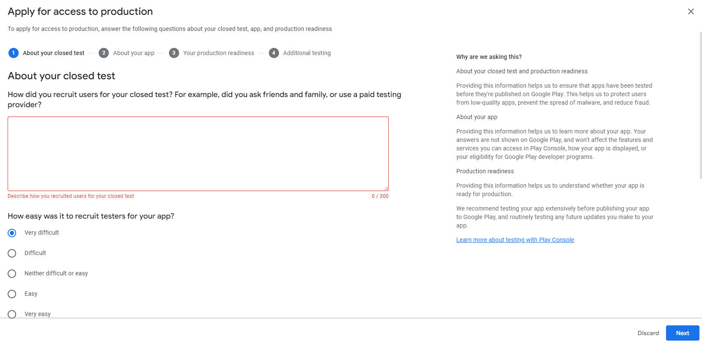 -->

#### Production

After Google approves everything, you can finally release your app. Go to the Production tab and create a new release as we did previously. You can then check that your app is on the Play Store.


<!-- 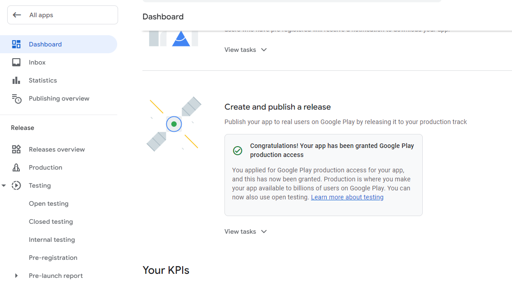 -->


<!-- 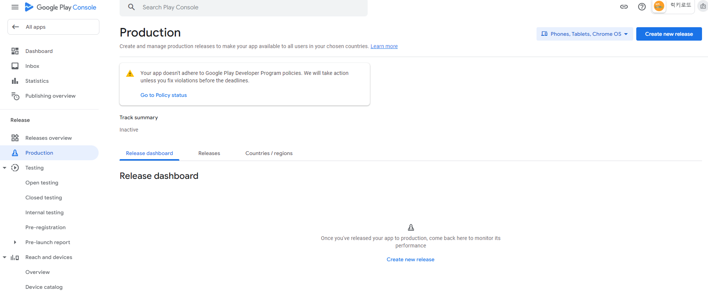 -->
