# Tree Structure

- Hierarchical arrangement facilitating non-linear relationships.
- Comprised of parent-child relationships.
- Each node may have multiple children but only one parent.
- Unidirectional flow from parent to child.
- Root node serves as the topmost entity with children nodes.
- Children nodes branch out from the root and may further branch into additional nodes.
- Number of children nodes are unlimited.
- Ideal for representing organizational charts or file system structures.

 


<!-- 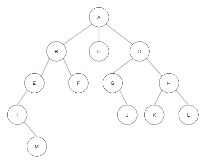 -->

&nbsp;

A tree is a hierarchical structure composed of nodes and edges. An edge is the line that connects these nodes.


<!-- 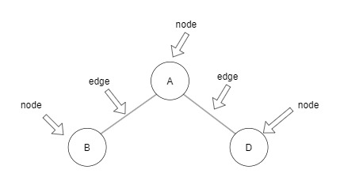 -->

&nbsp;

## Node Types in a Tree Structure

In tree structures, nodes are categorized based on their position and relationships within the hierarchy.

### Position in the Tree

- **Root Node:** The initial node at the top of the tree.
- **Leaf or Terminal Node:** A node devoid of child nodes.
- **Internal Node:** A node that possesses child nodes.

### Relationships Between Nodes

- **Parent Node:** Connects to child nodes via edges.
- **Child Node:** Linked to a parent node via an edge.
- **Ancestor Node:** Includes all nodes from the root node to a given parent node.
- **Descendant Node:** Encompasses all nodes beneath a specific node.
- **Sibling Node:** Nodes that share the same parent node.

&nbsp;


<!-- 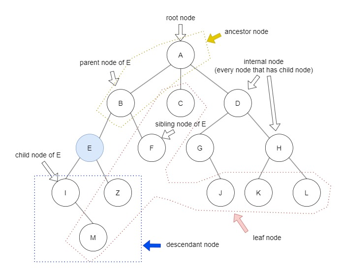 -->

&nbsp;

## Node Characteristics

Nodes in a tree structure possess distinct properties that help define their position and relationships within the hierarchy.

- **Level:** Represents the distance of a node from the root node.
- **Height:** The length of the path from the root node to the deepest node in the tree.
- **Depth:** Equivalent to the level of a node, indicating its distance from the root.
- **Degree:** Denotes the number of children nodes directly linked to a particular node.
- **Path:** The sequential arrangement of nodes from one particular node to another. (e.g., from node A to F: A-B-F)
- **Path Length:** The count of nodes included in the path. (e.g., Number of nodes from A to F: 3)
- **Size:** The total count of nodes within a subtree, including the node itself. (e.g., Size of node B: 5)
- **Width:** The count of nodes at the same level within the tree. (e.g., Width of level 2: 4)
- **Breadth:** The count of leaf nodes in the tree.
- **Distance:** The number of edges between two nodes along the shortest path. (e.g., Distance between nodes G and K: 3)
- **Order:** The maximum count of children nodes that a parent node can have.

&nbsp;


<!-- 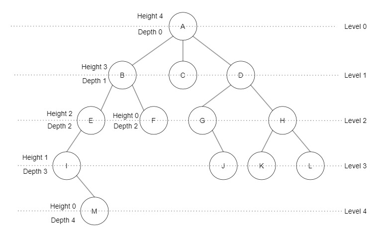 -->

&nbsp;

- **Subtree:** A subset of nodes that belong to a larger tree structure.
- **Forest:** A collection of individual tree structures, each existing independently.

&nbsp;


<!-- 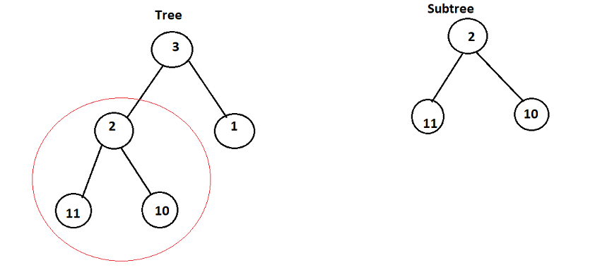 -->

sorce: https://takeuforward.org/data-structure/subtree-of-another-tree/

&nbsp;

## Types of Trees

&nbsp;


<!-- 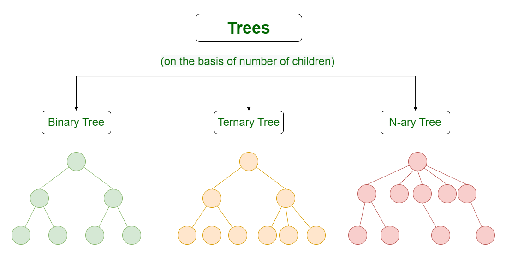 -->

sorce: https://www.geeksforgeeks.org/types-of-trees-in-data-structures/

&nbsp;

- **Binary Tree**: A tree that can have two children nodes at most.
- **Ternary Tree**: A tree that can hve three children nodes at most.
- **N-ary Tree**: A tree that can have N children nodes at most.

The maximum number of nodes in N-ary tree is calculated by the formula: \( N^h - 1 \), where \( h \) denotes the height of the tree.

```
N^h - 1
```

&nbsp;

- **Balanced Tree**
- **Unbalanced Tree**


<!-- 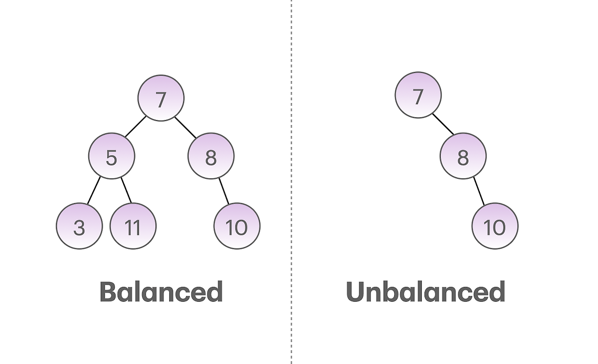 -->

&nbsp;

## Binary Tree

#### Binary Tree based on the number of children

1. **Full Binary Tree**: There is no child node or there are only two child nodes.

2. **Degenerate or Skewed Binary Tree**: In this scenario, each node extends in a single direction, leading to a linear structure with each node having only one child node. Number of nodes are same as the height of a tree.

&nbsp;


<!-- 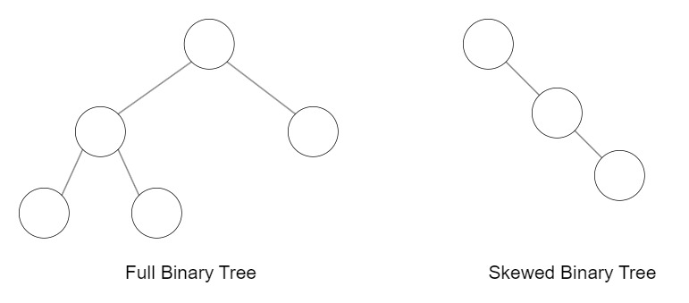 -->

&nbsp;

#### Binary tree based on the basis of completion of levels

1. **Complete Binary Tree**: This type of binary tree ensures that all levels, except possibly the last one, are filled to capacity. Additionally, in the last level, nodes are filled from left to right, maintaining structural integrity.

2. **Perfect Binary Tree**: This type of tree exhibits nodes at every level, where each node possesses exactly two child nodes, ensuring a full structure across all levels.

- Number of Nodes in full binary tree

  ```
  2^h - 1
  ```

3. **Balanced Binary Tree**: In a balanced binary tree, the discrepancy in height between the left and right subtrees of any node does not exceed one. Furthermore, both the left and right subtrees themselves exhibit balanced heights, contributing to an overall equilibrium in the tree's structure.

&nbsp;


<!-- 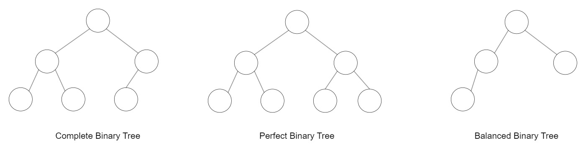 -->

&nbsp;

## Special Types of Trees based on the nodes’ values:

&nbsp;

### Binary Search Tree

In a Binary Search Tree (BST), each node follows a specific ordering principle: the value of any node's left child is less than the value of the parent node, while the value of any right child is greater than that of the parent node.

Additionally, this ordering property extends recursively to the left and right subtrees of each node, ensuring that every subtree within the BST maintains the binary search tree property.


<!-- 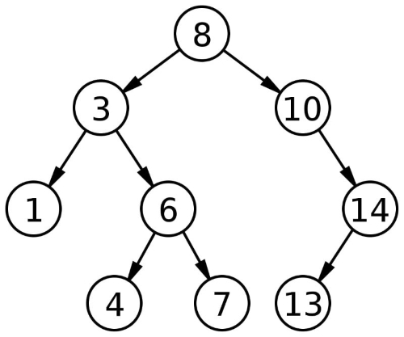 -->

&nbsp;

### AVL Tree

An AVL Tree, like a Binary Search Tree (BST), maintains the ordering property where the left child of a node has a lesser value and the right child has a greater value than the parent node.

However, what sets AVL Trees apart is their self-balancing feature. In an AVL Tree, the difference in heights between the left and right subtrees of any node, known as the balance factor, cannot exceed one. This ensures that the tree remains balanced, optimizing search and insertion operations.

&nbsp;


<!-- 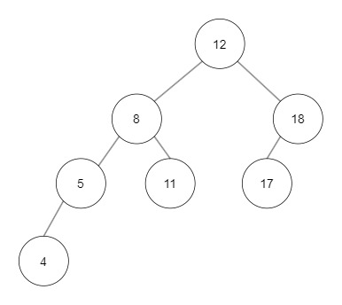 -->
