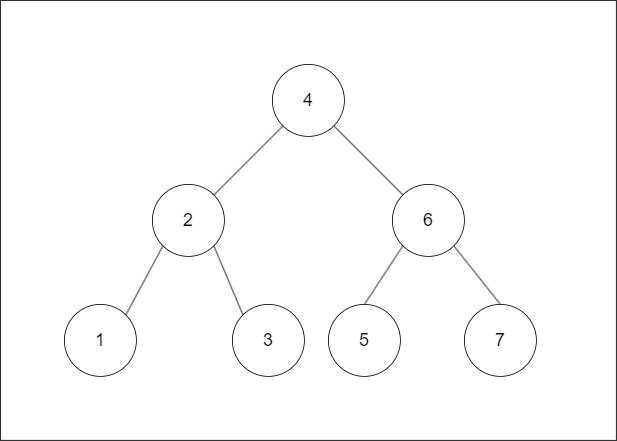
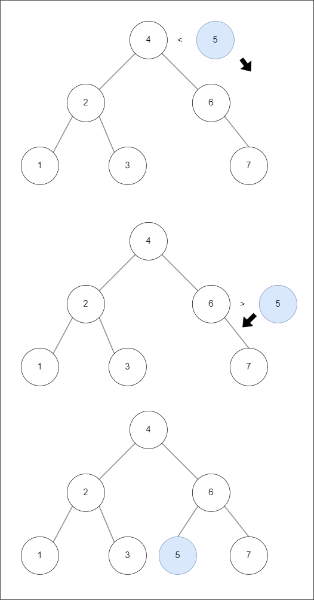
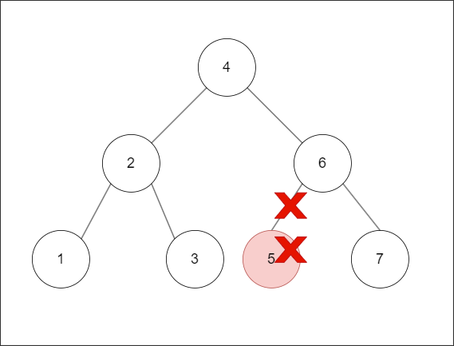
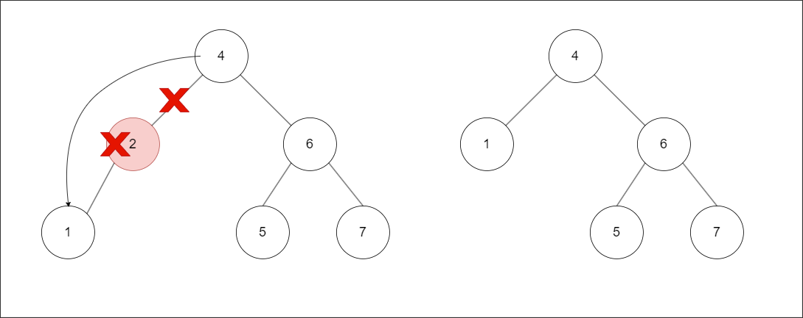
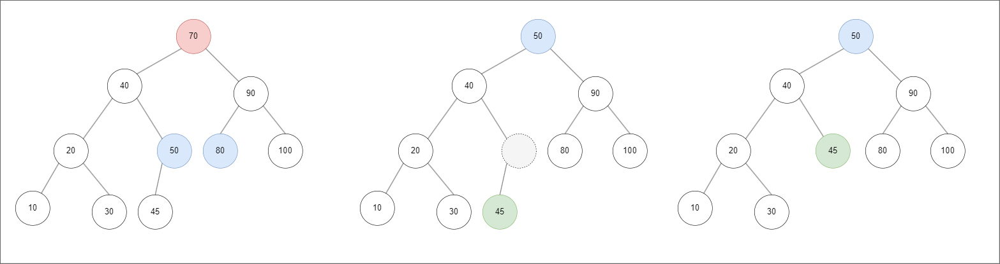

## Binary Search Tree

A Binary Search Tree (BST) is a data structure designed to combine the efficient search capabilities of binary search with the flexibility of linked lists for insertion and deletion. This structure ensures an average time complexity of O(log n) for search, insertion, and deletion operations, making it a versatile tool for many applications.

### Features of a Binary Search Tree

1. **Left Subtree Keys**: All keys in the left subtree are smaller than the key of the root node.
2. **Right Subtree Keys**: All keys in the right subtree are greater than the key of the root node.
3. **Recursive Property**: Every left and right subtree is also a binary search tree.
4. **Uniqueness**: No two nodes in the tree have the same key.

These features ensure that the data in a binary search tree is sorted, allowing for efficient search operations. Each time you move to the next child node, the search range is effectively halved, maintaining the O(log n) search time complexity.

### Advantages Over Other Data Structures

1. **Compared to Binary Search**: While binary search on a sorted array has a time complexity of O(\log n), it does not allow for efficient insertion and deletion. These operations require O(n) time in an array, as elements may need to be shifted.
2. **Compared to Linked Lists**: Linked lists allow for O(1) insertion and deletion, but their search time complexity is O(n), as elements must be traversed sequentially.

A BST complements the strengths of both binary search and linked lists by providing efficient search, insertion, and deletion operations.

&nbsp;


<!--  -->

&nbsp;

## Search

The search process in a binary search tree is straightforward and efficient due to the tree's inherent properties.

1. **If the search key equals the current node's key**: The search is successful, and the process ends.
2. **If the search key is smaller than the current node's key**: Move to the left subtree and continue the search.
3. **If the search key is greater than the current node's key**: Move to the right subtree and continue the search.

&nbsp;

## Add New Data

Adding a new node to a binary search tree follows a process similar to searching, ensuring the tree's properties are maintained.

1. **Find the Parent Node**: Traverse the tree from the root, comparing the new key with existing node keys to find the appropriate parent node.
   - If the new key is greater than the current node's key, move to the right subtree.
   - If the new key is smaller than the current node's key, move to the left subtree.
2. **Insert the New Node**: Once the appropriate parent node is found, add the new node as a child of the parent node in the correct position (left or right).


<!--  -->

&nbsp;

## Deleting a Node in a Binary Search Tree

The process of deleting a node in a binary search tree can be categorized into three scenarios:

1. The node to be deleted has no children.
2. The node to be deleted has one child.
3. The node to be deleted has two children.

#### 1. Deleting a Node with No Children

This is the simplest case. You can simply remove the node and set the corresponding link in the parent node to null.


<!--  -->

&nbsp;

#### 2. Deleting a Node with One Child

1. Delete the target node.
2. Remove the link between the target node and its parent node.
3. Link the child of the target node to the parent node of the target node.


<!--  -->

&nbsp;

#### 3. Deleting a Node with Two Children

This is the most complex case. When the target node has two children, you need to find a replacement node that maintains the binary search tree properties. The replacement node must be:

1. The greatest key in the left subtree, or
2. The smallest key in the right subtree.

Either option works. The key point is that if the replacement node has children, its child node will take the original position of the replacement node.


<!--  -->

&nbsp;

## Binary Search Tree implementation in C++:

```cpp
#include <iostream>
#include <queue>

class BinarySearchTree {
private:
    // Node structure for the binary search tree
    struct Node {
        int key;
        char value;
        Node* pLeftChild = nullptr;
        Node* pRightChild = nullptr;
    };

    // Root node of the binary search tree
    Node* pRootNode = nullptr;

public:
    // Function to create a new node with the given key and value
    Node* createNewNode(int key, char value) {
        Node* newNode = new Node;
        newNode->key = key;
        newNode->value = value;
        return newNode;
    }

    // Function to find the parent node for a given key
    int getParent(Node* pCurrentNode, int key, Node** ppResult) {
        int ret = 1;
        Node* pParentNode = nullptr;

        // Traverse the tree to find the parent node
        while (pCurrentNode != nullptr) {
            if (key == pCurrentNode->key) {
                std::cout << "Same key exists\n";
                ret = 0;
                return ret;
            } else if (key < pCurrentNode->key) {
                pParentNode = pCurrentNode;
                pCurrentNode = pCurrentNode->pLeftChild;
            } else {
                pParentNode = pCurrentNode;
                pCurrentNode = pCurrentNode->pRightChild;
            }
        }
        if (ret == 1) {
            *ppResult = pParentNode;
        }
        return ret;
    }

    // Function to add a new node to the binary search tree
    void addBST(int key, char value) {
        int ret = 1;
        Node* pParentNode = nullptr;
        Node* pNewNode = nullptr;

        // Find the parent node for the new node
        ret = getParent(pRootNode, key, &pParentNode);
        if (ret == 0) {
            return;
        }

        // Create the new node
        pNewNode = createNewNode(key, value);

        // If the tree is empty, set the new node as the root
        if (pParentNode == nullptr) {
            pRootNode = pNewNode;
        } else {
            // Otherwise, attach the new node to the appropriate child position
            if (pNewNode->key < pParentNode->key) {
                pParentNode->pLeftChild = pNewNode;
            } else {
                pParentNode->pRightChild = pNewNode;
            }
        }
    }

    // Function to search for a node and its parent by key
    Node* searchWithParentNodeBST(int key, Node** ppParentNode) {
        Node* pReturn = pRootNode;
        Node* pParentNode = nullptr;

        // Traverse the tree to find the node
        while (pReturn != nullptr) {
            if (key == pReturn->key) {
                break;
            }
            pParentNode = pReturn;

            if (key < pReturn->key) {
                pReturn = pReturn->pLeftChild;
            } else {
                pReturn = pReturn->pRightChild;
            }
        }

        if (ppParentNode != nullptr) {
            *ppParentNode = pParentNode;
        }

        return pReturn;
    }

    // Function to delete a node with no children
    void deleteNodeNoChild(Node* pParentNode, Node* pDelNode) {
        if (pParentNode != nullptr) {
            if (pParentNode->pLeftChild == pDelNode) {
                pParentNode->pLeftChild = nullptr;
            } else {
                pParentNode->pRightChild = nullptr;
            }
        } else {
            pRootNode = nullptr;
        }
    }

    // Function to delete a node with one child
    void deleteNodeOneChild(Node* pParentNode, Node* pDelNode) {
        Node* pChildNode = nullptr;

        if (pDelNode->pLeftChild != nullptr) {
            pChildNode = pDelNode->pLeftChild;
        } else {
            pChildNode = pDelNode->pRightChild;
        }

        if (pParentNode != nullptr) {
            if (pParentNode->pLeftChild == pDelNode) {
                pParentNode->pLeftChild = pChildNode;
            } else {
                pParentNode->pRightChild = pChildNode;
            }
        } else {
            pRootNode = pChildNode;
        }
    }

    // Function to delete a node with two children
    void deleteNodeTwoChildren(Node* pParentNode, Node* pDelNode) {
        Node* pPredecessor = nullptr;
        Node* pSuccessor = nullptr;

        pPredecessor = pDelNode;
        pSuccessor = pDelNode->pLeftChild;

        // Find the in-order predecessor (rightmost node in the left subtree)
        while (pSuccessor->pRightChild != nullptr) {
            pPredecessor = pSuccessor;
            pSuccessor = pSuccessor->pRightChild;
        }

        // Replace the target node with the successor
        pPredecessor->pRightChild = pSuccessor->pLeftChild;
        pSuccessor->pLeftChild = pDelNode->pLeftChild;
        pSuccessor->pRightChild = pDelNode->pRightChild;

        if (pParentNode != nullptr) {
            if (pParentNode->pLeftChild == pDelNode) {
                pParentNode->pLeftChild = pSuccessor;
            } else {
                pParentNode->pRightChild = pSuccessor;
            }
        } else {
            pRootNode = pSuccessor;
        }
    }

    // Function to delete a node by key
    void deleteBST(int key) {
        Node* pDelNode = nullptr;
        Node* pParentNode = nullptr;

        // Find the node to be deleted and its parent
        pDelNode = searchWithParentNodeBST(key, &pParentNode);
        if (pDelNode == nullptr) {
            std::cout << "Error! Key does not exist: " << key << std::endl;
            return;
        }

        // Handle the three cases of node deletion
        if (pDelNode->pLeftChild == nullptr && pDelNode->pRightChild == nullptr) {
            deleteNodeNoChild(pParentNode, pDelNode);
        } else if (pDelNode->pLeftChild != nullptr && pDelNode->pRightChild != nullptr) {
            deleteNodeTwoChildren(pParentNode, pDelNode);
        } else {
            deleteNodeOneChild(pParentNode, pDelNode);
        }

        delete pDelNode;
    }

    // Function to search for a key in the tree and print its value
    void search(int key) {
        if (pRootNode != nullptr) {
            Node* pNode = pRootNode;

            // Traverse the tree to find the node
            while (pNode != nullptr) {
                if (key == pNode->key) {
                    break;
                } else if (key < pNode->key) {
                    pNode = pNode->pLeftChild;
                } else {
                    pNode = pNode->pRightChild;
                }
            }

            // Print the result of the search
            if (pNode != nullptr) {
                std::cout << "Key: " << pNode->key << ", Value: " << pNode->value << std::endl;
            } else {
                std::cout << "Cannot find key: " << key << std::endl;
            }
        } else {
            std::cout << "Root node is null\n";
        }
    }

    // Function to print the tree using level-order traversal
    void print() {
        std::queue<Node*> q;
        Node* pNode = pRootNode;

        if (pRootNode == nullptr) return;

        q.push(pRootNode);

        while (!q.empty()) {
            pNode = q.front();
            q.pop();

            std::cout << "(Key: " << pNode->key << ", Value: " << pNode->value << ") ";

            if (pNode->pLeftChild != nullptr) {
                q.push(pNode->pLeftChild);
            }
            if (pNode->pRightChild != nullptr) {
                q.push(pNode->pRightChild);
            }
        }
        printf("\n");
    }

    // Function to recursively delete all nodes in the tree
    void deleteBSTInternal(Node* pNode) {
        if (pNode != nullptr) {
            deleteBSTInternal(pNode->pLeftChild);
            deleteBSTInternal(pNode->pRightChild);
            delete pNode;
        }
    }

    // Destructor to clean up the tree
    ~BinarySearchTree() {
        deleteBSTInternal(pRootNode);
    }
};
```

&nbsp;

## Result

```cpp
int main() {

	int key = 0;

	BinarySearchTree tree;

	tree.addBST(70, 'A');
	tree.addBST(40, 'B');
	tree.addBST(90, 'C');
	tree.addBST(20, 'D');
	tree.addBST(60, 'E');
	tree.addBST(80, 'F');
	tree.addBST(100, 'G');
	tree.addBST(10, 'H');
	tree.addBST(30, 'I');
	tree.addBST(50, 'J');

	tree.print();

	key = 30;
	tree.search(key);

	key = 35;
	tree.search(key);

	key = 70;
	tree.deleteBST(key);
	tree.print();


	return 0;
}
```

```
(key: 70 value: A) (key: 40 value: B) (key: 90 value: C) (key: 20 value: D) (key: 60 value: E) (key: 80 value: F) (key: 100 value: G) (key: 10 value: H) (key: 30 value: I) (key: 50 value: J)

key: 30 value: I

can not find 35

(key: 60 value: E) (key: 40 value: B) (key: 90 value: C) (key: 20 value: D) (key: 50 value: J) (key: 80 value: F) (key: 100 value: G) (key: 10 value: H) (key: 30 value: I)
```
