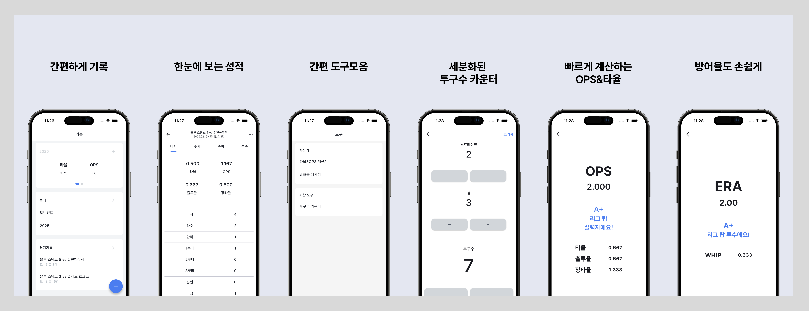

# Catchball - A Baseball Stats App for Amateur Players

<!--  -->

&nbsp;

## Project Overview

Catchball is a mobile application designed to help amateur and recreational baseball players log and manage their personal game records in detail. More than just a simple stats tracker, the app organizes game data structurally and visually to support performance analysis and player development over time.

&nbsp;

## Key Features

- Position-specific stat recording

  - Dedicated input screens for batting, pitching, fielding, and baserunning
  - Users can save records per game and organize them into folders by season, team, or any grouping
  - The app calculates aggregate stats for each folder (e.g., batting average, OPS, ERA)

- Quick and intuitive stat tools

  - Built-in calculators for batting average and ERA
  - A pitch counter for tracking pitch counts during games

- Cross-platform release
  - Available on both Google Play Store and Apple App Store

&nbsp;

## Tech Stack

| Category         | Technology Used                             |
| ---------------- | ------------------------------------------- |
| **Frontend**     | Flutter (Dart)                              |
| **Backend / DB** | Firebase                                    |
| **Architecture** | Clean Architecture                          |
| **CI/CD**        | Manual builds via Play Console / TestFlight |

&nbsp;

App Store: https://apps.apple.com/kr/app/%EC%BA%90%EC%B9%98%EB%B3%BC-%EA%B2%BD%EA%B8%B0%EA%B8%B0%EB%A1%9D-%EB%B3%BC%EC%B9%B4%EC%9A%B4%ED%84%B0-%ED%83%80%EC%9C%A8-%EB%B0%A9%EC%96%B4%EC%9C%A8-%EA%B3%84%EC%82%B0%EA%B8%B0/id6670429220?l=en-GB

Play Store: https://play.google.com/store/apps/details?id=com.blackcode.catchball&pcampaignid=web_share
