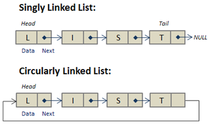

# What is Circular Linked List?

A circular linked list differs from a traditional linked list in that the last node does not point to 'NULL'. Instead, its link points back to the first node of the list, forming a circular structure. This unique feature enables efficient traversal of the entire list from any starting point, as each node can access all subsequent nodes. Additionally, operations such as insertion and deletion of nodes are simpler compared to those in a singly linked list, as there is no need to update pointers to maintain list integrity.


<!--  -->

sorce: https://study.com/academy/lesson/circularly-linked-lists-in-java-creation-uses.html

&nbsp;

# Circular Linked List Node

This node structure closely resembles its counterpart in the singly linked list. It features a generic type 'data' variable to store information and a pointer variable, 'pLink', which points to the next node in the sequence.

```cpp
template <typename T>
struct CircularListNode {
	T data = NULL;
	CircularListNode* pLink = nullptr;
};
```

&nbsp;

# Cirular Linked List Class

As member variables, we have 'currentCount', which tracks the number of nodes (or data elements), and the variable for the header node.

```cpp
template <typename T>
class CircularList {
private:
	int currentCount = 0;
	CircularListNode<T> headerNode;

public:
...
}
```

&nbsp;

# Get data

This method traverses the list until it reaches the desired index, then returns the data value of the node at that index.

```cpp
int getData(int index) {
	if (index < this->currentCount) {
		CircularListNode<T>* pCurrentNode = &(this->headerNode);
		for (int i = 0; i <= index; i++) {
			pCurrentNode = pCurrentNode->pLink;
		}
		return pCurrentNode->data;
	}
	else {
		std::cout << "invaild index\n";
		return 1;
	}
}
```

&nbsp;

# Add data

When adding new data to the circular linked list, there are a few steps involved:

- Create a new node.
- Link the new node with the next node.
- Link the new node with the previous node.
- Ensure the first node points to itself if it's the only node in the list.

```cpp
void addData(int index, T data) {
	if (index <= this->currentCount) {
		CircularListNode<T>* pNewNode = new CircularListNode<T>;
		pNewNode->data = data;
		CircularListNode<T>* pPreNode = &(this->headerNode);

		for (int i = 0; i < index; i++) {
			pPreNode = pPreNode->pLink;
		}
		pNewNode->pLink = pPreNode->pLink;
		pPreNode->pLink = pNewNode;

		this->currentCount++;

		if (pNewNode->pLink == nullptr) {
			pNewNode->pLink = pNewNode; // link itself if it's the only node in the list
		}
	}
	else {
		std::cout << "invaild index\n";
	}
}
```

&nbsp;

# Remove data

The critical aspect of removing data in a circular linked list arises when removing the last node. If there's only one node left and it's removed, the header node still points to the removed node. To address this issue, the header node must be updated to point to 'NULL' after removing the last node.

```cpp
void removeData(int index) {
	if (index < this->currentCount) {
		CircularListNode<T>* pDelNode = nullptr;
		CircularListNode<T>* pPreNode = &(this->headerNode);

		for (int i = 0; i < index; i++) {
			pPreNode = pPreNode->pLink;
		}

		pDelNode = pPreNode->pLink;
		pPreNode->pLink = pDelNode->pLink;
		this->currentCount--;

		if (this->currentCount == 0) {
			this->headerNode.pLink = nullptr;
		}

		delete pDelNode;
	}
	else {
		std::cout << "invaild index\n";
	}
}
```

&nbsp;

# Delete List

```cpp
void deleteList() {
	CircularListNode<T>* pDelNode = nullptr;
	CircularListNode<T>* pNextNode = this->headerNode.pLink;

	for (int i = 0; i < this->currentCount; i++) {
		pDelNode = pNextNode;
		pNextNode = pNextNode->pLink;
		delete pDelNode;
	}
	this->currentCount = 0;
	this->headerNode.pLink = nullptr;
}
```

&nbsp;

# Print the list

```cpp
void print() {
	if (this->currentCount > 0) {
		CircularListNode<T>* pCurrentNode = this->headerNode.pLink;
		for (int i = 0; i < this->currentCount; i++) {
			std::cout << pCurrentNode->data << " ";
			pCurrentNode = pCurrentNode->pLink;
		}
		printf("\n");
	}
	else {
		std::cout << "no data exists\n";
	}
}
```

# Source code

```cpp
#include <iostream>

template <typename T>
struct CircularListNode {
	T data = NULL;
	CircularListNode* pLink = nullptr;
};

template <typename T>
class CircularList {
private:
	int currentCount = 0;
	CircularListNode<T> headerNode;

public:

	int getData(int index) {
		if (index < this->currentCount) {
			CircularListNode<T>* pCurrentNode = &(this->headerNode);
			for (int i = 0; i <= index; i++) {
				pCurrentNode = pCurrentNode->pLink;
			}
			return pCurrentNode->data;
		}
		else {
			std::cout << "invaild index\n";
			return 1;
		}
	}

	void addData(int index, T data) {
		if (index <= this->currentCount) {
			CircularListNode<T>* pNewNode = new CircularListNode<T>;
			pNewNode->data = data;
			CircularListNode<T>* pPreNode = &(this->headerNode);

			for (int i = 0; i < index; i++) {
				pPreNode = pPreNode->pLink;
			}
			pNewNode->pLink = pPreNode->pLink;
			pPreNode->pLink = pNewNode;

			this->currentCount++;

			if (pNewNode->pLink == nullptr) {
				pNewNode->pLink = pNewNode;
			}
		}
		else {
			std::cout << "invaild index\n";
		}
	}

	void removeData(int index) {
		if (index < this->currentCount) {
			CircularListNode<T>* pDelNode = nullptr;
			CircularListNode<T>* pPreNode = &(this->headerNode);

			for (int i = 0; i < index; i++) {
				pPreNode = pPreNode->pLink;
			}

			pDelNode = pPreNode->pLink;
			pPreNode->pLink = pDelNode->pLink;
			this->currentCount--;

			if (this->currentCount == 0) {
				this->headerNode.pLink = nullptr;
			}

			delete pDelNode;
		}
		else {
			std::cout << "invaild index\n";
		}
	}

	void deleteList() {
		CircularListNode<T>* pDelNode = nullptr;
		CircularListNode<T>* pNextNode = this->headerNode.pLink;

		for (int i = 0; i < this->currentCount; i++) {
			pDelNode = pNextNode;
			pNextNode = pNextNode->pLink;
			delete pDelNode;
		}
		this->currentCount = 0;
		this->headerNode.pLink = nullptr;
	}

	void print() {
		if (this->currentCount > 0) {
			CircularListNode<T>* pCurrentNode = this->headerNode.pLink;
			for (int i = 0; i < this->currentCount; i++) {
				std::cout << pCurrentNode->data << " ";
				pCurrentNode = pCurrentNode->pLink;
			}
			printf("\n");
		}
		else {
			std::cout << "no data exists\n";
		}
	}

};
```
