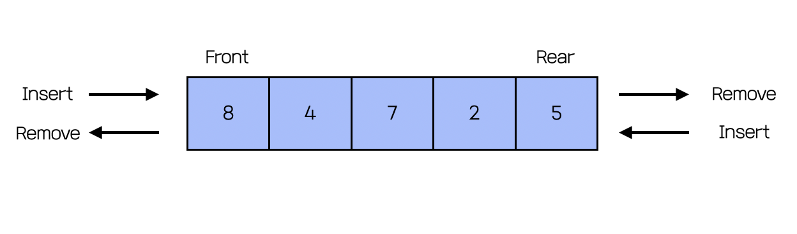
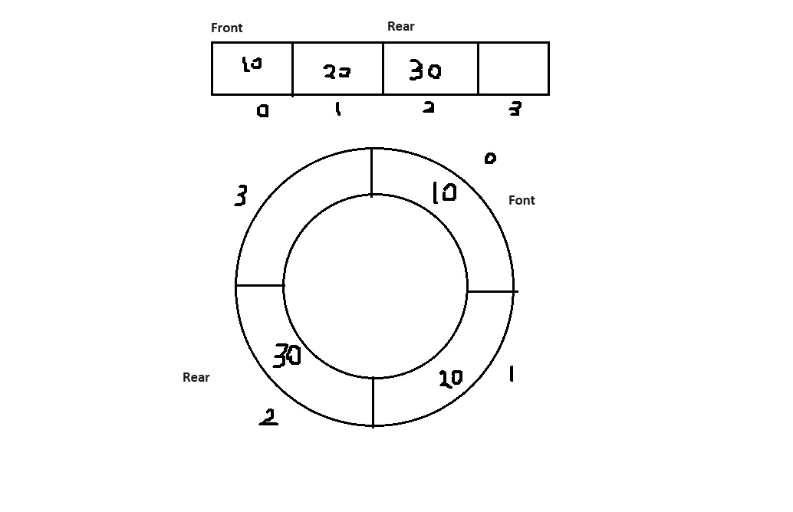
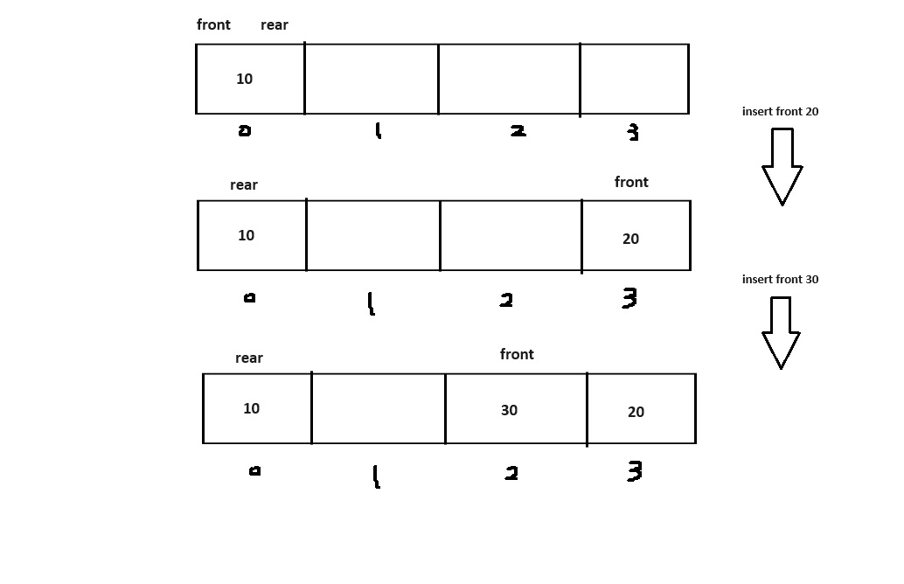

# What is a deque?

- A deque, short for "double-ended queue," combines the features of both a stack and a queue.
- It supports adding data to both the front and rear, as well as removing data from both ends.
- Deques can be implemented using circular arrays or linked lists.
- The time complexity for insertion and deletion operations is O(1).


<!--  -->

&nbsp;

## Linked Deque

- Using linked list
- Simpler implementation
- No limit on the number of elements
- Consumes more resources for adding, relinking, and deleting memory.

&nbsp;

### Linked Deque Node

There are two pointer variable for links. This two variable points both ways.

```cpp
template <typename T>
struct LinkedDequeNode
{
    T data;
    LinkedDequeNode<T>* pNext = nullptr;
    LinkedDequeNode<T>* pPrev = nullptr;
};
```

&nbsp;

### Linked Deque Class

Member variables are pretty simple. The key is that there are pointer variables for positon of front and rear.

```cpp
template <typename T>
class LinkedDeque
{
private:
    int curretnCount = 0;
    LinkedDequeNode<T>* pFront;
    LinkedDequeNode<T>* pRear;

public:
// methods
```

&nbsp;

### insertFront

There are few things to consider here.

If there is already data...

- The next node of new node should be the current front node.
- The previous node of new node should be the current rear node
- The next node of current rear node is new node.
- New node becomes front node.

If ther no any data...

- New node becomes both front and rear node.

```cpp
void insertFront(T data)
{
    LinkedDequeNode<T>* pNode = new LinkedDequeNode<T>;
    pNode->data = data;
    if (!isEmpty())
    {
        pNode->pNext = this->pFront;
        pNode->pPrev = this->pRear;
        this->pRear->pNext = pNode;
        this->pFront = pNode;
    }
    else
    {
        this->pFront = pNode;
        this->pRear = pNode;
    }
    this->curretnCount++;
}
```

&nbsp;

### insertRear

The process of insertion on rear is similar.

```cpp
void insertRear(int data)
{
    LinkedDequeNode<T>* pNode = new LinkedDequeNode<T>;
    pNode->data = data;

    if (!isEmpty())
    {
        pNode->pPrev = this->pRear;
        pNode->pNext = this->pFront;
        this->pRear->pNext = pNode;
        this->pRear = pNode;
    }
    else
    {
        this->pFront = pNode;
        this->pRear = pNode;
    }
    this->curretnCount++;
}
```

&nbsp;

### deleteFront

- Create a pointer variable that points to the current front node, which will be the node to delete.
- Set the front node to be the next node of the deletion node.
- Update the previous node of the newly set front node to be the previous node of the deletion node.
- Update the next node of the current rear node to point to the new front node.
- Free the memory occupied by the deletion node.
- If there are no remaining nodes, reset both the front and rear pointers to nullptr to avoid dangling pointers.

```cpp
void deleteFront()
{
    if (!isEmpty())
    {
        LinkedDequeNode<T>* pDelNode = this->pFront;
        this->pFront = pDelNode->pNext;
        this->pFront->pPrev = pDelNode->pPrev;
        this->pRear->pNext = this->pFront;
        delete pDelNode;
        this->curretnCount--;

        if (this->curretnCount == 0)
        {
            this->pFront = nullptr;
            this->pRear = nullptr;
        }
    }
    else
    {
        std::cout << "deque is empty!\n";
    }
}
```

&nbsp;

### deleteRear

```cpp
void deleteRear()
{
    if (!isEmpty())
    {
        LinkedDequeNode<T>* pDelNode = this->pRear;
        this->pRear = pDelNode->pPrev;
        this->pRear->pNext = this->pFront;
        this->pFront->pPrev = this->pRear;
        delete pDelNode;
        this->curretnCount--;

        if (this->curretnCount == 0)
        {
            this->pFront = nullptr;
            this->pRear = nullptr;
        }
    }
    else
    {
        std::cout << "Deque is emtpy!\n";
    }
}
```

&nbsp;

### Rest code

```cpp
bool isEmpty()
{
    bool ret = false;
    if (this->curretnCount == 0)
    {
        ret = true;
    }
    return ret;
}

T peekFront()
{
    if (!isEmpty())
    {
        return this->pFront->data;
    }
    else
    {
        std::cout << "Deque is empty!\n";
    }
}

T peekRear()
{
    if (!isEmpty())
    {
        return this->pRear->data;
    }
    else
    {
        std::cout << "Deque is empty!\n";
    }
}

void print()
{

    std::cout << "count: " << this->curretnCount << std::endl;

    LinkedDequeNode<T>* pNode = this->pFront;
    for (int i = 0; i < this->curretnCount; i++)
    {
        std::cout << pNode->data << " ";
        pNode = pNode->pNext;
    }
    printf("\n");
}

~LinkedDeque()
{

    for (int i = 0; i < this->curretnCount; i++)
    {
        deleteFront();
    }
}
```

&nbsp;

### Result

```cpp
int main()
{
    LinkedDeque<int>* a = new LinkedDeque<int>;

    a->insertFront(1);
    a->insertFront(2);
    a->insertFront(3);
    a->print();

    a->deleteFront();
    a->print();

    a->insertRear(4);
    a->print();

    a->deleteRear();
    a->print();

    a->deleteFront();
    a->deleteFront();
    a->print();
    a->deleteRear();

    delete a;

    return 0;
}
```

```sh
count: 3
3 2 1
count: 2
2 1
count: 3
2 1 4
count: 2
2 1
count: 0

Deque is emtpy!
```

&nbsp;

## Circular Arrary Deque

- The insertion and deletion processes are straightforward. All is about to update the index of the front and rear.
- Due to its fixed size, expanding an array to accommodate additional data incurs significant costs.

&nbsp;

### Circular Array Node

```cpp
template <typename T>
struct CircularArrayDequeNode {
	T data = NULL;
};
```

&nbsp;

### Circular Array Class

The crucial aspect here is that the values of 'front' and 'rear' are initialized to 1 and -1, respectively. In a circular array queue, these variables typically start with a value of -1. This is done to facilitate connecting the beginning of the array with the end of it using modulo operations. However, in a deque, data can be inserted from the front. Therefore, the initial value of 'front' should be 1 to accommodate this functionality. I'll delve into more details later.


<!--  -->

```cpp
template <typename T>
class CircularArrayDeque {
private:
	int currentCount = 0;
	int maxCount;
	int front = 1;
	int rear = -1;
	CircularArrayDequeNode<T>* pData;
public:
// member function
```

&nbsp;

### Constructor

```cpp
	CircularArrayDeque(int size)
		:maxCount{ size }
	{
		this->pData = new CircularArrayDequeNode<T>[size];
	}
```

&nbsp;

### insertFront

The key of inserting at the front lies in determining the index. Suppose we have an array with a size of four. When adding the first data, the index should be 0. If we add another data at the front, the index should be the length of the array minus 1, which is 3. Subsequently, with each new addition, the index decreases by 1. So, we discern two features:

When inserting data at the front:

1. The new front index is the current index minus 1.
2. If the current index is 0, the index should reset to the index of the end of the array.


<!--  -->

To address this, I've created a new function named 'setFront' that calculates the index of the new front. Essentially, it decrements the current index by 1. However, if the resulting index is less than 0, the value is reassigned to the size of the array minus 1.

Furthermore, the reason for initializing the 'front' variable with 1 is as follows: if there's no data in the array, the index of the first data should be 0. However, since the 'setFront' function essentially subtracts from the index, it would result in a negative value (-2) if the 'front' is initially -1. Consequently, the first data would be positioned at the end of the array. To avoid this, I initialize 'front' with 1.

Also, when added data is the first data in the array, value of 'rear' which is -1 should count up.

```cpp
void insertFront(T data) {

	if (!isFull()) {
		this->front = setFront();
		this->pData[this->front].data = data;

		if (this->currentCount == 0) {
			this->rear++;
		}
		this->currentCount++;

	}
	else {
		std::cout << "deque is full\n";
	}
}
```

```cpp
	int setFront() {
		int index = this->front - 1;
		if (index < 0) {
			index = this->maxCount - 1;
		}
		return index;
	}
```

&nbsp;

### deleteFront

This method mirrors the dequeue process in a queue. Upon deleting data, the 'front' value is updated to the remainder of (front + 1) divided by 'size'. However, a key distinction is made when there are no remaining elements: the 'rear' variable is set to -1.

```cpp
void deleteFront() {
	if (!isEmpty()) {
		this->pData[this->front].data = NULL;
		this->front = (this->front + 1) % this->maxCount;
		this->currentCount--;
		if (this->currentCount == 0) {
			this->rear == -1;
		}
	}
	else {
		std::cout << "deque is empty\n";
	}
}
```

&nbsp;

### insertRear

This is same as the enqueue prcoess in a queue. One different thing is that value of 'front' should decrease by 1 when adding first data at rear.

```cpp
void insertRear(T data) {
	if (!isFull()) {
		this->rear = (this->rear + 1) % this->maxCount;
		this->pData[this->rear].data = data;
		if (this->currentCount == 0) {
			this->front--;
		}
		this->currentCount++;
	}
	else {
		std::cout << "deque is full\n";
	}
}

```

&nbsp;

### deleteRear

Similar to inserting at the front, deleting from the rear involves a process to compute the index for the new rear. Consider an array with a size of four. Initially, the rear index is 2 and the front index is 3. With each deletion from the rear, the rear index decreases by 1. Eventually, when the rear index reaches 0 and another deletion from the rear occurs, the rear index should wrap around to the size minus one, which is 3. This illustrates two principles consistent with insertion at the front:

1. The new rear index is computed by subtracting 1 from the current index.
2. If the current index is 0, the index should be reset to the index of the end of the array.

```cpp
void deleteRear() {
	if (!isEmpty()) {
		this->pData[this->rear].data = NULL;
		this->rear = setRear();
		this->currentCount--;

		if (this->currentCount == 0) {
			this->front = 1;
		}
	}
	else {
		std::cout << "deque is empty\n";
	}
}

int setRear() {
	int index = this->rear - 1;
	if (index < 0) {
		index = this->maxCount - 1;
	}
	return index;
}
```

&nbsp;

### Rest code

```cpp
T peekFront()
{
	if (!isEmpty())
	{
		return this->pData[this->front].data;
	}
	else
	{
		std::cout << "Deque is empty!\n";
	}
}

T peekRear()
{
	if (!isEmpty())
	{
		return this->pData[this->rear].data;
	}
	else
	{
		std::cout << "Deque is empty!\n";
	}
}

// prinit an arrary from the front to the rear.
void print() {
	std::cout << "Nodes: " << this->currentCount << std::endl;

	int index = this->front;

	int i = 0;
	while (i < this->maxCount) {
		std::cout << this->pData[index].data << " ";
		index = (index + 1) % this->maxCount;
		i++;
	}
		printf("\n");
}

~CircularArrayDeque() {
	delete[] pData;
}
```

&nbsp;

### Result

```cpp
int main() {

	CircularArrayDeque<int>* a = new CircularArrayDeque<int>(4);

	a->insertRear(1);
	a->insertRear(2);
	a->insertFront(3);
	a->insertRear(4);
	a->print();

	a->deleteFront();
	a->print();

	a->insertFront(3);
	a->deleteRear();
	a->print();

	a->insertFront(4);
	a->insertFront(5);
	a->print();

	a->insertRear(6);
	a->insertFront(7);
	a->print();

	a->deleteFront();
	a->deleteRear();
	a->deleteRear();
	a->deleteRear();

	a->insertFront(1);
	a->print();

	std::cout << "front: " << a->peekFront() << std::endl;


	return 0;
}
```

```sh
Nodes: 4
3 1 2 4
Nodes: 3
1 2 4 0
Nodes: 3
3 1 2 0
deque is full
Nodes: 4
4 3 1 2
deque is full
deque is full
Nodes: 4
4 3 1 2
Nodes: 1
1 0 0 0
front: 1
```
