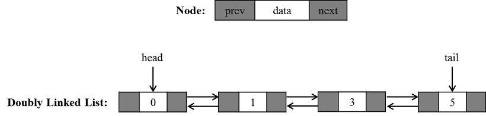
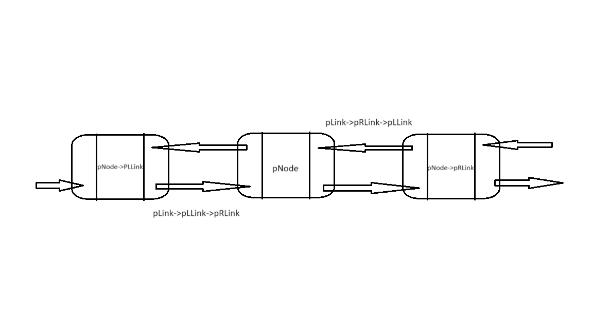

# What is Doubly Linked List?

In a doubly linked list, nodes are interconnected in both forward and backward directions. Unlike singly linked lists and circular linked lists, where nodes only point to the next node, doubly linked lists facilitate direct access to the previous node. For instance, in a singly linked list, accessing the previous node requires iterating the list from the beginning again, while in a circular linked list, it necessitates traversing the list until reaching the desired previous node.

Essentially, nodes in a doubly linked list maintain two types of links: one pointing to the next node and another to the previous node.

<!-- Notably, the first node lacks a previous node, so it points to "NULL" for the previous node. Similarly, the last node indicates "NULL" as its next node. -->


<!--  -->

Image source: https://untitledtblog.tistory.com/84

It seems there are two different approaches to implement doubly linked list. One option is to link the first and the last node each other as like circular linked list. However, the book I'm referencing suggests linking the first node to the header node as the previous node and the last node to the header node as the next node. Therefore, I will adhere to the second method.

&nbsp;

# Doubly Linked List Node

The key aspect to note is the presence of two pointer variables for links.

```cpp
template <typename T>
struct DoublyListNode {
	T data = NULL;
	DoublyListNode* pLLink = nullptr;
	DoublyListNode* pRLink = nullptr;
};
```

&nbsp;

# Doubly Linked List Class

Here's a crucial distinction from other lists: the doubly linked list requires a class constructor to initialize the links of the header node. The pointer variables for the header node must be updated with its own address. This is essential for the functionality of a doubly linked list.

```cpp
pNode == pNode->pLLink->pRLink == pNode->pRLink->pLLink
```

For instance, consider a scenario with just one node in the doubly linked list. Its next node's previous node is itself, and its previous node's next node is also itself. The doubly linked list must maintain this feature, hence the need to initialize the header node as shown in the code below:


<!--  -->

```cpp
template <typename T>
class DoublyList {
private:
	int currentCount = 0;
	DoublyListNode<T> headerNode;
public:
	DoublyList() {
		this->headerNode.pLLink = &(this->headerNode);
		this->headerNode.pRLink = &(this->headerNode);
	}
...
}
```

&nbsp;

# Get Data

The process to add new data involves several steps:

1. Create a new node and initialize the data variable.
2. Find the previous node (pPreNode) of the desired index.
3. Set pPreNode as the previous node for the new node, and set pPreNode->pRLink as the next node for the new node.
4. Update pPreNode->pRLink with the address of the new node.
5. Update the previous link of the next node of the new node with the address of the new node.

```cpp
void addData(int index, T data) {
		if (index <= this->currentCount) {
			DoublyListNode<T>* pNewNode = new DoublyListNode<T>;
			pNewNode->data = data;
			DoublyListNode<T>* pPreNode = &(this->headerNode);

			for (int i = 0; i < index; i++) {
				pPreNode = pPreNode->pRLink;
			}

			pNewNode->pRLink = pPreNode->pRLink;
			pNewNode->pLLink = pPreNode;
			pPreNode->pRLink = pNewNode;
			pNewNode->pRLink->pLLink = pNewNode;

			this->currentCount++;
		}
		else {
			std::cout << "invaild index\n";
		}
	}
```

&nbsp;

# Remove Data

The key is to find the previos node of the node that should be deleted.

1. Find the previous node (pPreNode) of the desired index.
2. Update the variable for the desired node with the link of the previous node's next (pPreNode->pRLink).
3. Update the previous node's link for the next node with the desired node's link of the next.
4. Update the link for the previous node of the desired node's next node with the previous node.
5. Free the desired node.

```cpp
void removeData(int index) {
		if (index < this->currentCount) {
			DoublyListNode<T>* pDelNode = nullptr;
			DoublyListNode<T>* pPreNode = &(this->headerNode);

			for (int i = 0; i < index; i++) {
				pPreNode = pPreNode->pRLink;
			}

			pDelNode = pPreNode->pRLink;
			pPreNode->pRLink = pDelNode->pRLink;
			pDelNode->pRLink->pLLink = pPreNode;
			this->currentCount--;

			delete pDelNode;
		}
		else {
			std::cout << "invaild index\n";
		}
	}
```

&nbsp;

# Get Data

```cpp
int getData(int index) {
		if (index < this->currentCount) {
			DoublyListNode<T>* pCurrentNode = &(this->headerNode);

			for (int i = 0; i <= index; i++) {
				pCurrentNode = pCurrentNode->pRLink;
			}
			return pCurrentNode;
		}
		else {
			std::cout << "invaild index!\n";
		}
	}
```

&nbsp;

# Return length of the list

```cpp
int length() {
		return this->currentCount;
	}
```

&nbsp;

# Print list

Update and print the data of node until the updated node's address is not the address of the header node.

```cpp
void print() {
		if (this->currentCount > 0) {
			DoublyListNode<T>* pCurrentNode = this->headerNode.pRLink;
			while (pCurrentNode != &(this->headerNode)) {
				std::cout << pCurrentNode->data << " ";
				pCurrentNode = pCurrentNode->pRLink;
			}
			printf("\n");
		}
		else {
			std::cout << "no data\n";
		}
	}
```

&nbsp;

# Delete the whole list

```cpp
void deleteList() {
	while (this->currentCount > 0) {
		this->removeData(0);
	}
}
```

&nbsp;

# Source code

```cpp
#include <iostream>

template <typename T>
struct DoublyListNode {
	T data = NULL;
	DoublyListNode* pLLink = nullptr;
	DoublyListNode* pRLink = nullptr;
};

template <typename T>
class DoublyList {
private:
	int currentCount = 0;
	DoublyListNode<T> headerNode;
public:
	DoublyList() {
		this->headerNode.pLLink = &(this->headerNode);
		this->headerNode.pRLink = &(this->headerNode);
	}

	int getData(int index) {
		if (index < this->currentCount) {
			DoublyListNode<T>* pCurrentNode = &(this->headerNode);

			for (int i = 0; i <= index; i++) {
				pCurrentNode = pCurrentNode->pRLink;
			}
			return pCurrentNode;
		}
		else {
			std::cout << "invaild index!\n";
		}
	}

	void addData(int index, T data) {
		if (index <= this->currentCount) {
			DoublyListNode<T>* pNewNode = new DoublyListNode<T>;
			pNewNode->data = data;
			DoublyListNode<T>* pPreNode = &(this->headerNode);

			for (int i = 0; i < index; i++) {
				pPreNode = pPreNode->pRLink;
			}

			pNewNode->pRLink = pPreNode->pRLink;
			pNewNode->pLLink = pPreNode;
			pPreNode->pRLink = pNewNode;
			pNewNode->pRLink->pLLink = pNewNode;

			this->currentCount++;
		}
		else {
			std::cout << "invaild index\n";
		}
	}

	void removeData(int index) {
		if (index < this->currentCount) {
			DoublyListNode<T>* pDelNode = nullptr;
			DoublyListNode<T>* pPreNode = &(this->headerNode);

			for (int i = 0; i < index; i++) {
				pPreNode = pPreNode->pRLink;
			}

			pDelNode = pPreNode->pRLink;
			pPreNode->pRLink = pDelNode->pRLink;
			pDelNode->pRLink->pLLink = pPreNode;
			this->currentCount--;

			delete pDelNode;
		}
		else {
			std::cout << "invaild index\n";
		}

	}

	int length() {
		return this->currentCount;
	}

	void print() {
		if (this->currentCount > 0) {
			DoublyListNode<T>* pCurrentNode = this->headerNode.pRLink;
			while (pCurrentNode != &(this->headerNode)) {
				std::cout << pCurrentNode->data << " ";
				pCurrentNode = pCurrentNode->pRLink;
			}
			printf("\n");
		}
		else {
			std::cout << "no data\n";
		}
	}

	void deleteList() {
		while (this->currentCount > 0) {
			this->removeData(0);
		}
	}


};
```
