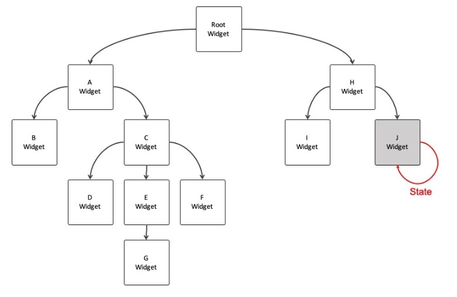
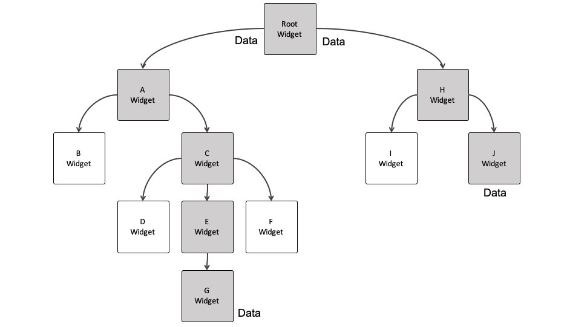
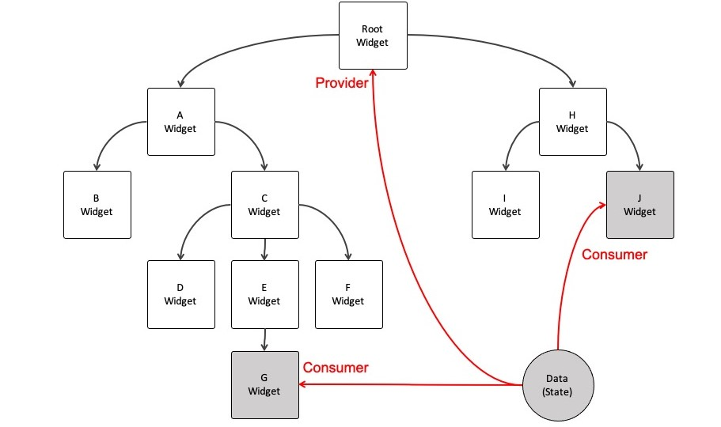
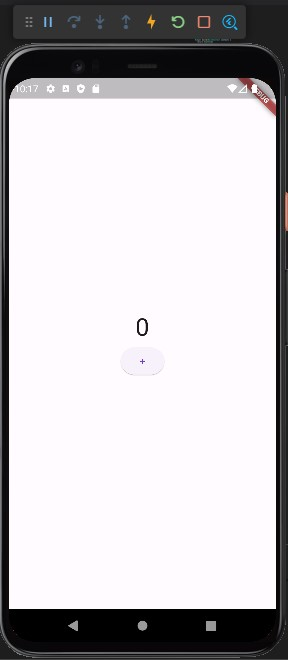
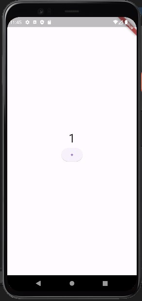
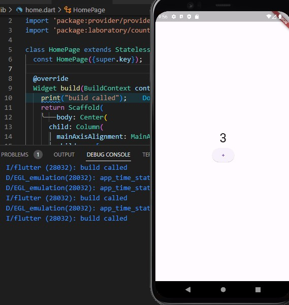
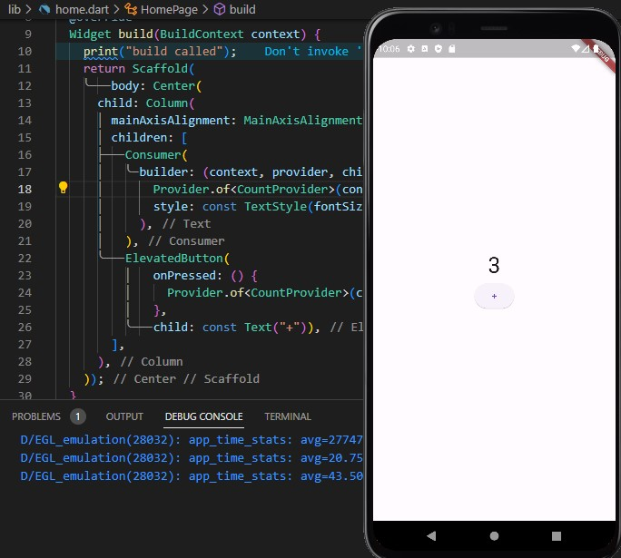

# Provider

Provider is a Flutter package designed for state management, which essentially involves managing data within your app. While lightweight apps may not demand intricate state management, it becomes increasingly critical as your app scales in size and complexity.

&nbsp;

# Why do we use Provider?

One of the simplest ways to manage state in Flutter is by using Stateful Widgets. These widgets enable dynamic changes to the user interface based on the data within the widget's state.


<!--  -->

When multiple widgets require access to the same state data, they can share this data if their parent widget is a Stateful Widget, which passes the state as a parameter to these child widgets.

However, when one of the child widgets needing the same state has multiple parent widgets, all widgets, including those that don't require rebuilding, are also rebuilt, leading to potential performance issues. To address this problem, the Provider package comes into play.


<!--  -->


Provider enables widgets to share the same state efficiently without causing unnecessary rebuilds. It does so by employing an independent class that stores states (data) independently of the widget tree. The provider is then supplied to the parent widget, and the widgets requiring the state can consume data directly from the provider.


<!--  -->


&nbsp;

# Exmaple

Here's an example of an app that utilizes the Provider package. This app is incredibly straightforward, consisting of a text field that displays a count and a button to increment it.


<!--  -->

&nbsp;

## main.dart

```dart
import 'package:flutter/material.dart';
import 'home.dart';

void main() {
  runApp(const MyApp());
}

class MyApp extends StatelessWidget {
  const MyApp({super.key});

  // This widget is the root of your application.
  @override
  Widget build(BuildContext context) {
    return MaterialApp(
      title: 'Flutter Laboratory',
      theme: ThemeData(
        colorScheme: ColorScheme.fromSeed(seedColor: Colors.deepPurple),
        useMaterial3: true,
      ),
      home: const HomePage(),
    );
  }
}
```

&nbsp;

## home.dart
```dart
import 'package:flutter/material.dart';

class HomePage extends StatelessWidget {
  const HomePage({super.key});

  @override
  Widget build(BuildContext context) {
    return Scaffold(
        body: Center(
      child: Column(
        mainAxisAlignment: MainAxisAlignment.center,
        children: [
          const Text(
            '0',
            style: TextStyle(fontSize: 36),
          ),
          ElevatedButton(onPressed: () {}, child: const Text("+")),
        ],
      ),
    ));
  }
}

```


Next, I established the CountProvider class to store data globally. To achieve this, the provider class must utilize the ChangeNotifier class through the **with** keyword. Within this class, I established a private integer variable along with a getter method. Additionally, I incorporated a function to increment the count. The key aspect of this function is the call to **notifyListeners()**, which belongs to the ChangeNotifier class. This call informs the app of any changes that have occurred.

&nbsp;

## count_provider.dart
```dart
import 'package:flutter/material.dart';

class CountProvider with ChangeNotifier {
  int _count = 0;
  int get count => _count;

  void addCount() {
    _count++;
    notifyListeners();
  }
}
```

Now, let's ensure that this provider is accessible at the highest level of the application. This is akin to water flowing down from the summit of a mountain, allowing every tree to absorb the water. To do this, wrap your **MaterialApp** or **MyApp** with **ChangeNotifierProvider**.


```dart

void main() {
  runApp(const MyApp());
}

class MyApp extends StatelessWidget {
  const MyApp({super.key});

  @override
  Widget build(BuildContext context) {
    return ChangeNotifierProvider(
      create: (context) => CountProvider(),
      child: MaterialApp(
```

However, in real-world applications, you'll likely have multiple providers. In such cases, you should use **MultiProvider** and include all your **ChangeNotifierProvider**s within the list.

```dart
  Widget build(BuildContext context) {
    return MultiProvider(
      providers: [
        ChangeNotifierProvider(create: (context) => CountProvider()),
      ],
      child: MaterialApp(
```

&nbsp;

# How to consume Provider

1. Provider.of<T>(context)
   

  ```dart
  Provider.of<T>(context) 
  Provider.of<T>(context, listen: true) 
  Provider.of<T>(context, listen: false)
  ```

  This is the basic way to consume data from provider.
  You can set the **listen** parameter to **true** for the UI elements that will be updated when **notifyListeners()** is called (the default behavior). Conversely, set **listen** to **false** for UI elements that don't need updates when the data changes.

  When **listen** is set to **true**, the entire widget subscribing to the provider will be rebuilt.

  ```dart
  Text(
    Provider.of<CountProvider>(context).count.toString(),
    style: const TextStyle(fontSize: 36),
  ),
  ElevatedButton(
      onPressed: () {
        Provider.of<CountProvider>(context, listen: false).addCount();
        // UI for this button does not change so it is false.
      },
      child: const Text("+")),
  ```


<!--  -->

&nbsp;

2. using BuildContext

Originally, context.watch and context.read were distinct from Provider.of, but after a certain version update, they became quite similar in terms of functionality. The choice between them now largely depends on personal preference.

```dart
context.watch<T>()
context.read<T>()
context.select<T, R>(R cb(T value))
```
```dart
Text(
  context.watch<CountProvider>().count.toString(),
  style: const TextStyle(fontSize: 36),
),
ElevatedButton(
    onPressed: () {
      context.read<CountProvider>().addCount();
    },
    child: const Text("+")),
```


```dart
context.watch<T>()
// which makes the widget listen to changes on T. similar to Provider.of<T>(context).
// If there is any change on the class T


context.read<T>()
// which returns T without listening to it. similar to Provider.of<T>(context, listen: false).


context.select<T, R>(R cb(T value))
// which allows a widget to listen to only a small part of T. 

// for example, only listen to the field "name"
class Person extends ChangeNotifier{
  Streing name;
  int age;
  ...
}

Widget build(BuildContext context) {
  return Text('name:${context.select((Person p) => p.name)}');

  // or context.select<Person, String>((Person p)
}

```


1. Consumer

Using the Consumer widget has similar performance characteristics to Provider.of, but there are specific cases where it's a better choice.

**Consumer** is particularly useful when you need to create and consume a provider within the same build method. In other words, when there are no child **BuildContext** instances of the provider, **Provider.of** cannot be used effectively, and **Consumer** provides a more suitable alternative.

context: variable that stores widget position information in the widget tree.

of method: searches for the nearest widget upwards in the widget tree.

```dart
@override
Widget build(BuildContext context // there's no provider widget above this context
) {
  return ChangeNotifierProvider(
    create: (context) => CountProvider(),
    child: Text(Provider.of<CountProvider>(context).count.toString()),
  );
}
```

An error **ProviderNotFoundException** is returned because the provider widget does not exist upwards based on the current context (position).

```dart
@override
Widget build(BuildContext context) {
  return ChangeNotifierProvider(
    create: (context) => CountProvider(),
    child: Consumer<CountProvider>(
      builder: (context, countProvider, child) => Text(countProvider.count.toString()),
    },
  );
}
```

The Consumer widget is useful when you want to rebuild only specific widgets, rather than rebuilding the entire widget tree.

When BarWidget changes, FooWidget is rebuilt too.
```dart
@override
 Widget build(BuildContext context) {
   return FooWidget(
     child: BarWidget(
       bar: Provider.of<Bar>(context),
     ),
   );
 }
```

Now, only BarWidget reuilds.

```dart
@override
 Widget build(BuildContext context) {
   return FooWidget(
     child: Consumer<Bar>(
       builder: (_, bar, __) => BarWidget(bar: bar),
     ),
   );
 }
```


Reversely, when FooWidget changes, BarWidget is rebuilt too.

```dart
 @override
 Widget build(BuildContext context) {
   return FooWidget(
     foo: Provider.of<Foo>(context),
     child: BarWidget(),
   );
 }
```

The child property of Consumer allows you to specify a widget that should not be rebuilt when the builder's returned widget is being rebuilt.

```dart
@override
 Widget build(BuildContext context) {
   return Consumer<Foo>(
     builder: (_, foo, child) => FooWidget(foo: foo, child: child),
     child: BarWidget(),
   );
 }
```

For instance, this is the same code I previously shared, which utilizes Provider.of with listen set to true. I added a print statement to observe whether the build method is invoked.

```dart
class HomePage extends StatelessWidget {
  const HomePage({super.key});

  @override
  Widget build(BuildContext context) {
    print("build called");
    return Scaffold(
        body: Center(
      child: Column(
        mainAxisAlignment: MainAxisAlignment.center,
        children: [
          Text(
            Provider.of<CountProvider>(context).count.toString(),
            style: const TextStyle(fontSize: 36),
          ),
          ElevatedButton(
              onPressed: () {
                Provider.of<CountProvider>(context, listen: false).addCount();
              },
              child: const Text("+")),
        ],
      ),
    ));
  }
}
```

Whenever the count increments, the build method is triggered, causing all widgets, including unnecessary ones, to rebuild.


<!--  -->


In this case, I wrapped the Text widget that uses Provider.of with listen set to true with a Consumer. As a result, even when the count increases, the rebuild method is not triggered again. This improves performance of the app.

```dart
Consumer(
  builder: (context, provider, child) => Text(
    Provider.of<CountProvider>(context).count.toString(),
    style: const TextStyle(fontSize: 36),
  ),
```


<!--  -->

&nbsp;

# MVVM design pattern

To use provider, MVVM design pattern is necessary. Then, what is MVVM design pattern? and What is design pattern? I asked these questions to ChatGPT.

MVVM stands for Model-View-ViewModel, which is a design pattern used in software development. A design pattern is a general reusable solution to a commonly occurring problem within a given context in software design. It's like a template or blueprint for solving a particular problem in a structured and efficient way.

MVVM, specifically, is a design pattern that separates the user interface (View) from the application's business logic (Model) with the help of an intermediate layer (ViewModel). Here's a brief explanation of each component:

1. **Model (M)**: The Model represents the application's data and business logic. It is responsible for retrieving data from various sources (like databases, APIs, etc.), processing that data, and providing it to the ViewModel. The Model should not contain any information about how the data is displayed.

2. **View (V)**: The View represents the user interface elements, such as buttons, labels, and screens. It is responsible for displaying data and capturing user input. In MVVM, the View is passive and should not contain any application logic. Instead, it binds to the ViewModel to display data and respond to user actions.

3. **ViewModel (VM)**: The ViewModel acts as an intermediary between the Model and the View. It contains the presentation logic and exposes data and commands that the View can bind to. The ViewModel transforms the raw data from the Model into a format that the View can easily display. It also handles user interactions and communicates with the Model to retrieve or update data.

MVVM promotes separation of concerns, making it easier to maintain and test code. It's particularly well-suited for applications with complex user interfaces, where the presentation logic can become intricate.