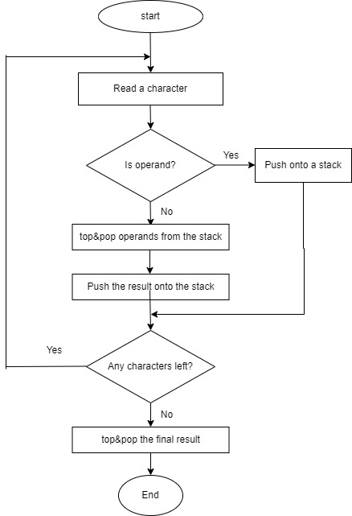
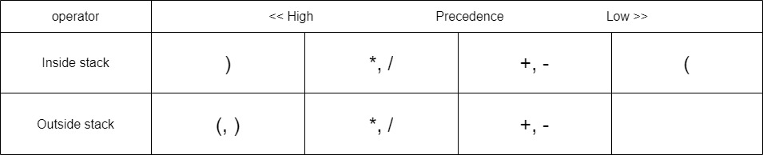
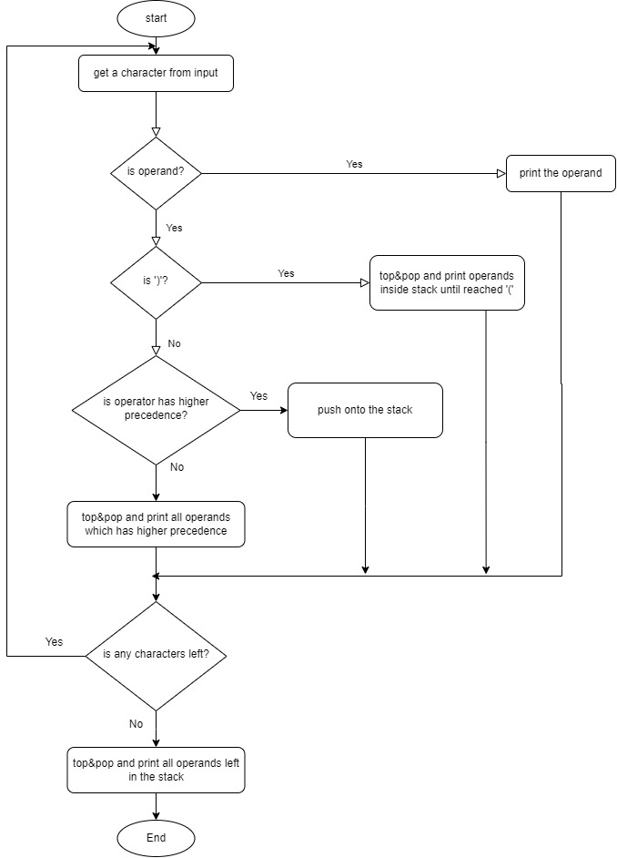

# How can we use a stack?

One popular example of using a stack is with postfix notation. In real-world math expressions, we commonly use infix notation, such as "A + B," which is easy for humans to read and understand. However, computers find it challenging to process infix expressions. As a solution, we have postfix notation such as "A B +".

&nbsp;

# Postfix Notation

In postfix notation, all operators come after the operands, allowing computers to read expressions from left to right. When expressions become complicated with precedence, one must halt reading from the left and calculate precedence first (from right to left) in infix notation.

&nbsp;

#### Infixt Notion

    $A + B * C$

- First Step: $B * C$
- Second Step: $A + (B * C)$

However, postfix notation simplifies this complexity. Computers can calculate from left to right without needing to process precedence. How simple it is.

&nbsp;

#### Postfix Notion

$A B C * +$

- First Step: Read A
- Second Step: Read B
- Third Step: Read C
- Fourth Step: Multiply the operands B and C in front of \*
- Fifth Step: Add the operands A and (B\*C) in front of +

So postfix notion is simply a process that calculate last two operands. You put operands in a box and take last operands.This is LIFO system and why you need a stack here.

the procees of postfix notation with a stack is..

1. Operand is pushed in the stack
2. when reached the operlator, take operands out(top and pop) as much as needed
3. Caluates it and push the result in the stack again.

&nbsp;

# Calculating postfix expression

Let's now proceed with implementing the code for calculating postfix notation. The following flowchart illustrates the steps involved. Essentially, the process entails looping through each character in the input string and performing the three aforementioned processes.


<!--  -->

&nbsp;

To utilize the stack, I've included the 'stack' header file from the Standard Template Library (STL). Additionally, it's crucial to determine whether each character is a digit or not. For this purpose, I've included the 'cctype' header to utilize the 'isdigit()' method.

```cpp
#include <iostream>
#include <stack>
#include <string>
#include <cctype>

int calPostFix(std::string exp) {
	std::stack<int> s;

	for (int i = 0; i < exp.length(); i++) {
		if (isdigit(exp[i])) {
			int conNum = exp[i] - '0';
			s.push(conNum);
		}
		else {
			int op2 = s.top();
			s.pop();
			int op1 = s.top();
			s.pop();

			switch (exp[i])
			{
			case '+':
				s.push(op1 + op2);
				break;
			case '-':
				s.push(op1 - op2);
				break;
			case '*':
				s.push(op1 * op2);
				break;
			case '/':
				s.push(op1 / op2);
				break;
			}
		}
	}
	int result = s.top();
	s.pop();
	return result;
}
```

&nbsp;

The following section is dedicated to converting character-type digits to integer-type digits. By subtracting two characters, the computer computes the difference in their ASCII values. In the ASCII table, the character '0' corresponds to the number 48. Thus, subtracting 48 from a numeric character's ASCII value yields its integer equivalent. For instance, the character '3' has an ASCII value of 51, and subtracting 48 from this value results in 3.

```cpp
int conNum = exp[i] - '0';
```

&nbsp;

## Result

```cpp
int main() {

	std::string exp = "234+5*-";
	std::string exp2 = "12+";

	int val = calPostFix(exp);
	std::cout << "value: " << val << std::endl;

	int val2 = calPostFix(exp2);
	std::cout << "value2: " << val2 << std::endl;

	return 0;
}
```

```sh
value: -33
value2: 3
```

&nbsp;

# Convert Infix Notation to Postfix Notion

Let's refine the process of converting infix notation to postfix notation:

1. Operands are directly outputted (appended to a string variable).
2. Operators are pushed onto the stack.
3. However, if the operator at the top of the stack has higher precedence, it is popped and outputted (appended to the string variable).
4. Note that the precedence order may vary between operators outside and inside the stack.
5. When encountering a closing parenthesis ')', all operators in the stack are popped and outputted until an opening parenthesis '(' is encountered.

#### Precedence table


<!--  -->

The essence of the process lies in comparing the precedence of operators. Initially, as we iterate through each character in the string, upon encountering a new operator character, we compare it with the operator at the top of the stack. If the operator in the stack has higher precedence, it's popped out, and then the new operator is pushed in. Conversely, if the new operator has higher precedence, it's simply pushed in.

However, when we encounter an opening parenthesis '(', it poses a unique scenario. Opening parenthesis has the highest precedence, so it's pushed in. Yet, if an opening parenthesis is already inside the stack, it has the lowest precedence. Consequently, it's not popped out, as any operators following the opening parenthesis should remain in the stack until we encounter the corresponding closing parenthesis. This ensures the proper conversion to postfix notation.

&nbsp;

#### Flow chart

Converting infix notation to postfix notation, as depicted in the flowchart, involves several intricate steps. Following the flowchart from the reference book, I implemented the code, which appears somewhat convoluted and filled with nested structures.


<!--  -->

&nbsp;

#### Funtion for precedence

As mentioned above, the precedence of operators is important. Therefore, creating a function for comparing precedence is crucial. Because the precedence inside and outside the stack differs, we need two functions. One change I made in the code is assigning different precedence even to the same operators for the inside and outside. This is because incorrect notation can result when there are no parentheses for operators at the same level. By assigning certain precedence with parentheses to operators at the same level (e.g., (2\*4)/2), the proper postfix notation is obtained. Consider an expression without parentheses (e.g., 2+3-2). If there is already a '+' operator in the stack and then the '-' operator needs to be compared, the '+' operator should be popped out because the first operator has higher precedence among operators at the same level. However, the code in the book does not consider this situation, so I assigned different precedence to operators at the same level. As a result, operators in the stack have higher precedence even though they are the same or at the same level as operators outside of the stack.

```cpp
int inPriority(char oper) {
	switch (oper) {
	case '(':
		return 0;
	case ')':
		return 5;
	case '*':
	case '/':
		return 4;
	case '+':
	case '-':
		return 2;

	}
}

int outPriority(char oper) {
	switch (oper) {
	case '(':
		return 6;
	case ')':
		return 5;
	case '*':
	case '/':
		return 3;
	case '+':
	case '-':
		return 1;

	}
}
```

&nbsp;

One important consideration is that parentheses should not be included in the output. Additionally, I've made a slight adjustment to the code by storing operands in a variable and returning it at the end.

```cpp
std::string convertInfixtToPostfix(std::string exp) {
	std::stack<int> s;
	std::string result = "";


	for (int i = 0; i < exp.length(); i++) {
		if (isdigit(exp[i])) {
			result.push_back(exp[i]);
		}
		else {
			if (exp[i] == ')') {
				while (s.top() != '(') {
					result.push_back(s.top());
					s.pop();
				}
				s.pop(); // to remove '('
			}
			else {

				if (s.size() == 0 || outPriority(exp[i]) > inPriority(s.top())) {
					s.push(exp[i]);
				}
				else {
					while (s.size() != 0 && outPriority(exp[i]) < inPriority(s.top())) {
						result.push_back(s.top());
						s.pop();
					}
					s.push(exp[i]);
				}
			}
		}
	}

	while (s.size() != 0) {
		result.push_back(s.top());
		s.pop();
	}

	return result;
}
```
