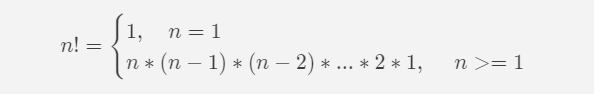
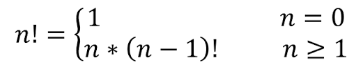
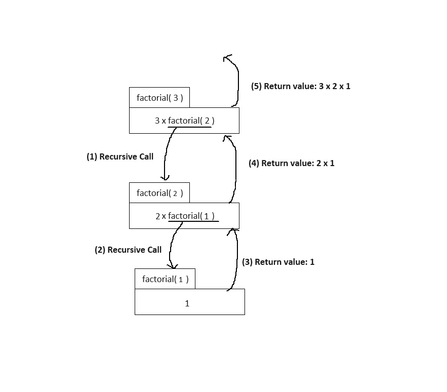
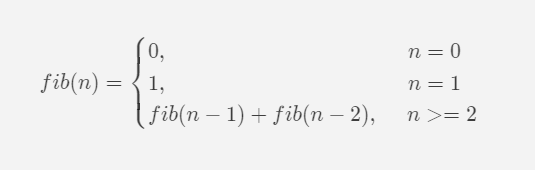
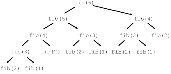
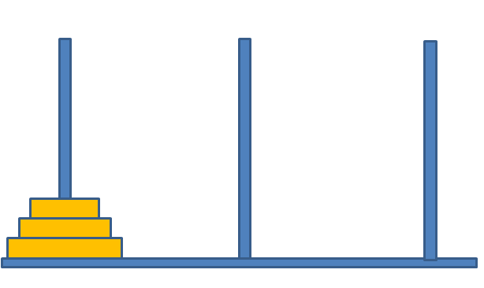

# Recursion

- Recursion involves calling itself again.
- A recursive function calls itself within its function body.
- In non-linear data structures, visiting every node is referred to as "traversal," and recursion is one solution for traversal algorithms.
- Recursion is also used to solve complex tasks by dividing them into smaller tasks, a concept known as "divide and conquer."

 

## Two Principles for Recursion

The key is to avoid creating an infinite loop in recursion. To achieve this, you must adhere to two principles:

**Base case**: There must be a base case, which serves as the termination condition. Further recursion is unnecessary once this condition is met.
**Recursive case**: Each recursion should reduce the range of tasks.

```cpp
int recusrion(int x){
    if (x == 0) return;  // base case
    recursion(x-1);    // recusive case
}
```

 

# Factorial

Factorial is one of the most common examples of recursion. The factorial of a number n is denoted as $n!$, and it represents the product of all positive integers from n down to 1.

 


<!--  -->

&nbsp;

Example

```
4! = 4 * 3 * 2 * 1 = 24
```

Expression for recursion


<!--  -->

### Code

```cpp
int factorial(int n){
    int ret = 0;

    if(n <= 1){
        return 1;
    } else {
        ret = n * factorial(n-1);
    }
    return ret;
}
```

&nbsp;

## The process of recursion

If number 3 is given to function "factorial" as an argument, the process of recursion is same as below.


<!--  -->

Operating systems execute recursive calls using a stack-based approach. When a function is called, all local variables and parameters are stored in a data structure called an 'activation record'. This record contains information about the function's execution state.

Here's how it works:

1. The operating system initiates a call to the 'factorial(3)' function.
2. An activation record for 'factorial(3)' is created and stored.
3. The 'factorial(2)' function is called within 'factorial(3)'.
4. Another activation record is created for 'factorial(2)' and stored.
5. The activation record for 'factorial(3)' is pushed onto a stack.
6. The process continues until 'factorial(1)' is called recursively.
7. Once 'factorial(1)' completes its execution, its activation record is popped from the stack.
8. The next function's activation record is loaded from the stack.

However, recursion has two notable disadvantages:

1. It can lead to slower execution speeds due to the overhead of managing activation records and function calls.
2. There is a limit to the number of function calls that can be made due to the finite size of the stack. Exceeding this limit can result in a stack overflow error.

&nbsp;

# Iteration

To mitigate the disadvantages of recursion, iteration provides an alternative approach. Instead of relying on recursive function calls, iteration utilizes loop statements such as 'for' or 'while' to repeat a block of code until a termination condition is met. This iterative approach offers several advantages:

1. **Improved Execution Speed**: Iterative solutions often execute more quickly compared to recursive ones due to reduced overhead associated with function calls and activation record management.

2. **Efficient Memory Usage**: Iteration typically consumes less memory as it does not involve the creation and management of activation records on a call stack. This can be particularly beneficial when dealing with large datasets or complex algorithms.

&nbsp;

## Factorial by using iteration

```cpp
int factorial(int n){
    int ret = 1;

    for(int i = n; i > 1; i--){
        ret = ret * i;
    }
    return ret;
}
```

&nbsp;

# Fibonacci sequence

The Fibonacci sequence begins with two initial terms, 0 and 1, where each subsequent term is the sum of the two preceding terms.

```
0,1,1,2,3,5,8,13,21,34,55,…
```

term 0

```
0 + 1 = 1
```

fist term

```
1 + 1 = 2
```

second term

```
1 + 2 = 3
```

The formula for the Fibonacci sequence for each term is:


<!--  -->

As you can see, there should be two basce cases.

```cpp
int fib(int n) {
	int ret = 0;

	if (n == 0) {
		ret =  0;
	}
	else if (n == 1) {
		ret =  1;
	}
	else if(n >= 2) {
		ret = fib(n - 1) + fib(n - 2);
	}

	return ret;
}
```

Using recursion to implement the Fibonacci sequence poses a significant inefficiency. With each function call, it branches out into two separate function calls, resulting in a tree structure with a height of n. Consequently, the time complexity of the Fibonacci sequence using recursion is $O(2^n)$. Hence, it is more efficient to implement it using an iterative version.


<!--  -->

&nbsp;

## Fibonacci sequence by using iteration

Although comprehending the inner workings of this code might be slightly more challenging than its recursive version, its time complexity is $O(N)$, making it significantly faster.

```cpp
int fib_iter(int n) {
	int ret = 0;

	if (n < 2) {
		ret = n;
	}
	else {
		int i = 0;
		int temp = 0;
		int current = 1;
		int last = 0;

		for (i = 2; i <= n; i++) {
			temp = current;
			current += last;
			last = temp;
			ret = current;
		}
		return ret;
	}
}
```

&nbsp;

# The Tower of Hanoi

The Tower of Hanoi is a classic problem that can only be effectively solved using recursion. It involves moving a stack of disks from pole A to pole C.


<!--  -->

Here are the rules for the Tower of Hanoi problem:

1. Only one disk can be moved at a time.
2. Each move involves taking the top disk from one stack and placing it onto another.
3. A larger disk cannot be placed on top of a smaller disk.

&nbsp;

## Code

The process in the following steps:

1. Move all disks except the last one at the bottom to pole B.
2. Transfer the bottom disk from pole A to pole C.
3. Move all remaining disks from pole B to pole C.

```cpp
void hanoi_tower(int n, int from, int temp, int to) {

	if (n == 1) {
        // Move the top disk from the source to the destination
		std::cout << from << " " << to << std::endl;

	}
	else {
		hanoi_tower(n - 1, from, to, temp); // move the whole disks from 'from' to 'temp' except the last disk on the bottom
		std::cout << from << " " << to << std::endl; // move a disk from 'from' to 'to'
		hanoi_tower(n - 1, temp, from, to); // move disks from 'temp' to 'to'
	}
}
```

&nbsp;

## The tower of hanoi with vector

This code simulates the Tower of Hanoi problem using vectors to represent the poles. While it would be more intuitive to use a stack data structure, vectors are employed here due to the lack of iterator support in the stack implementation.

The implementation follows the same recursive approach as the previous code. However, in addition to moving disks between poles, this version also manages the insertion and removal of disks in the vectors.

```cpp
void hanoi(int n, std::vector<int>& from, std::vector<int>& temp, std::vector<int>& to) {

	if (n == 1) {
		int top = from.back();
		from.pop_back();
		to.push_back(top);
	}
	else {
		hanoi(n - 1, from, to, temp);
		int top = from.back();
		from.pop_back();
		to.push_back(top);
		hanoi(n - 1, temp, from, to);
	}
}

int main() {

	std::vecotr<int> A, B, C;

	int n = 3;
	int temp = n;
	for (int i = temp; i > 0; i--) {
		A.push(temp);
		temp--;
	}

	hanoi(n, A, B, C);

	std::cout << "\tA: ";
    for (int i = 0; i < refA.size(); i++) {
    	std::cout << refA[i] << " ";
    }
    std::cout << "\tB: ";
    for (int i = 0; i < refB.size(); i++) {
    	std::cout << refB[i] << " ";
    }
    std::cout << "\tC: ";
    for (int i = 0; i < A.size(); i++) {
    	std::cout << refC[i] << " ";
    }

	return 0;
}
```
