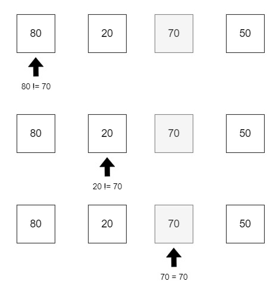
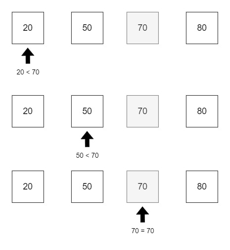
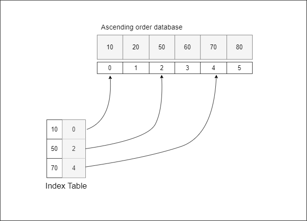
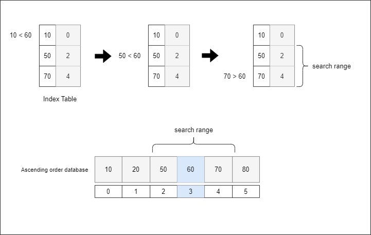
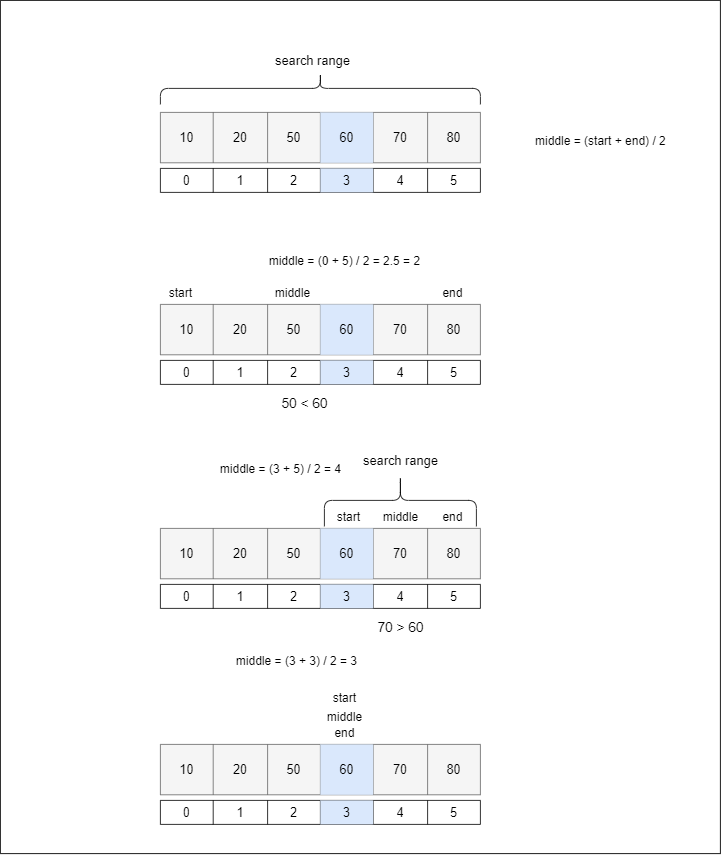

# Search

Searching involves finding specific data within a dataset. There are various methods for searching, but here we will cover the most fundamental ones:

1. Sequential Search
2. Sequential Index Search
3. Binary Search

&nbsp;

## 1. Sequential Search

- **Description**: Sequential search is the simplest and most intuitive search method. It involves comparing each element in a dataset one by one.
- **Use Case**: It is useful for small datasets where the overhead of more complex algorithms is not justified.
- **Time Complexity**: O(n), where n is the number of elements in the dataset.

Sequential search can be performed on both sorted and unsorted data. When the data is unsorted, the search key is compared sequentially with each element until a match is found or the end of the dataset is reached. If the key and the data match, the search stops.

### Example of Sequential Search


<!--  -->

&nbsp;

In the case where the data is sorted, the process is similar. The key is compared with each data element sequentially. If the key is smaller than the current data element, the search stops and moves to the next data element.


<!--  -->

### 1-2. Sequential Serach in C++

```cpp
#include <iostream>

// not sorted
int sequentialSearchNotSorted(int values[], int size, int key) {
	int ret = -1;
	int i  = 0;
	for (i = 0; i < size && values[i] != key; i++) {
		// do nothing
	}
	if (i < size) {
		ret = i;
	}

	return ret;
}

// sorted
int sequentialSearchAsendingStored(int values[], int size, int key) {
	int ret = -1;
	int i = 0;

	for (i = 0; i < size && values[i] < key; i++) {
		// do nothing
	}
	if (i < size && values[i] == key) {
		ret = i;
	}

	return ret;
}

void showArray(int values[], int size) {
	int i = 0;

	std::cout << "posittion, key" << std::endl;
	std::cout << "---------------\n";
	for (int i = 0; i < size; i++) {
		std::cout << i << "," << values[i] << "\n";
	}
}

void showSearchResult(int key, int index) {
	if (index >= 0) {
		std::cout << "key-" << key << ", position-" << index << "\n";
	}
	else {
		std::cout << "key-" << key << " failed\n";
	}
}

int main() {

	int index = 0, count = 0;
	int notSortedArray[] = { 80, 20, 70, 50 };
	int ascSortedArray[] = { 20, 50, 70, 80 };


	// 1. not sorted
	count = sizeof(notSortedArray) / sizeof(int);

	showArray(notSortedArray, count);


	// 1-1. search success
	index = sequentialSearchNotSorted(notSortedArray, count, 70);
	showSearchResult(70, index);

	// 1-2. search fail
	index = sequentialSearchNotSorted(notSortedArray, 6, 25);
	showSearchResult(25, index);

	// 2. sorted
	count = sizeof(ascSortedArray) / sizeof(int);
	showArray(ascSortedArray, count);

	// 2-1. search success
	index = sequentialSearchAsendingStored(ascSortedArray, count, 70);
	showSearchResult(70, index);

	// 2-2. search fail
	index = sequentialSearchAsendingStored(ascSortedArray, count, 25);
	showSearchResult(5, index);

	return 0;
}
```

```
posittion, key
---------------
0,80
1,20
2,70
3,50
key-70, position-2
key-25 failed

posittion, key
---------------
0,20
1,50
2,70
3,80
key-70, position-2
key-5 failed
```

&nbsp;

## 2. Sequential Index Search

What is an index? Think of it like the table of contents in a book. On the first page, you find a list of subjects and their corresponding page numbers. Instead of flipping through hundreds of pages to find a particular topic, you simply check the table of contents and turn directly to the page you need. Similarly, in a database, an index records the position of specific data, greatly improving search performance.

An index table is a collection of such indexes. For example, consider an index table where the first entry has 10 as the key and 0 as the position. This means that the value 10 is located at position 0 in the dataset. It's important to note that the database should be sorted for this method to work effectively.

The time complexity for a sequential index search is O(m + n/m), where n is the number of elements and m is the number of indexes.


<!--  -->

&nbsp;

## 2-1. The Process of Sequential Index Search

1. Determine the search range using the index table by comparing the key value with the indices in the table.
2. Stop when the index value exceeds the key value.
3. Perform a sequential search within the reduced search range in the original database.

Let's assume we are looking for the key 60. In the index table, the key value 60 is first compared to 10. Since 60 is greater, we move to the next index and compare again. The key is still greater than 50, so we move to the next index. This time, the key value is smaller than 70. Now, we know that the key value 60 is between positions 2 and 4. Since the value at position 4 is greater than the key value, we only need to search from positions 2 to 3.


<!--  -->

&nbsp;

## 2-2. Sequential index search in C++

```cpp
#include <iostream>

class IndexSearch {
private:
	// struct for index
	struct SimpleIndex {
		int position;
		int key;
	};

	// pointer for array
	int* pValues = nullptr;

	int size;

	// size for index table
	int indexSize;

	SimpleIndex* indexTable = nullptr;

public:

	// Constructor to create index table
	IndexSearch(int values[], int size,int indexSize)
		:size{size}, indexSize{indexSize} {
		pValues = values;

		// Determine ratio for indexing
		int ratio = 0;
		ratio = size / indexSize;

		// Adjust ratio for non-even division
		if (size % indexSize > 0) {
			ratio = ratio + 1;
		}

		// Allocate memory for index table
		indexTable = new SimpleIndex[indexSize];

		// Populate index table with key and position
		for (int i = 0; i < indexSize; i++) {
			indexTable[i].position = i * ratio;
			indexTable[i].key = pValues[i * ratio];
		}
	}

	// Function to perform sequential search within a range
	void sequentialRangeSearch(int start, int end, int key) {
		int i = 0;
		for (i = start; i <= end && pValues[i] < key; i++) {
			// Do nothing, just increment
		}

		if (i <= end && pValues[i] == key) {
			std::cout << "key-" << key << " position-" << i << "\n";
		}
		else {
			std::cout << "key-" << key << " fail\n";
		}

	}

	 // Function to perform index-based sequential search
	void IndexSequentionalSearch(int key) {

		int i = 0;
		int start = 0, end = 0;

		if (key >= pValues[0] && key <= pValues[size - 1]) {
			// Find the first index entry with a key greater than the search key
			for (i = 0; i < indexSize; i++) {
				if (indexTable[i].key > key) {
					break;
				}
			}

			if (i < indexSize) {
				start = indexTable[i - 1].position;
				end = indexTable[i].position - 1;
			}
			// in case of the key is greater then all index values in the index table
			else {
				// If the key is greater than all index values
				start = indexTable[i - 1].position;
				end = size - 1;
			}
			sequentialRangeSearch(start, end, key);
		}

	}

	void showIndexTable() {
		std::cout << "Index Table\n";
		std::cout << "position key\n";
		std::cout << "-------------\n";
		for (int i = 0; i < indexSize; i++) {
			std::cout << indexTable[i].position << " " << indexTable[i].key << "\n";
		}
		printf("\n");
	}

	void showArray() {

		std::cout << "position key\n";
		std::cout << "-------------\n";
		for (int i = 0; i < size; i++) {
			std::cout << i << " " << pValues[i] << "\n";
		}
		printf("\n");
	}


	~IndexSearch() {
		delete[] indexTable;
	}

};


int main() {

	int values[] = {10, 20, 50, 60, 70, 80};
	IndexSearch a{ values, 6, 3 };

	a.showArray();
	a.showIndexTable();
	a.IndexSequentionalSearch(60);

	a.IndexSequentionalSearch(65);

	return 0;
}
```

```
position key
-------------
0 10
1 20
2 50
3 60
4 70
5 80

Index Table
position key
-------------
0 10
2 50
4 70

key-60 position-3
key-65 fail
```

&nbsp;

## 3. Binary Search

Binary Search is an efficient method for finding a target value within a sorted array by repeatedly dividing the search interval in half. Here's how it works:

### Summary of Steps:

1. Calculate the middle index.
2. Compare the search key with the middle value:
   - If they are equal, the search is complete.
   - If the key is smaller, focus on the left subarray.
   - If the key is larger, focus on the right subarray.
3. Repeat the process until the key is found or the subarray size becomes zero.

### Example

Let's consider an array: [10, 20, 50, 60, 70, 80] and we want to find the value 60.

1. **Initial Setup**:

   - Start index: 0
   - End index: 5 (length of array - 1)

2. **First Iteration**:

   - Calculate the middle index: (0 + 5) / 2 = 2.5. Take the integer part, so the middle index is 2.
   - Compare the search key (60) with the middle value (50):
     - 60 is greater than 50.

3. **Narrowing Down**:

   - Since 60 is greater than 50, focus on the right half of the array:
     - New start index: 3 (middle index + 1)
     - End index remains 5.

4. **Second Iteration**:

   - Calculate the new middle index: (3 + 5) / 2 = 4.
   - Compare the search key (60) with the middle value (70):
     - 60 is less than 70.

5. **Narrowing Down Again**:

   - Since 60 is less than 70, focus on the left half of the subarray:
     - Start index remains 3.
     - New end index: 3 (middle index - 1).

6. **Final Iteration**:
   - Calculate the middle index: (3 + 3) / 2 = 3.
   - Compare the search key (60) with the middle value (60):
     - 60 is equal to 60.

We have found the key value at index 3.

Binary Search has a time complexity of O(log n), making it significantly faster than sequential search methods for large datasets.


<!--  -->

&nbsp;

## 3-2. Binary Search in C++

This algorithm can be efficiently implemented using recursion. With each recursive call, the search range is halved. If no match is found, the base case is reached when the start index exceeds the end index, at which point the recursion stops and returns.

```cpp
#include <iostream>

int binarySearchRecursive(int values[], int start, int end, int key) {
	int ret = -1;
	int middle = 0;

	// Base case: key not found
	if (start <= end) {
		// Calculate the middle index
		middle = (start + end) / 2;
		if (key == values[middle]) {
			ret = middle;
		}
		else if (key < values[middle]) {
			// Search in the left half
			ret = binarySearchRecursive(values, start, middle - 1, key);
		}
		else {
			// Search in the right half
			ret = binarySearchRecursive(values, middle + 1, end, key);
		}
	}
	return ret;
}

int main() {

	int key = 0;
	int index = 0;
	int array[] = { 10, 20, 50, 60, 70, 80 };

	key = 60;
	index = binarySearchRecursive(array, 0, 5, key);

	if (index >= 0) {
		std::cout << "key-" << key << " position-" << index << std::endl;
	}
	else {
		std::cout << "key-" << key << " fail" << std::endl;
	}

	key = 65;
	index = binarySearchRecursive(array, 0, 5, key);

	if (index >= 0) {
		std::cout << "key-" << key << " position-" << index << std::endl;
	}
	else {
		std::cout << "key-" << key << " fail" << std::endl;
	}

	return 0;
}
```

```
key-60 position-3
key-65 fail
```
