# What is a Simple Market app?

Simple Market is a small-scale Flutter project that showcases the full implementation of Create, Read, Update, and Delete (CRUD) operations using Firebase. This app draws inspiration from the popular Korean application known as 'Karrot,' which serves as a local community marketplace for users to effortlessly buy, sell, and trade both new and pre-owned items.

Let's go to browse the full code for project: https://github.com/Blackcode2/Flutter-Simple_Market_App

&nbsp;

# Goal

* Implement comprehensive CRUD functionality.

* Harness the power of Firebase as the backend platform.

* Implement chatting functionality.


&nbsp;

# Firebase
----

During mobile application development, developers often find themselves reinventing the wheel by recreating common functionalities such as authentication, database integration, storage, and API management for every new application. Firebase streamlines this process by providing an all-in-one solution, eliminating the need to build these components from scratch each time.

Firebase offers a wide array of products, and its portfolio continues to expand. While I won't be utilizing all of Firebase's offerings in this project, I plan to explore and integrate them gradually over time, gaining a deeper understanding of each product as I progress.


<!-- 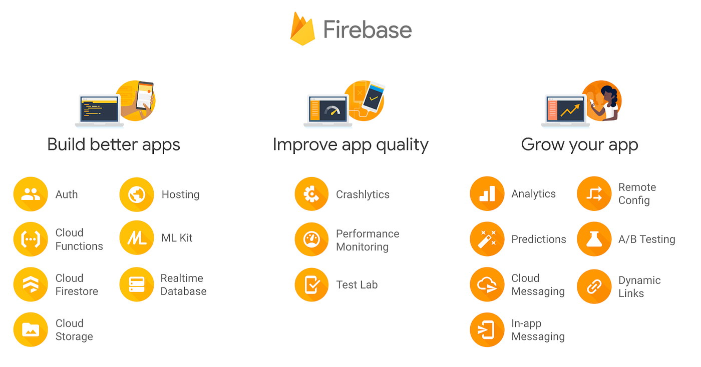 -->

&nbsp;

## Add Firebase to Flutter

Instructions for integrating Firebase into your Flutter project are readily available on the official Firebase website. This accessible resource enables anyone to seamlessly incorporate Firebase into their Flutter projects with ease.


<!-- 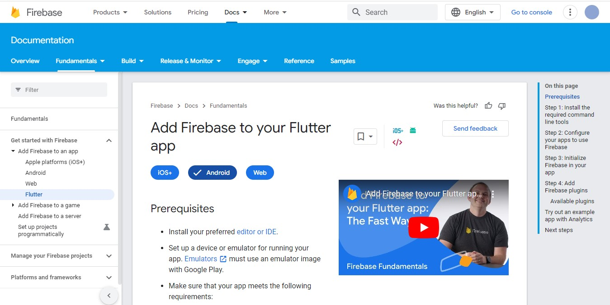 -->

https://firebase.google.com/docs/flutter/setup?platform=android


I've categorized the process of adding Firebase to a Flutter project into two distinct approaches. 

1. The first method involves using the Firebase CLI(Command Line Interface) exclusively, which may appeal to experienced developers. 

2. The second method combines CLI and GUI(Graphic User Interface) tools, making it a more beginner-friendly option. 

In this post, I'll primarily focus on explaining the second approach.

&nbsp;

### 1. create Firebase project

Go to your Firebase account console and add new project.

 
<!-- 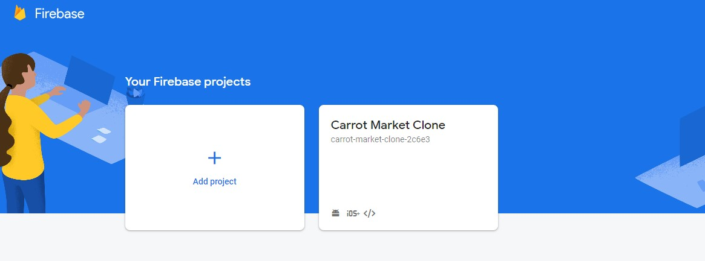 -->

Once you've created a new project, look for the Flutter icon button and give it a click.

 
<!-- 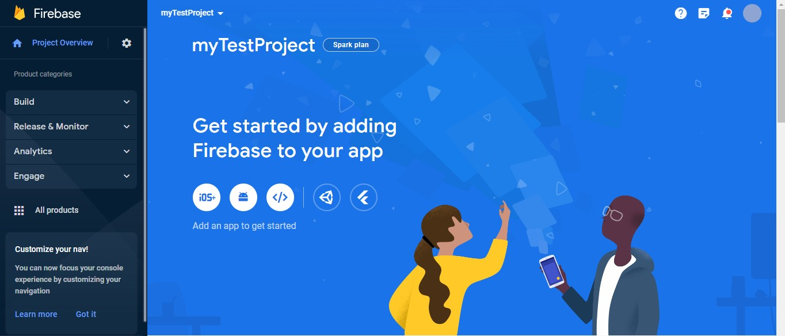 -->

Now, you have the steps to add Firebase to your Flutter project right here. Assuming you've already installed the Flutter SDK, the next step is to install Firebase CLI.

 
<!-- 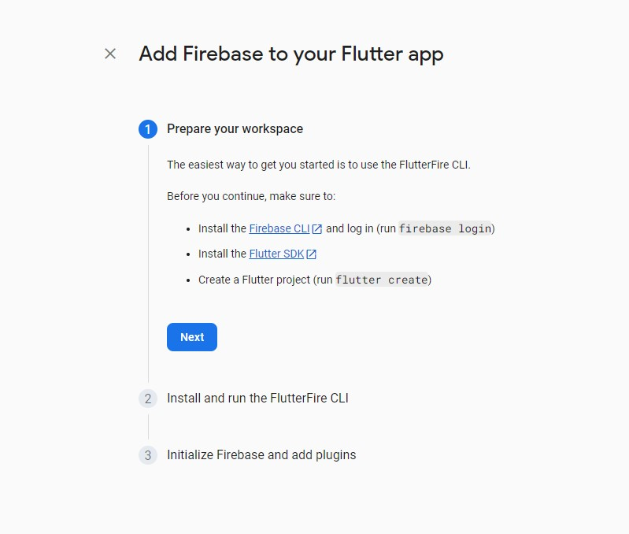 -->

&nbsp;

### 2. Install the Firebase CLI

If you're familiar with Node.js, you can opt for npm. If you're not, you can download the standalone binary. I've opted to download the standalone binary, as it's a more widely recognized choice for those new to Firebase. However, My recommendation is to use npm. I will explain this later.

 
<!-- 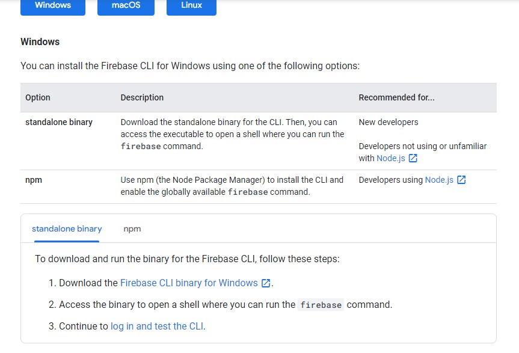 -->

After downloading the standalone binary, be sure to move it to the directory where you plan to create your Flutter project. For some reason, if it's not in the same folder as your Flutter project or within the Flutter project directory, errors may occur. Additionally, remember to add the download path to your environment variables.

When you open the CLI, it will automatically lead you to login page to your Google account after seeking your agreement to collect information. If, for any reason, the Google login page doesn't open, use the following command:

```
firebase login
```


<!--  -->

Choose the account that you created the Firebase project.


<!-- 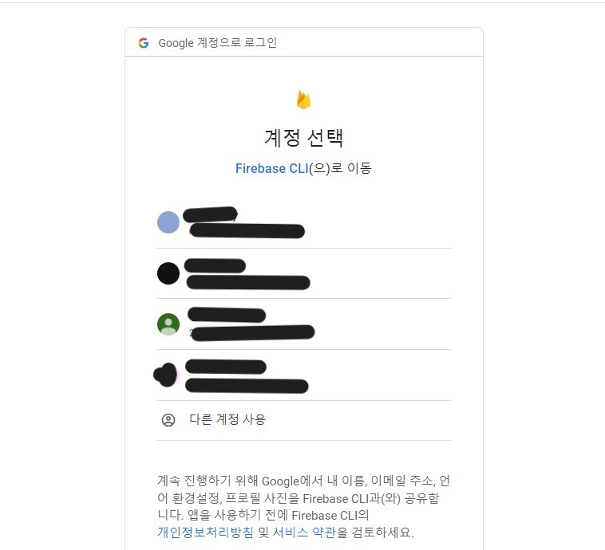 -->


<!-- 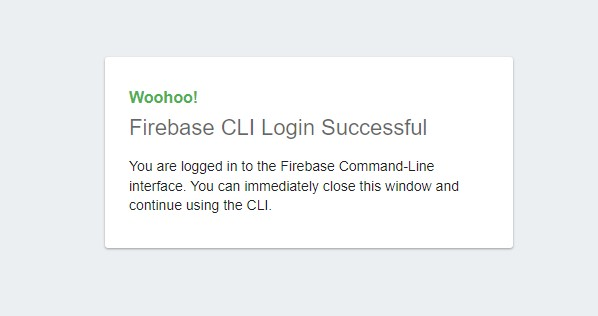 -->

&nbsp;

### 3. Create Flutter project

Whether you're using Android Studio, Visual Studio, or your preferred development environment, go ahead and create a new Flutter project. If you already have an existing Flutter project, that works too.

&nbsp;

### Step 4: Enter command in your terminal.

Next step is to run these commands.


<!-- 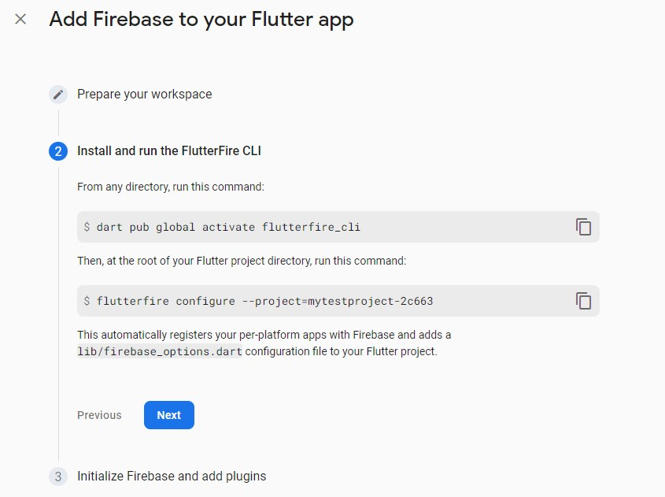 -->

Open your Flutter project, navigate to your project directory, and enter the commands.

```
dart pub global activate flutterfire_cli
```

When you execute the command, a 'flutterfire.bat' file will be generated in the following directory: C:\Users\user\AppData\Local\Pub\Cache\bin. Make sure to add this path to your environment variables.


<!-- 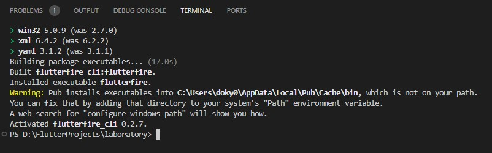 -->


Upon entering the second command, you will have the option to select the platforms for which the configuration should be supported.

```
flutterfire configure --project=mytestproject-2c663
```


<!-- 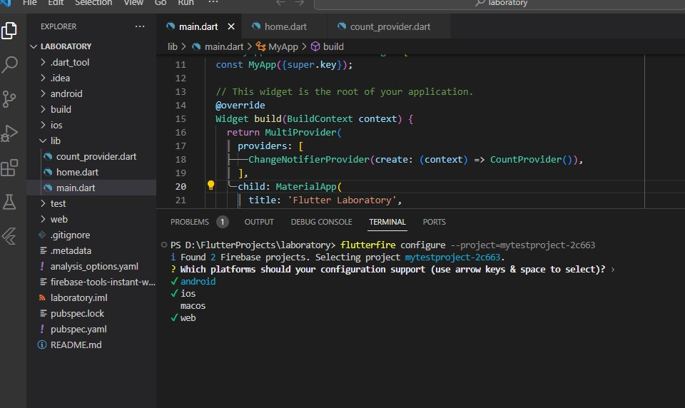 -->

If everything proceeds without issues, a 'firebase_options.dart' file will be generated.


<!-- 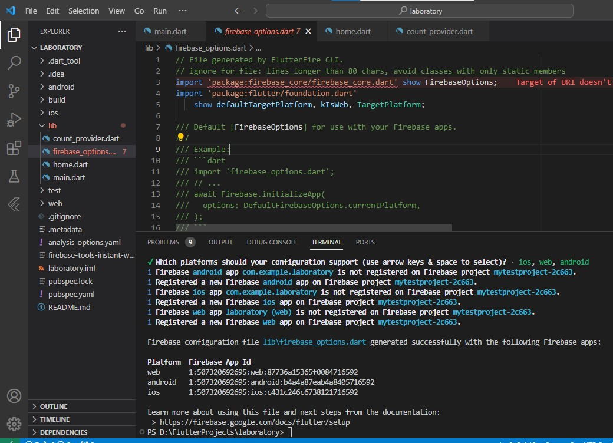 -->

&nbsp;

### 5. Initialize Firebase and add plugins

This is the final step. To utilize Firebase, please follow the procedures illustrated in the provided image.


<!-- 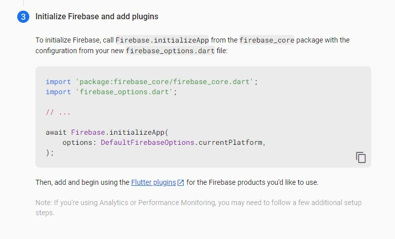 -->

To begin, you'll need to obtain the Firebase package. Execute the following command in your terminal.

```
flutter pub add firebase_core
```

Next, insert the following code in the **main** function to initialize Firebase.

```dart
import 'package:firebase_core/firebase_core.dart';
import 'firebase_options.dart';

// ...

await Firebase.initializeApp(
    options: DefaultFirebaseOptions.currentPlatform,
);
```

However, using just that code won't suffice. In reality, an additional line of code is required.

```dart
WidgetsFlutterBinding.ensureInitialized();
```

```dart
void main() async{
  WidgetsFlutterBinding.ensureInitialized();
  await Firebase.initializeApp(
    options: DefaultFirebaseOptions.currentPlatform,
  );
  runApp(const MyApp());
}
```


<!-- 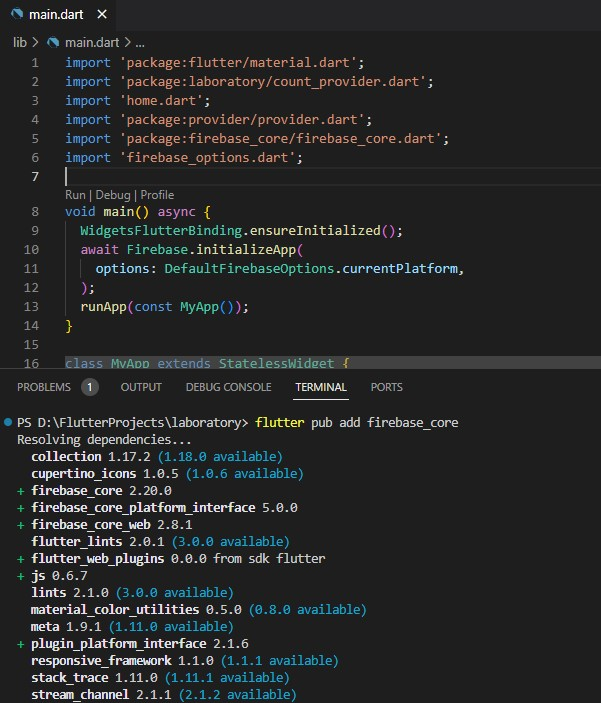 -->

Done!

&nbsp;

## Should a new Firebase project be created first?

The order of these procedures is flexible; you can create your Flutter project first or install the CLI first—either sequence works. As mentioned earlier, using Firebase CLI alone allows you to create both a new Firebase project and a Flutter project with a single command.

&nbsp;

## Is it easier to use the standalone binary? 

In my opinion, no. I initially described the process using the standalone binary because it's well-known for beginners, and I used it in this project. However, after several reviews, I've come to the conclusion that using npm is a more straightforward and convenient option. The standalone binary for Firebase CLI can lead to unexpected errors and can be time-consuming. Additionally, if you opt for the standalone binary, you'll need to install it again each time you start a new Firebase project. My recommendation is to use npm, which is simpler and hassle-free. The initial installation will be the last you need on your computer.

&nbsp;

----

# Let's start the real project

## Login page and Firebase Authentication


At the initial launch of the app, the login page is the first screen that appears.


<!-- 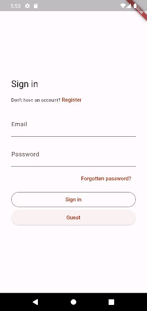 -->

To create this page, two essential packages are required: firebase_ui_auth and firebase_auth."

While you can design the login page's UI from scratch using TextFormField, there's an excellent package available that offers pre-designed login and profile UI components (SignInScreen and ProfileScreen). Utilizing this package can help you save valuable development time.


<!-- 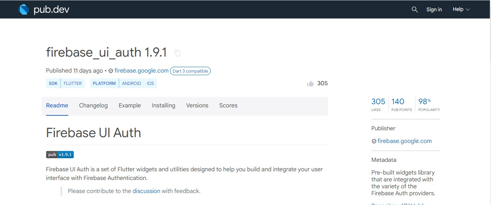 -->

To enable Firebase Authentication in your project, you must install the Firebase-provided Flutter package dedicated to authentication.


<!-- 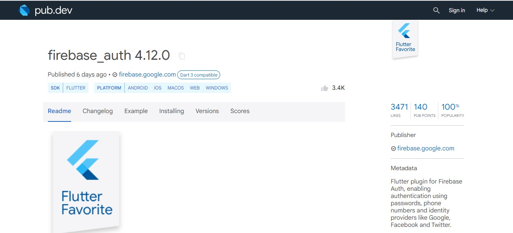 -->

After acquiring the necessary packages, make sure to import them. In this setup, I utilize 'hide EmailAuthProvider' because both packages include an 'EmailAuthProvider' class with the same name. This ensures that we're using only one of them. In the code, I've created a 'LoginPage' class and an 'Authentication' class, where the 'Authentication' class is responsible for presenting the login UI.


<!-- 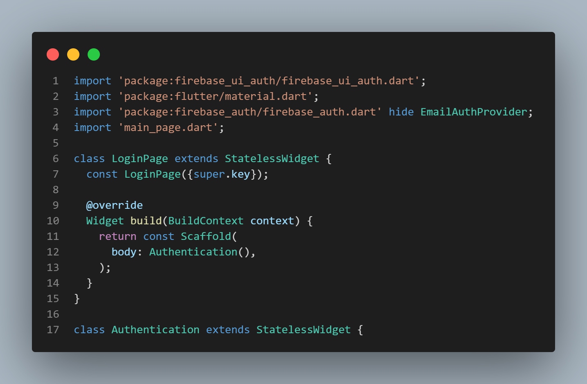 -->


First and foremost, we require the 'StreamBuilder' widget. This is essential for obtaining the authentication state stream. As users log in or out, the authentication state dynamically changes. To determine whether a user has logged in, granting them the necessary authority, it's crucial to continually monitor this state.


<!-- 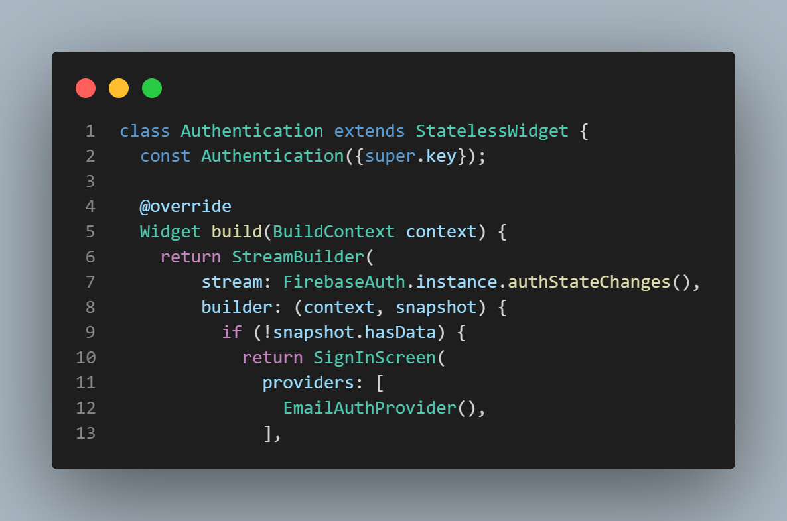 -->

**FirebaseAuth.instance** instantiates the 'FirebaseAuth' class, allowing you to utilize the 'authStateChanges()' method, which returns a stream.

If the user hasn't been verified, the sign-in screen should be displayed. When the snapshot contains no data, the 'SignInScreen' widget from 'firebase_ui_auth' is returned. 

This widget includes a 'providers' argument, which can be populated with various provider classes offered by the package. In this context, I exclusively use 'EmailAuthProvider()' for email authentication, although the package offers a variety of provider options. To utilize this feature, ensure that the email authentication method is enabled in the Firebase console.


<!-- 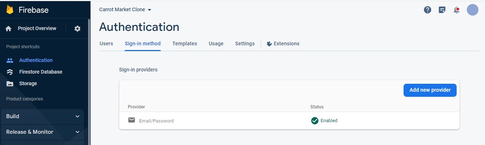 -->

When the user is authenticated, you can straightforwardly return the desired widget for further navigation right after the 'if' statement.

However, I've made some customizations to this widget.  I've introduced a convenient test button, allowing me to bypass the need for logging in repeatedly. Even though I named it "Guest", it just for test.

Notice that I've made use of the 'pushAndRemoveUntil' method in combination with 'Navigator.' This strategy is implemented to clear the stacked screens, ensuring that when a user taps the 'go back' button, the application gracefully terminates rather than revisiting the login page.


<!-- 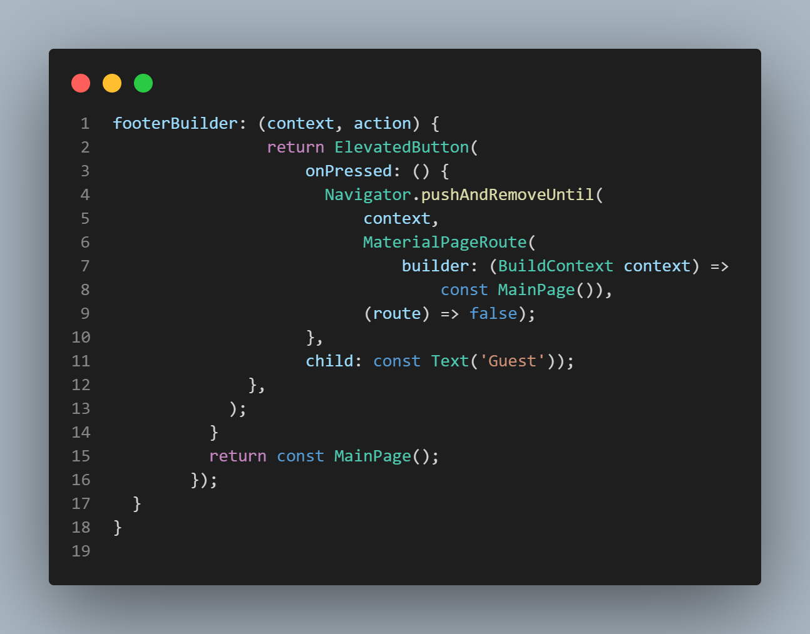 -->

The 'SignInScreen' widget provides screens and features for user registration and password recovery, along with email and password verification capabilities. Additionally, the log-out functionality is working seamlessly.


<!-- 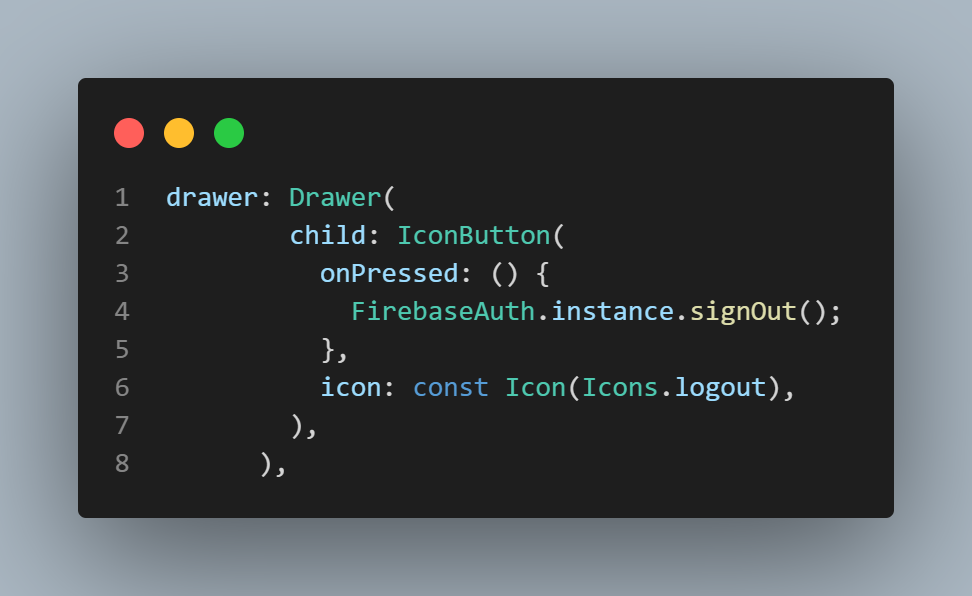 -->


<!--  -->

&nbsp;

## Main Page


<!-- 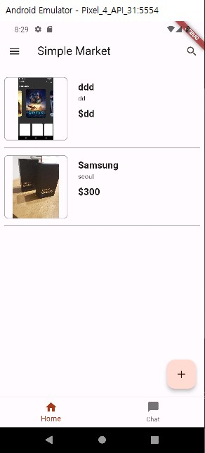 -->

Main page is largly divided into three parts: appBar, body, and bottomNavigationBar. Important part is bottomNavigationBar. 

There are several ways to creat bottomNavigationBar in Flutter. I think this the simplest one. 


<!-- 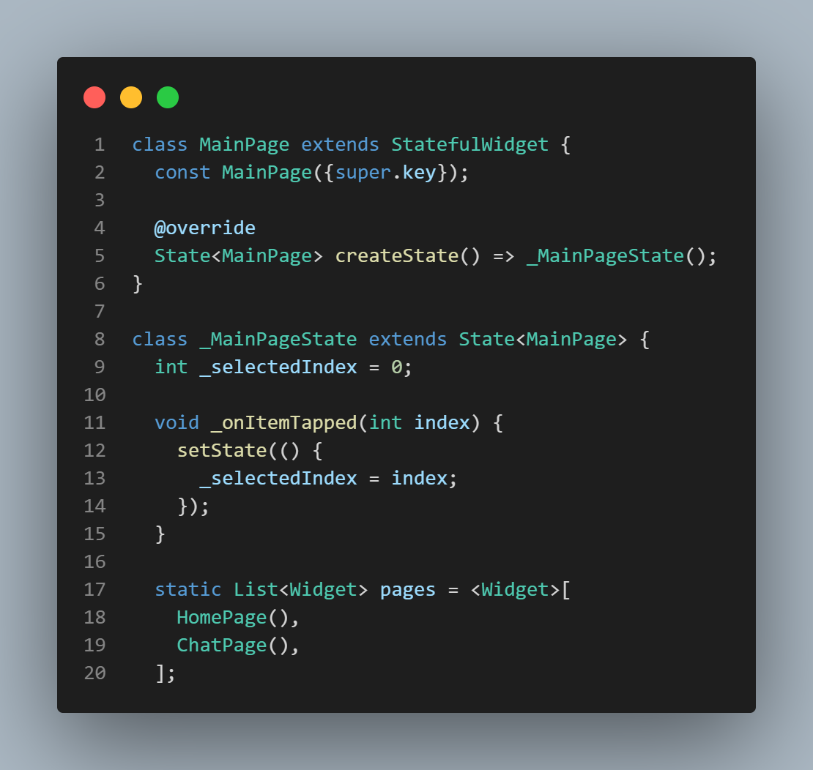 -->

1. A integer variable **_selectedIndex** is used to keep track of the currently selected tab or item in the app's navigation. It is initially set to 0.

2. **_onItemTapped** is a method that is called when a user taps on one of the items in the app's navigation. It takes an index parameter, which represents the index of the tapped item. Inside the method, the **_selectedIndex state** is updated to reflect the selected item, and the **setState** function is used to trigger a rebuild of the widget with the new selected index. 

3. **pages** is a list that contains two widget instances, HomePage() and ChatPage(). These widgets likely represent different pages or screens that can be navigated to within the app. The MainPage widget would typically render one of these pages based on the selected index.


<!-- 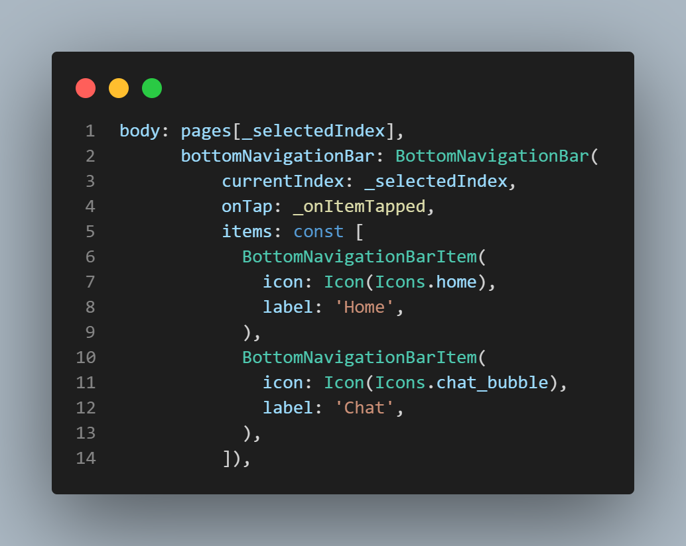 -->

4. **body: pages\[_selectedIndex\],**: This line sets the body of the **MainPage** widget to display the widget at the index specified by **_selectedIndex**. This means it will display either the **HomePage()** or the **ChatPage()** based on the selected index.

5. Within the **bottomNavigationBar**, the **currentIndex** property is set to **_selectedIndex**, which reflects the currently selected tab. This keeps the selected tab in sync with the **_selectedIndex** state variable. When a user taps on an item in the bottom navigation bar, the **_onItemTapped** function is invoked, causing **_selectedIndex** to update. This, in turn, leads to a change in the displayed screen, effectively enabling navigation between the available screens.


<!-- 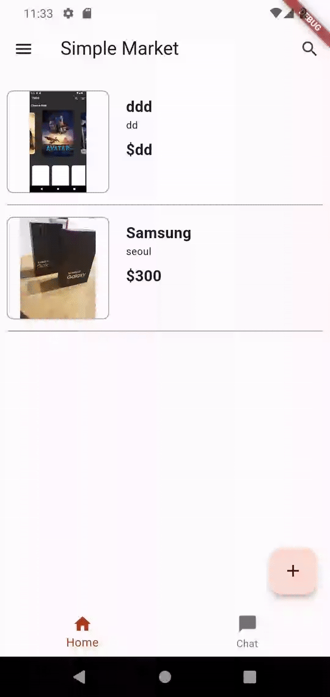 -->

&nbsp;

## InitialUserNamePage (Create)

When a user creates an account, they are initially directed to the 'HomePage.' Within the 'HomePage,' the app verifies whether the user is logged in and possesses authentication credentials, but doesn't have an assigned username yet. In cases where the user hasn't set an initial username, they are redirected to the 'InitialUserNamePage.' 


<!-- 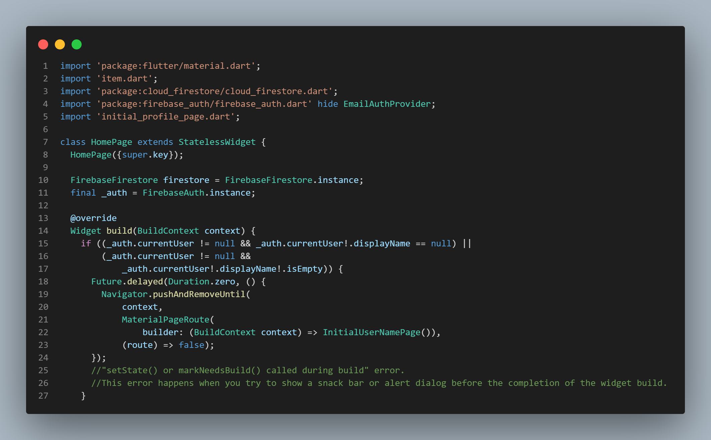 -->

You may notice that I've intentionally added a delay to the "Navigator". This is done to ensure that the app doesn't navigate to another page before the completion of the build method.

This is the profile page, where users have the option to set their profile image and name. Additionally, if the chosen name already exists in the server, it triggers a notification.


<!-- 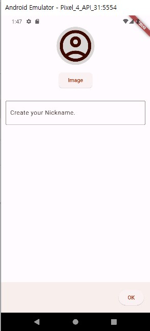 -->

#### Picking a profile picture

The selected image is supposed to fit within a circular frame. However, I've encountered an issue that seems to be emulator-related, as the images captured by the emulator do not align properly within the circular boundary.However, images from external sources function correctly and align well within the circular boundary.


<!-- 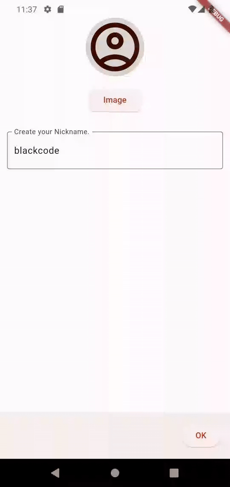 -->

&nbsp;

#### User name already exists.


<!-- 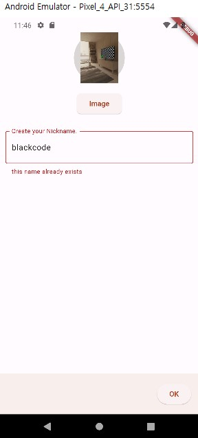 -->

&nbsp;

## Image picker

To retrieve images from the device, you'll need to install the 'image_picker' package.


<!-- 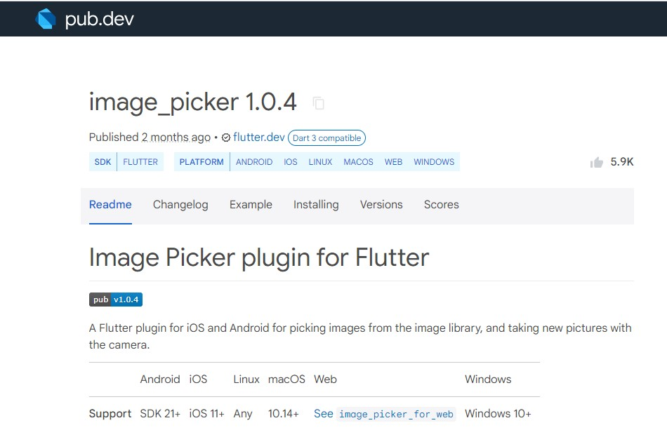 -->

&nbsp;

### How to use "image_picker".

Initially, an instance of the ImagePicker is created. The 'pickImage' method returns a value of the XFile data type, so the variable capturing this return value should be declared as XFile.


```dart
final ImagePicker _picker = ImagePicker();
    
// pick 1 image
final XFile? image = await _picker.pickImage(source: ImageSource.gallery);
    
// pick image by taking photo with camera    
final XFile? photo = await _picker.pickImage(source: ImageSource.camera);

// pick several images
final List<XFile>? images = await _picker.pickMultiImage();
```

This is the way to show image.

```dart
Image.file(
  File(image.path),
  fit: BoxFit.cover,
)
```

#### The code


<!-- 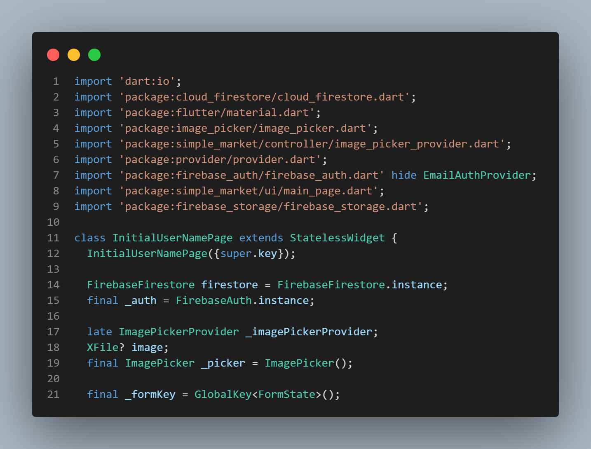 -->


<!-- 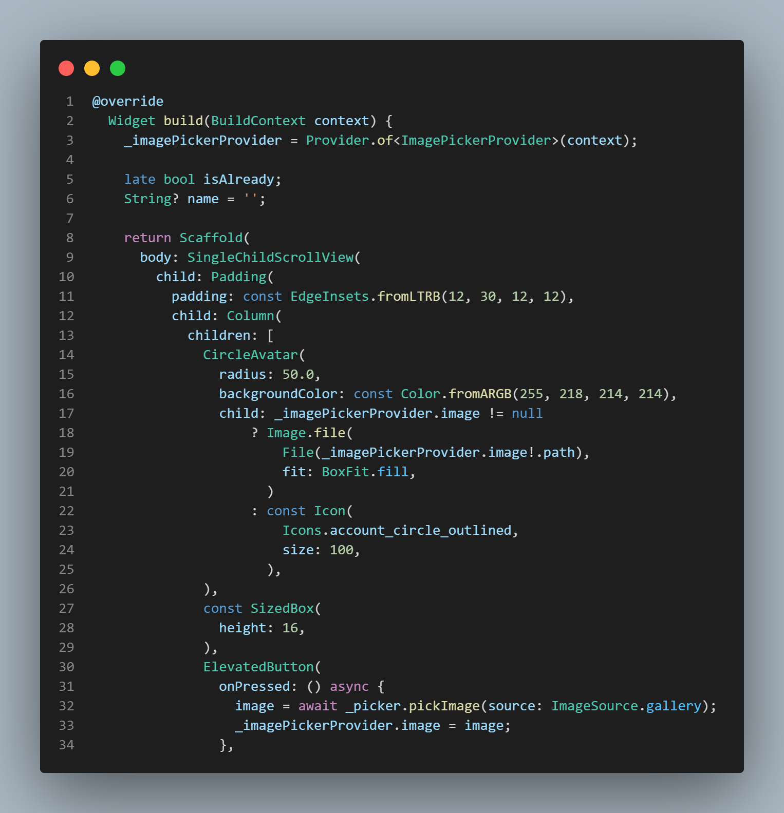 -->

When the variable that captures the returned value from the 'pickImage' method is updated, the 'setState' method should typically be invoked to inform the app of the change. However, in this scenario, I've opted to utilize the provider instead of the 'setState' method.


<!-- 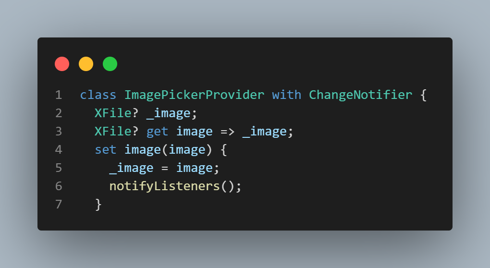 -->

&nbsp;

## Form

In Flutter, there are two types of widgets designed to capture user input text: 'TextField' and 'TextFormField.' 'TextFormField' is particularly useful when placed under the 'Form' widget, providing additional functionality such as validation and seamless integration with other 'TextFormField'. 

The 'Form' widget accepts a 'key' parameter along with 'TextFormField.' The 'key' serves the dual purpose of storing input values and facilitating validation.


The **_formKey.currentState!.save()** method triggers the **onSaved** function specified within the Form widget. Typically, **onSaved** is employed to call **setState**, but in this case, I've taken a different approach: I store the value into a string variable and subsequently use it as an argument for the **containsValue** method.

When a user enters their name and presses the 'OK' button, the app retrieves all data from the 'displayedName' document in Firestore. This document stores all user names. By comparing the entered name with the existing data, I can determine if the name already exists in the records.


<!-- 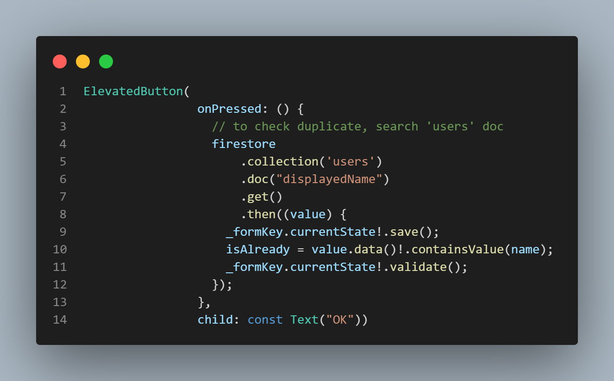 -->


<!--  -->

Following this, I trigger the **validate()** method, which in turn activates the statement within the 'validator' parameter of the Form widget. Upon successful validation without any issues, the 'setName' function is executed.


&nbsp;

## How to use Firebase Storage.


<!--  -->

1. **Save User Name in 'displayName' Document:** The user's name is stored in the 'displayName' document, which serves as a repository for all users' names within the application.

2. **Save User Name in Authentication:** Additionally, the user's name is saved within the authentication details. Authentication contains multiple fields capturing essential user information.

3. **Handling Selected Image:** In the event an image is selected, an instance of Firebase Storage is created. This instance allows the configuration of the image's file path and name.

```dart
refImage = FirebaseStorage.instance.ref().child("folder_name").child("image_file_name");
```

4. **Image Upload to Firebase Storage:** The selected profile image is uploaded to Firebase Storage using the 'putFile' method.

```dart
await refImage.putFile(File("image_path"));
```

5. **Saving Image URL in Authentication:** Following the upload, the URL of the uploaded image is stored within the authentication details for future reference.

```dart
final uri = await refImage.getDownloadURL();
await _auth.currentUser!.updatePhotoURL(uri);
```

6. **Default Image Handling:** In scenarios where no image is selected, a default image is saved in the server (Firebase Storage) to ensure every user has an associated profile image.

### Result Firebase Storage

<!-- 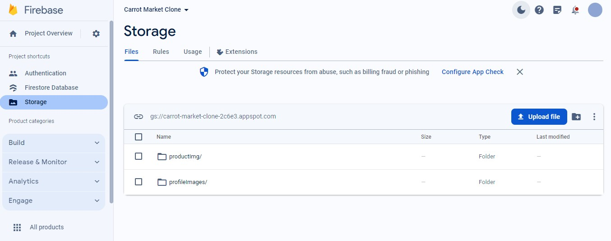 -->


<!-- 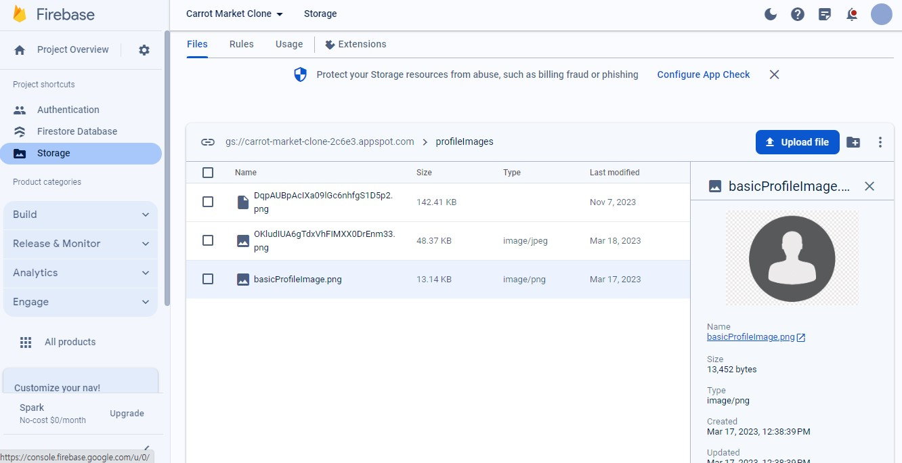 -->

&nbsp;

## HomePage and Firestore Database (Read)

The 'HomePage' is the screen where user-uploaded products are displayed. These product listings are sourced from the Firestore Database server. Let's explore how to interact with the Firestore Database to retrieve and display this information.

1. In your Firebase project console, initiate the process by creating a new Firestore Database.


<!--  -->

2. Set name and location. 


<!-- 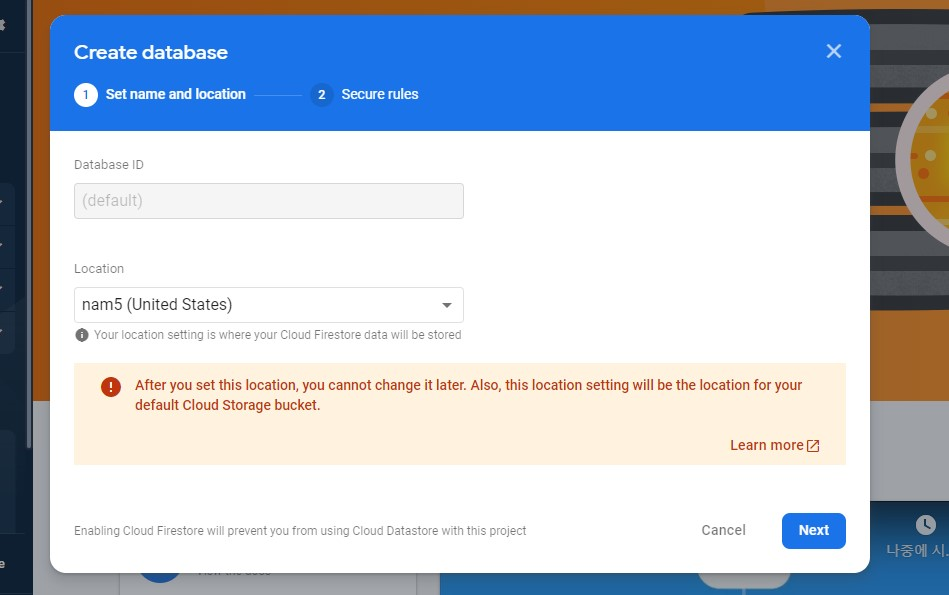 -->

3. Begin in test mode as it allows unrestricted access to the database for testing purposes. If you opt for the test mode, it's important to note that you'll need to update the security rules within 30 days, and Firebase will send you reminders via email to ensure compliance.


<!-- 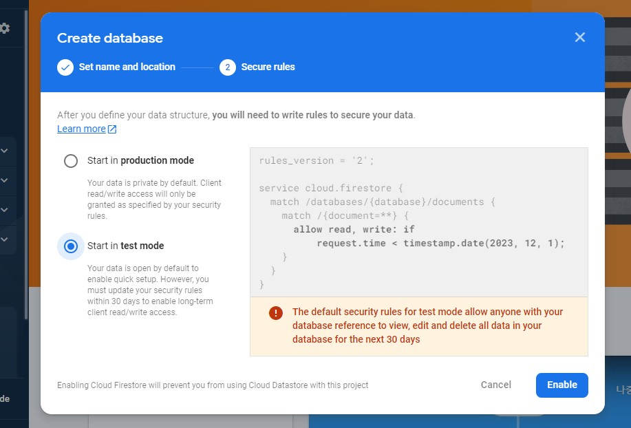 -->

&nbsp;

### Collection and Doc

Firestore is a NoSQL database with a key-value-based structure. This database is organized using collections and documents. 

A collection can be likened to a folder, representing a broad category, while a document is akin to a file containing specific information. What's intriguing is that within a document, you can generate additional collections, and within those collections, documents can exist, creating a structure that can be repeated as needed.

collection --> doc --> collection --> doc

&nbsp;

## Let's put it to use

This database serves as the foundation for my project. At this stage, our primary focus is on the **items** collection.

Within the **items** collection, each time a user uploads a product for sale, a new document is generated. The document's name is crafted by combining the user's UID and the timestamp of when the user uploaded the post. This naming convention ensures a unique identifier for each document. Additionally, the document encapsulates various fields encompassing information about the product and the user who uploaded it. These documents can include various fields, such as strings, numbers, booleans, and more. Currently, I haven't added additional collections beneath each document since it's not necessary for my current scope.


<!-- 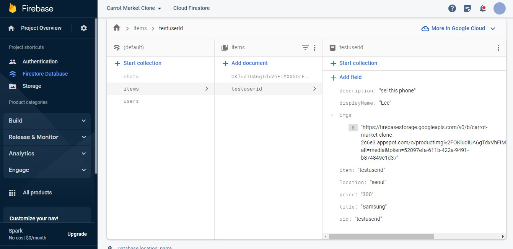 -->

This outlines the various fields within the document:

- **description**: Information and a detailed description of the product.
  
- **location**: The geographical location where the user intends to sell the product.

- **price**: The specified price for the selling product.

- **title**: The title of the post.

- **displayName**: The user's name retrieved from authentication.

- **imgs**: The URLs of Firebase Storage where product images are stored.

- **item**: The unique identifier for the item, identical to the document name (UID + Timestamp). Used when updating or deleting a post as the document name is required for reference. Additionally, this serves as the folder name when saving product images in Firebase Storage.

- **uid**: The user's UID, employed when initiating a chat with a counterpart to ascertain the existence of an already established chat room with that specific counterpart.

<!-- 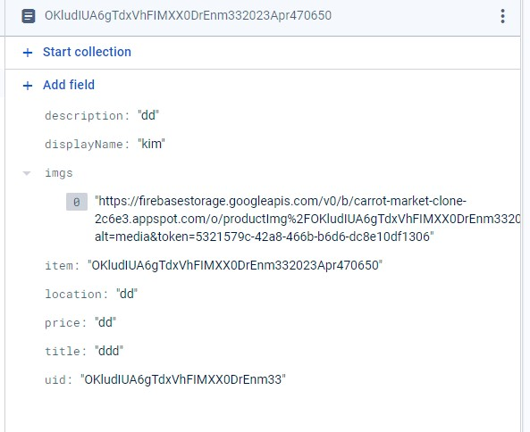 -->


To integrate Firestore database functionality into your project, you'll need to install a specific package.

```
flutter pub add cloud_firestore
```

Since the app can't predict exactly when new posts will be uploaded, it must continuously monitor for new data. To achieve this real-time data retrieval from the server, a stream is essential. For this purpose, I've employed the StreamBuilder widget. If I want to fetch specific data, the code will look like this.


<!-- 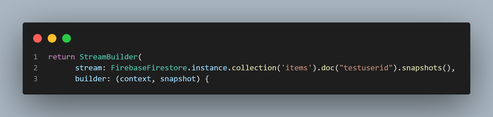 -->

This code is employed when you require specific data from a particular document. However, within the 'items' collection, numerous documents exist, and new documents are continuously generated. To monitor changes within the entire 'items' collection, the code is structured as follows."


<!-- 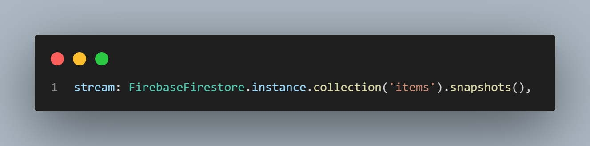 -->

While the snapshot is still actively fetching data from the server, the app displays a circular progress indicator. Once the data is available, it is stored in a list variable. Each document retrieved is then passed to a custom 'Item' widget using a 'ListView' widget. Take note of the 'itemCount' parameter, where '??' indicates that if 'docs?.length' is null, 'itemCount' defaults to 0.


<!-- 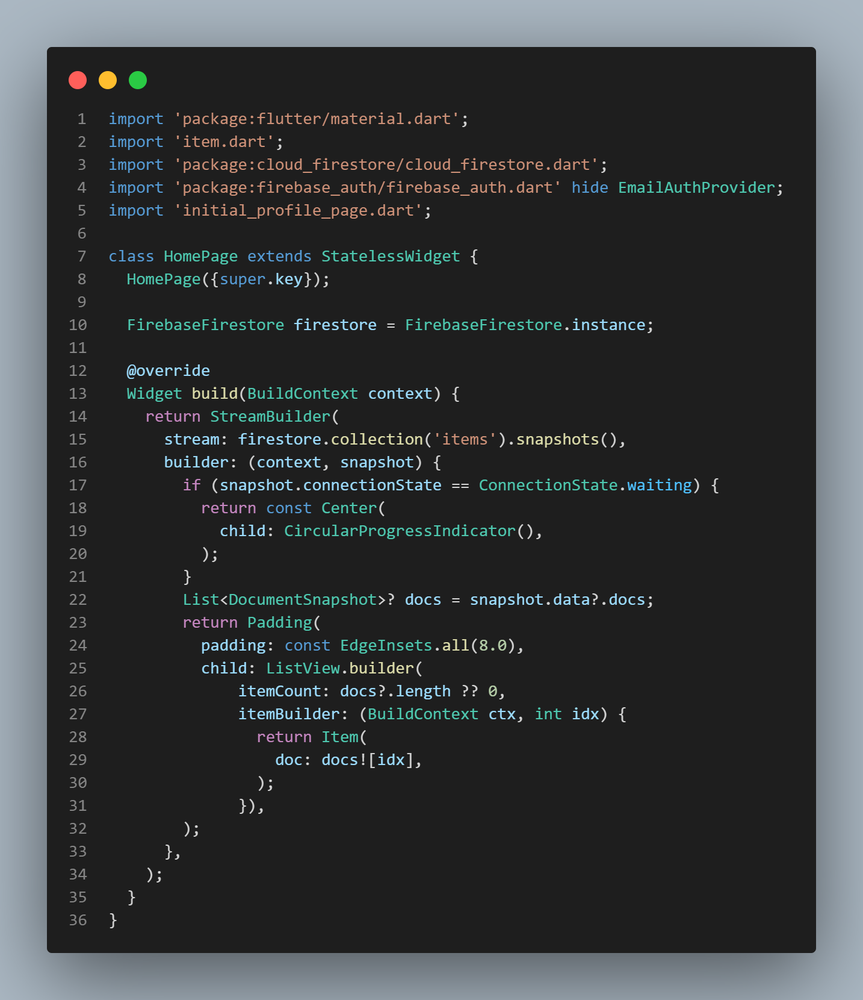 -->


Now, let's delve into the 'Item' class. The 'Item' widget serves as a thumbnail for displaying product details. By specifying the key name, I can effortlessly showcase the corresponding value on the screen.


<!-- 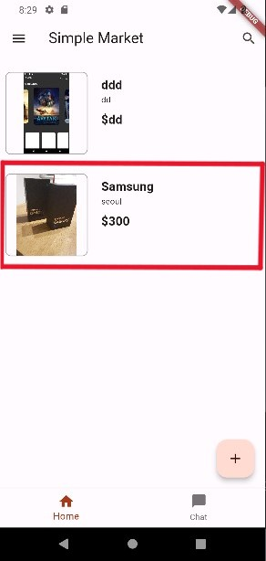 -->


<!-- 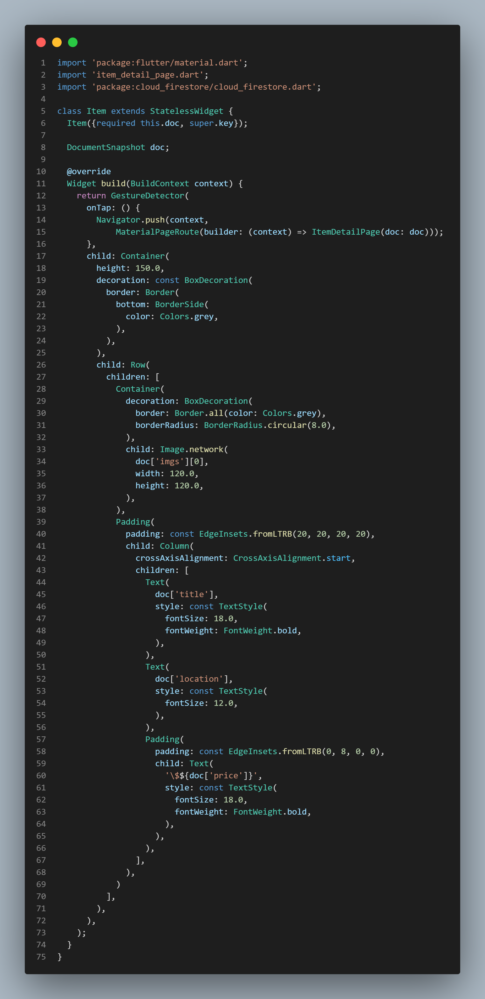 -->


When a user taps on the item thumbnail, it navigates them to the 'ItemDetailPage.' This page presents multiple images of the item for sale along with a detailed description of the product.

However, before delving into the details of the 'ItemDetailPage,' let's discuss the process of adding data to the server, as I've previously only explained retrieving data from Firestore.

&nbsp;

## Post item (Create)

Now that I've covered retrieving (Read) data from Firestore, the next step is to understand how to upload (Create) data to the server. The home page features a floating action button enabling users to upload products they wish to sell.

The user interface is quite intuitive. Users can select images of their product by tapping the camera icon and input basic information about the item they are selling in the provided text fields.


<!-- 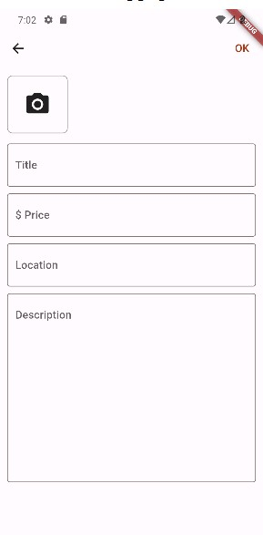 -->

Having used the 'image_picker' package previously, I've implemented it here as well. The distinction lies in utilizing the "pickMultiImage" method, allowing for the selection of multiple images.


<!-- 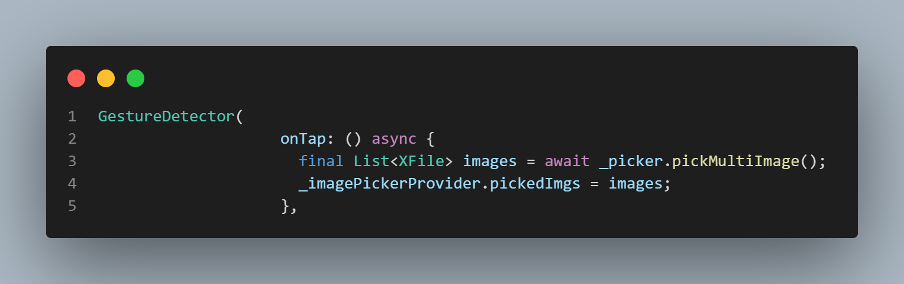 -->


<!-- 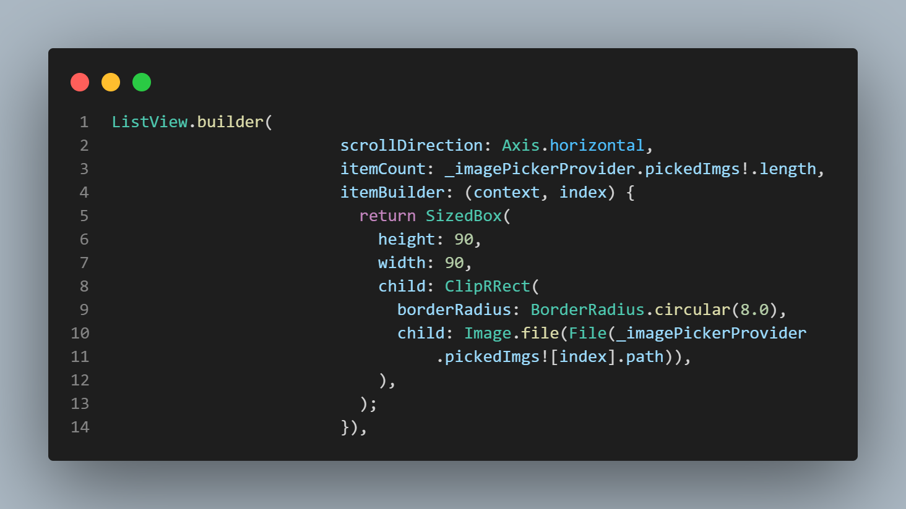 -->


<!--  -->

I also utilize "Form" and "TextFormField" widgets here.

When the user enters all the necessary information and taps the "OK" button on the app bar, the 'validate()' and 'save()' methods within the "Form" widget are executed. 

Subsequently, the data is sent to the designated path and saved within the firestore. 

If it's the initial data input, consider utilizing the 'set' method. However, if data already exists, opt for the 'update' method to prevent the deletion of any pre-existing information.

```dart
await FirebaseFirestore.instance.collection("collection_name").doc("document_name").set({'data': data});
```


<!-- 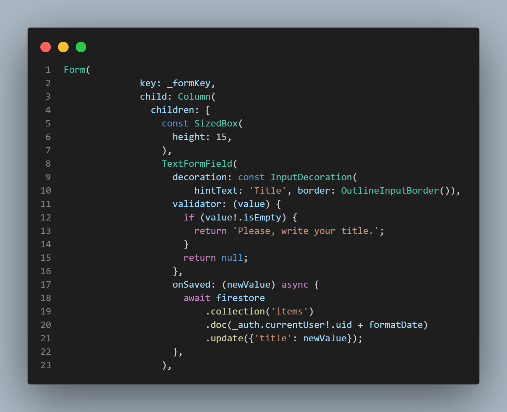 -->


"Procedure for the 'OK' Button:


<!-- 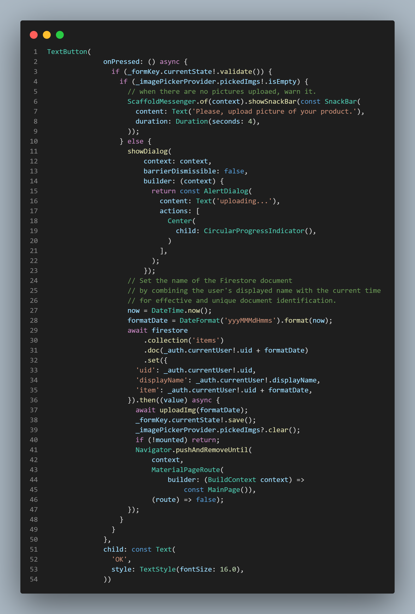 -->

1. **Validation Check:** Validate the form, and if no pictures are selected, display a Snackbar to alert the user.

2. **Upload Notification Dialog:** If pictures are selected, present a dialog to inform the user that the uploading process is in progress.

```dart
ScaffoldMessenger.of(context).showSnackBar(const SnackBar(
    content: Text(), 
  ));
```

3. **Generate Unique Document Name:** Utilize the DateTime class to create a unique string representing the current timestamp for the document.

4. **Document Creation:** Formulate essential information within the document.

5. **Invoke 'uploadImg' Function:** This function iteratively saves each image using a for-loop, and the resulting URL list is stored in the document. These URLs will later be used to display product images through Image.network("URL").
  

<!-- 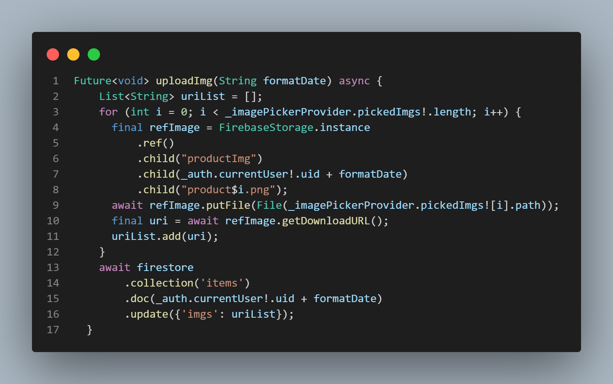 -->

6. **Invoke 'save' Method from Form Widget:** This method triggers the 'save' function, updating all field values in the document.

7. **Navigate to Main Page:** Finally, the page is routed to the Main Page. Note that the following code is essential:
   ```dart
   if (!mounted) return;
   ```
   Every widget possesses a boolean property 'mounted,' which turns true when a BuildContext is assigned to a state object. 'mounted' indicates whether the state object is in the widget tree. In essence, this code prevents errors if the widget is not ready. It's important to note that 'mounted' is applicable only with stateful widgets."

&nbsp;

## Item Detail page

Now, the Main Page displays the created posts, and users can navigate to a detailed information page about a selling product by tapping on a specific post.

<!--  -->

&nbsp;

### carousel_slider & dots_indicator

The product pictures are displayed in a slide format, enhancing the user experience. The implementation incorporates the "carousel_slider" package for this purpose. 

Additionally, small dots located at the bottom of the pictures serve as indicators, allowing users to track the current picture number. This feature is facilitated by the "dots_indicator" package.

The 'ItemDetailPage' retrieves pre-loaded data from Firestore through the 'doc' variable, which contains 'imgs' as a key and a list of picture URIs as its corresponding value. These URI values are then stored in a list variable. Subsequently, a list of 'Image' widgets is generated using a 'for' loop to display the product pictures.


<!--  -->

"DotsIndicatorProvider" is straightforward, consisting of a variable that maintains the current index (position) of the dot.


<!-- 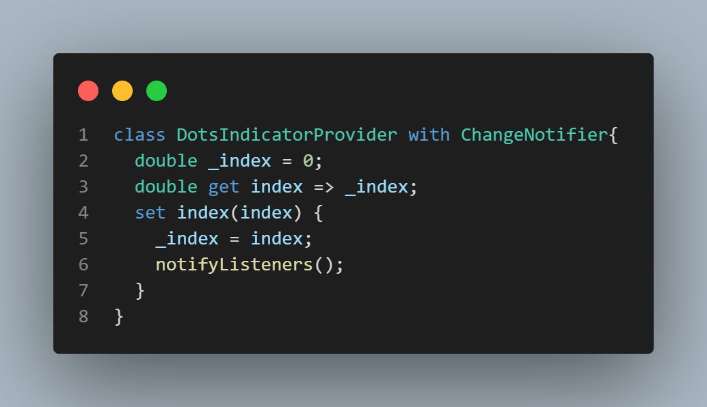 -->

To position dots on the image, I leverage the 'Stack' widget. The 'Stack' widget allows widgets to be layered on top of one another.

Within the 'CarouselOptions,' there's an 'onChanged' parameter that furnishes the current index (position) of the carousel item (picture). This index is then assigned to the variable in 'dotsIndicatorProvider.'

When stacking an additional widget on an existing one, the 'Positioned' widget is employed under the 'Stack' widget. Here, I've placed 'DotIndicator,' and you'll notice the 'position' parameter, where the variable containing the current carousel index can be placed.


<!-- 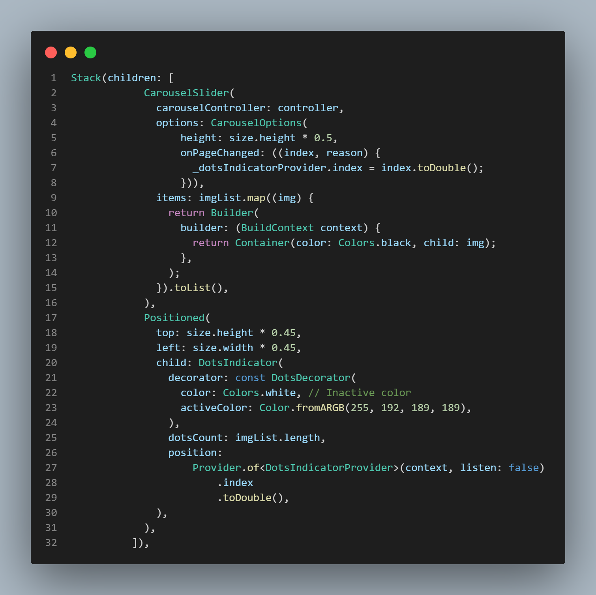 -->

&nbsp;

## Update & Delete

On the top right side, there are three dots icon. When a user taps it, a modal bottom sheet appears, providing options to report, update, or delete the post.


<!--  -->

The remarkable thing is that if the post does not belong to the currently logged-in user, it displays different menu options.


<!-- 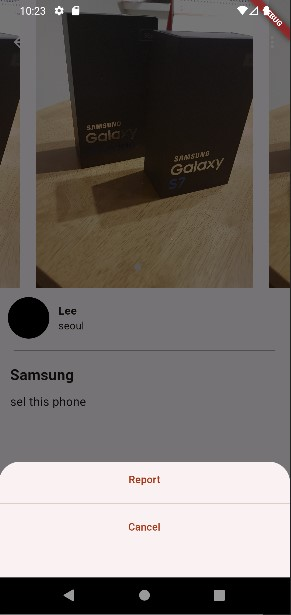 -->

Flutter offers the showModalBottomSheet function for creating modal bottom sheets. When using Firebase authentication, it compares the UID of the currently logged-in user with the UID associated with the post. If the UIDs differ, the function displays only the ‘Report’ and ‘Cancel’ options. Conversely, when the UIDs match, the custom widget ‘DeleteEditButton’ is invoked.


<!-- 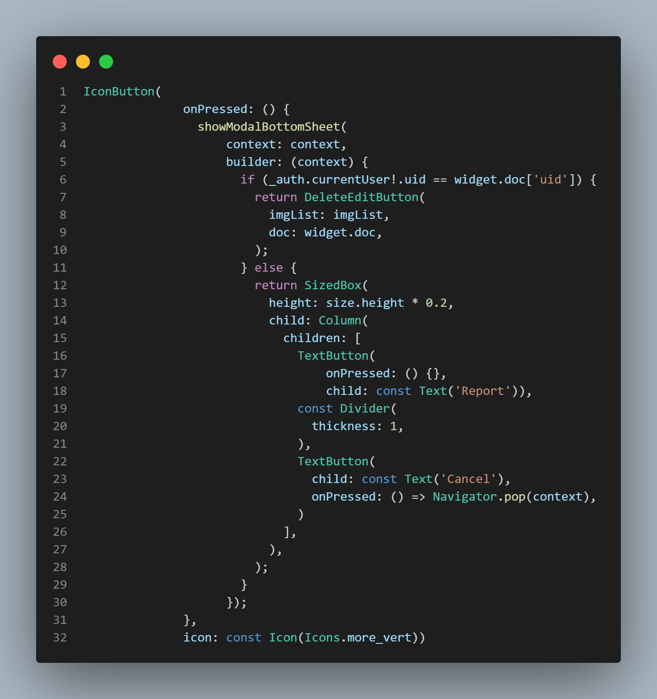 -->

&nbsp;

## Update

In the 'DeleteEditButton' class, a 'TextButton' widget for updating is provided. When users tap this button, they are directed to the 'UpdatePage,' with the 'imgList' containing 'Image' widgets and associated data being passed as parameters.


<!-- 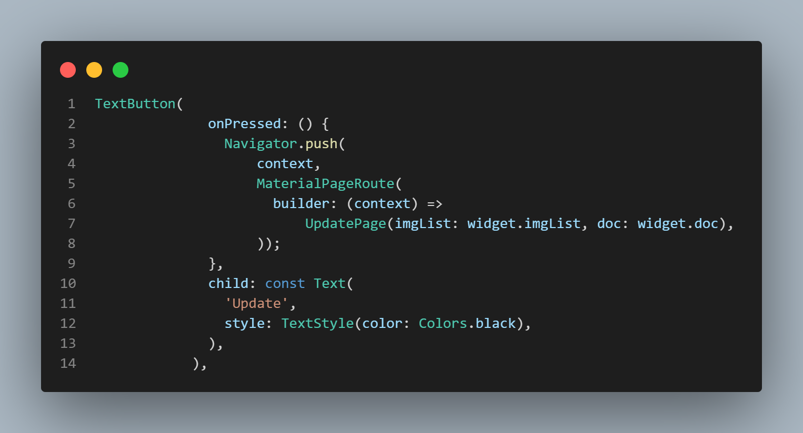 -->

The UI of the 'UpdatePage' is fundamentally the same as the 'PostPage,' with the key distinction lying in a few specific lines of code.


<!-- 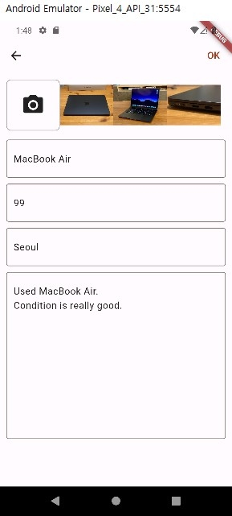 -->


On the left side is the code for the 'UpdatePage,' and on the right side is the code for the 'PostPage.' While they may appear quite similar, there are some nuanced differences.


<!-- 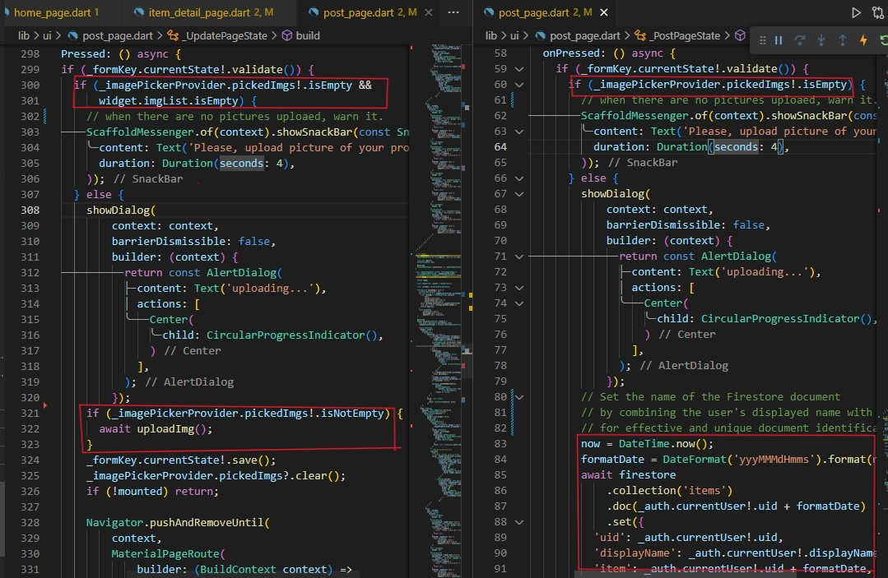 -->

In the 'PostPage' class, it simply checks whether the 'imagePickerProvider' has images. On the other hand, in the 'UpdatePage' class, it not only checks the 'imagePickerProvider' but also validates the 'imgList.' This distinction arises because it's acceptable for the 'imagePickerProvider' to lack images since they are expected to be passed from the 'ItemDetailPage' class. However, if 'imgList' is empty, it signifies that there are no pictures to upload, and this scenario needs to be addressed.

When the post page initially appears, 'imagePickerProvider.pickedImgs' is empty since the user hasn't selected any pictures yet. If the user doesn't upload any new pictures, there's no need to invoke the 'uploadImg' function. Therefore, the function should only be called if the user picks new images and 'imagePickerProvider.pickedImgs' is not empty, optimizing resource utilization.

Certain information, such as the document ID (name), 'displayName,' or 'uid,' doesn't require updating since it only needs to be set initially.

Additionally, the 'uploadingImg' function underwent minor adjustments. When updating a post, it simply rewrites the existing path, refraining from creating a new document in Firestore. Instead, it uploads to the existing document. This is why I let the item document to have its unique document ID field.


<!-- 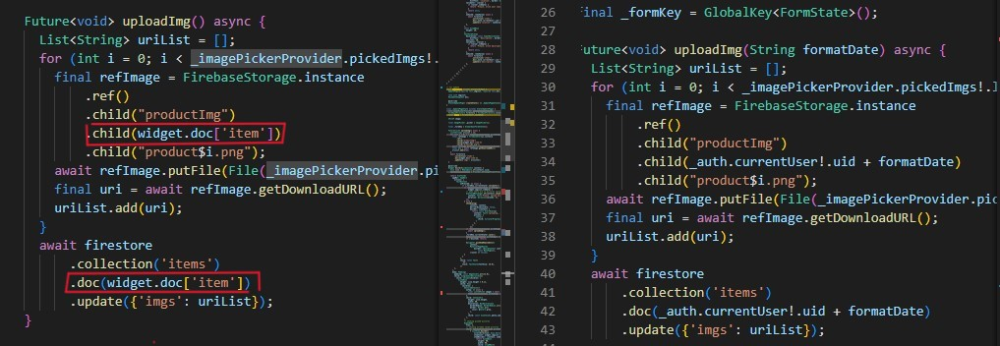 -->


You may observe that when the update page initially appears, the text fields are pre-filled with existing data. This is achieved by incorporating the 'initialValue' option in the 'TextFormField.'


<!-- 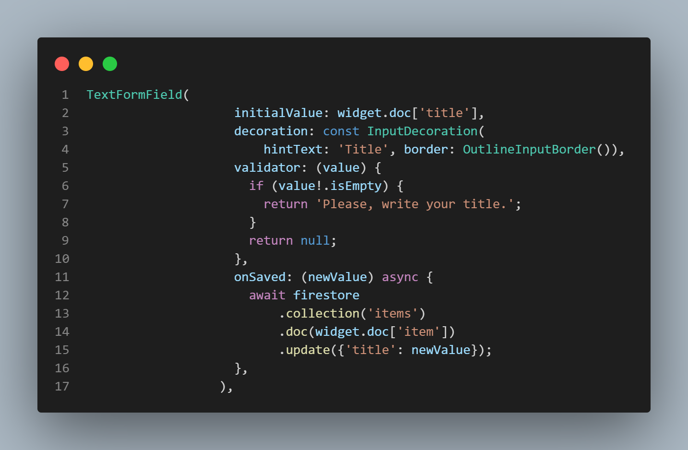 -->


#### The result!


<!--  -->

&nbsp;

## Delete

The deletion process is simpler than updating. When the user taps 'Delete' on the modal bottom sheet, a dialog appears to indicate that the deletion is in progress. 

Subsequently, the item document in Firestore and the images in Firebase Storage are deleted using the 'delete()' method.


<!--  -->

The key element in this process is handling Firebase Storage data removal. To achieve the deletion of files in the storage, the listAll method is utilized to obtain file references, and then each file is individually deleted within a loop. Initially, there was a misconception about Firebase Storage adhering to a folder structure, leading to an initial attempt using the following code.


<!-- 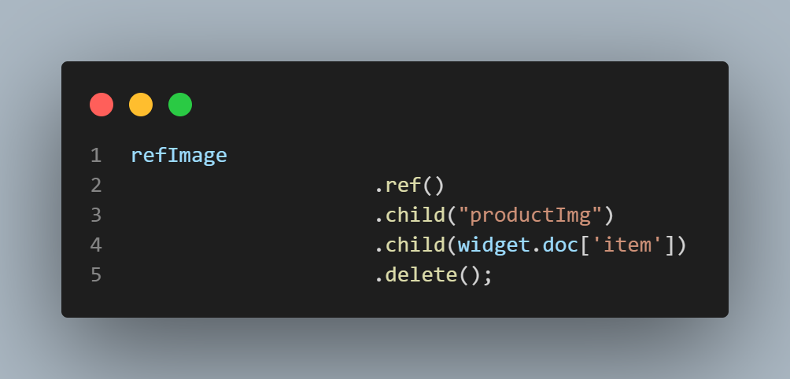 -->

Initially, I believed this code could delete the entire folder at once, but it resulted in an error. Upon further research on the internet, I discovered a solution.

"Cloud Storage doesn't actually have any folders. There are just paths that look like folders, to help you think about how your structure your data. Each object can just have a common prefix that describes its "virtual location" in the bucket.

There's no operations exposed by the Firebase SDKs that make it easy to delete all objects in one of these common prefixes. Your only real option is to list all files in a common prefix, iterate the results, and delete each object individually."

https://stackoverflow.com/questions/63459136/deleting-a-folder-from-firebase-cloud-storage-in-flutter


<!--  -->

&nbsp;

## Chatting

This project primarily focuses on implementing CRUD operations. Additionally, there's an exploration of chat functionality, although it's currently at the prototype stage with some potential errors.


<!--  -->

The process begins with a user, in this case, 'kim', logging in and uploading a new post for chatting. Subsequently, the user logs out. Then, another user logs in with a different account. The following details the steps taken when the user taps the 'chat' button:

1. Check for Existing Chat Room: The app first checks whether there's an existing chat room between the two users. This is done using their UIDs.

Firstable, we need to know the structure of 'users' collection.

In the 'users' collection, a document is created for each user upon their account creation. The document's name is the user's UID, serving as a unique identifier. 


<!-- 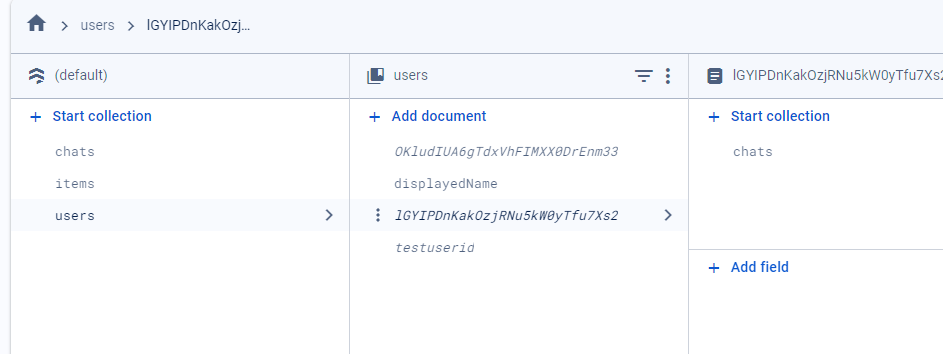 -->

Within each user document, there's an additional collection named 'chats.' This collection houses documents named after the counterpart's UID. When a user initiates a new chat, a document with the counterpart's UID is created. Each of these documents contains a field that represents the chatting room ID.


<!-- 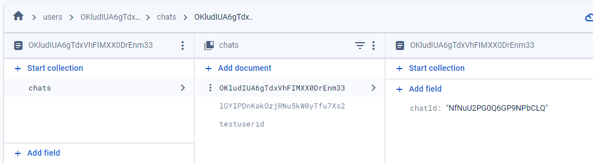 -->

To elaborate:

1. **User Document Creation**: When a user creates an account, a document is generated in the 'users' collection, uniquely identified by the user's UID.

2. **'Chats' Collection**: Within each user document, there exists a 'chats' collection, indicating the user's chat counterpart.

3. **Chat History Documents**: Documents within the 'chats' collection are named after the UID of the counterpart user. For example, if 'User A' initiates a chat with 'User B,' there will be a document named 'User B' within 'chats' in 'User A's document.

4. **Chat Room ID Field**: Inside each counterpart document, there's a field containing the ID of the chat room, facilitating easy navigation to the specific chat room when needed.


<!-- 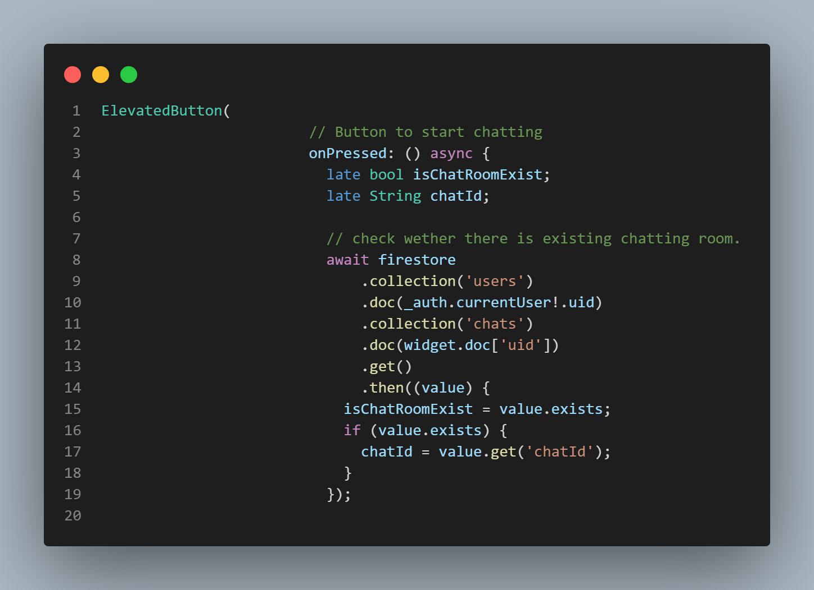 -->

When a user taps the 'chat' button, the initial step is to locate the current user's document within the 'users' collection. Following that, within the 'chats' collection, the system searches for a document named after the UID of the user who uploaded the post.

The 'exists' method is then employed, with the resulting boolean value assigned to the 'isChatRoomExist' variable. If an existing chatting room is found, the value of the 'chatId' field is subsequently assigned to the 'chatId' variable.


2. Navigate to the Chat Room: Once the existing chat room is identified, the app navigates the user to the respective chat room where they can engage in conversations with each other.
   
In the 'chats' collection, each document functions as an individual chat room, and the document's name serves as a unique identifier known as the 'chatId.'

Each document within this collection encapsulates valuable information pertaining to the users engaged in the conversation. This includes details such as user identifiers (UIDs) or other relevant identifiers.


<!-- 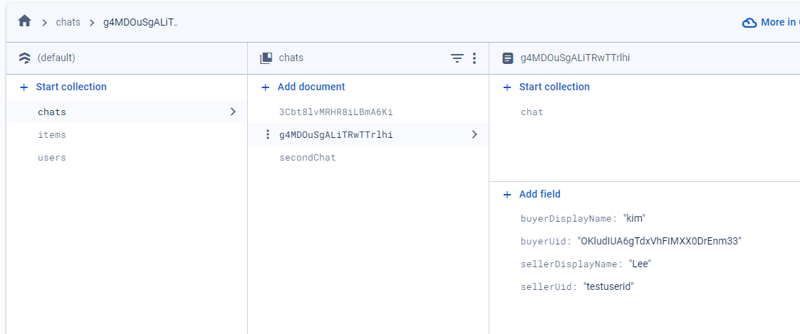 -->

When checking for the existence of a particular chatting room, the system employs the provided 'chatId.' This identifier is utilized to pinpoint the corresponding document within the 'chats' collection.

If an existing chatting room is identified using the 'chatId,' the system retrieves the relevant 'chats' document. Subsequently, it navigates to the designated chatting room, leveraging the retrieved data to initialize and render the chat interface. 


<!-- 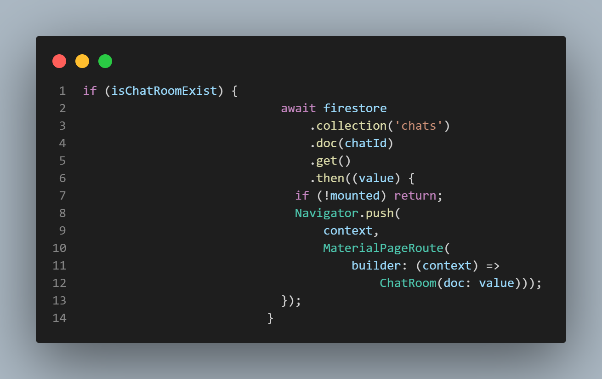 -->

3. If No Existing Chat Room: If there's no pre-existing chat room, the app creates a new one.

In the absence of an existing chat room, the system initiates the creation of a new chat room document within the 'chats' collection. Utilizing the 'id' method provides a random identifier for the newly generated document, ensuring uniqueness.


<!-- 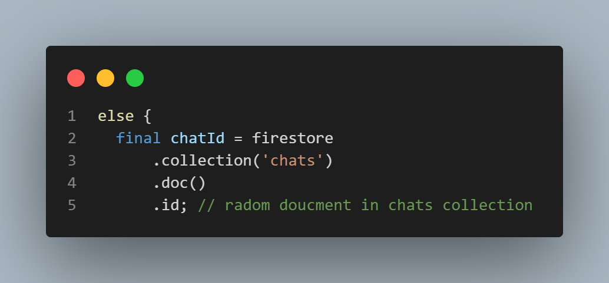 -->

The newly created document becomes a repository for storing essential information about the users engaged in the chat. User details, such as UIDs or relevant identifiers, are saved as fields within this document. This information is then passed as parameters to facilitate the setup of the corresponding chat room.


<!-- 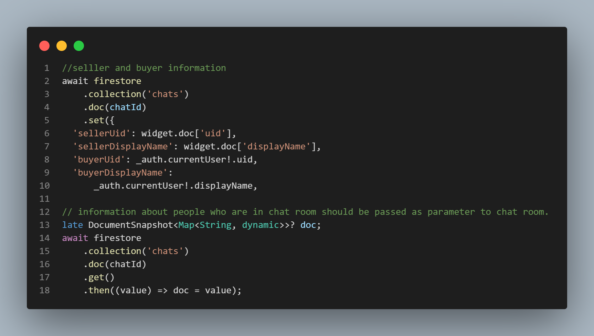 -->

In the scenario where two users initiate a new chat room, the system ensures that both users' information is accurately recorded. To establish a connection between the chatting users and facilitate seamless identification, each user's UID is stored in their respective personal document within the 'users' collection. Within the 'chats' collection under the user's personal document, a document bearing the UID of the conversational counterpart is generated. This document includes a 'chatID' field, allowing each user to store information about their active chat rooms and the specific individuals with whom they are engaged in conversation.


<!--  -->


&nbsp;

### ChatRoom

The chat room encompasses three key components: the app bar, the message display area, and the message text field. The app bar prominently showcases the name of the conversation counterpart, dynamically adjusting based on the user's role in the transaction. If the current user is the buyer, the seller's name takes precedence; conversely, if the user is the seller, the buyer's name is prominently featured.


<!-- 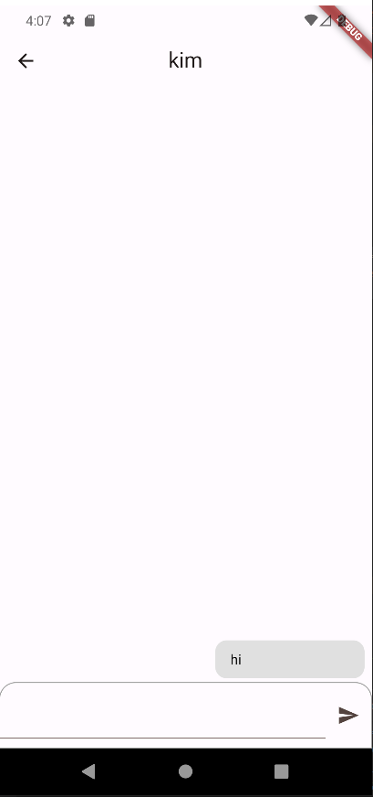 -->

<!-- 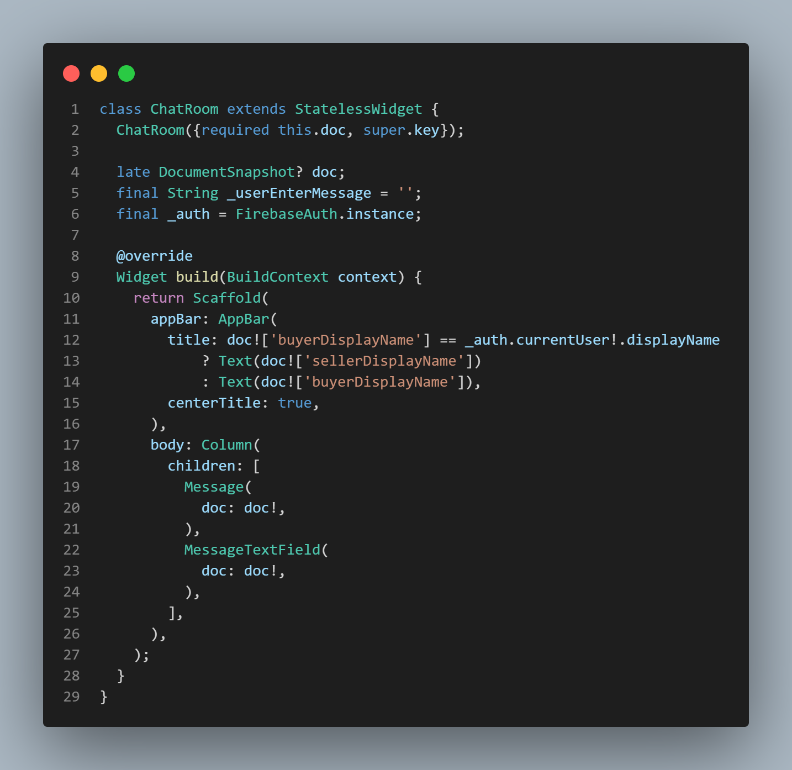 -->

To streamline the structure and enhance functionality, custom widgets have been designed for both the message display and the message text field sections.

&nbsp;

### MessageTextField

Let's delve into the 'MessageTextField' class for a clearer understanding. This class employs the 'TextField' widget along with its controller. Any alterations in the text field trigger the update of the '_userEnterMessage' variable. Upon the user tapping the 'send' icon button, the code validates whether the '_userEnterMessage' is empty or not. If the text field contains content, the message is then sent to the database.


<!-- 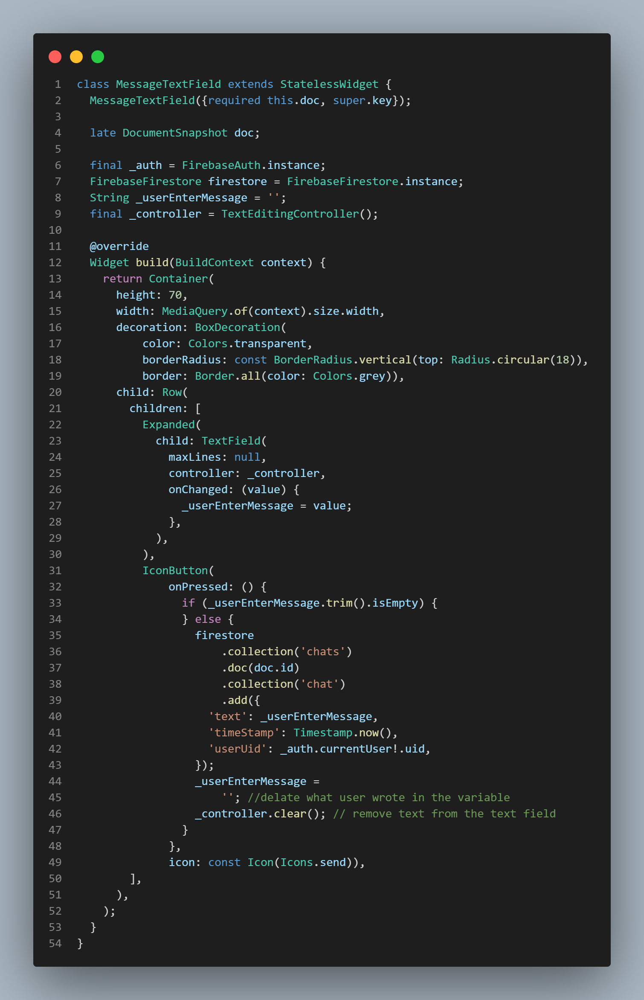 -->

In the 'chats' collection, each chat room has its dedicated document, and within this document, there exists a sub-collection named 'chat.' This sub-collection serves as the repository for the respective chat messages. The stored information includes the message text, a timestamp, and the user ID of the message sender. The timestamp is especially crucial for presenting messages in chronological order, ensuring a seamless and organized display of the conversation.


<!-- 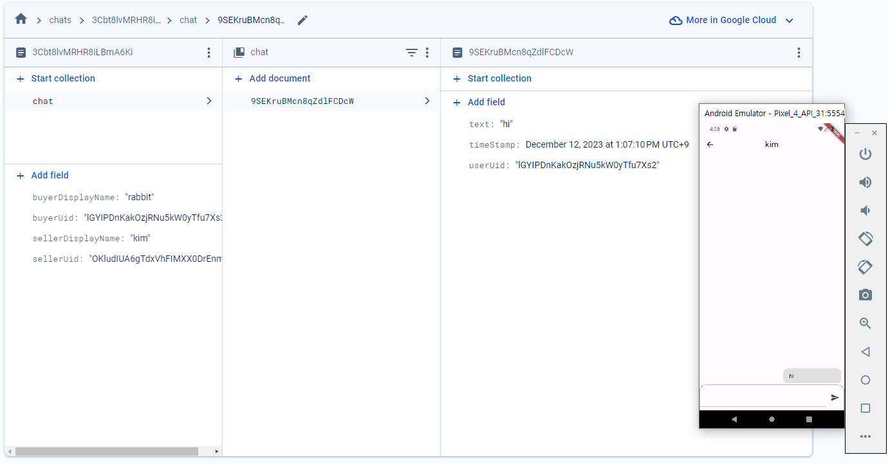 -->

&nbsp;

### Message

Now, let's explore how the messages sent to the database are presented to users. Utilizing the 'StreamBuilder,' the system retrieves snapshots from the database. A pivotal element here is the 'orderBy' method, which defines the criteria for ordering messages. Typically, chat rooms display the most recent messages at the bottom. By utilizing the 'orderBy' method with the timestamp field, I ensure that the messages are ordered chronologically. The default order is ascending, presenting the most recent message at the top. To achieve the desired arrangement, I set the 'descending' option to true.


<!-- 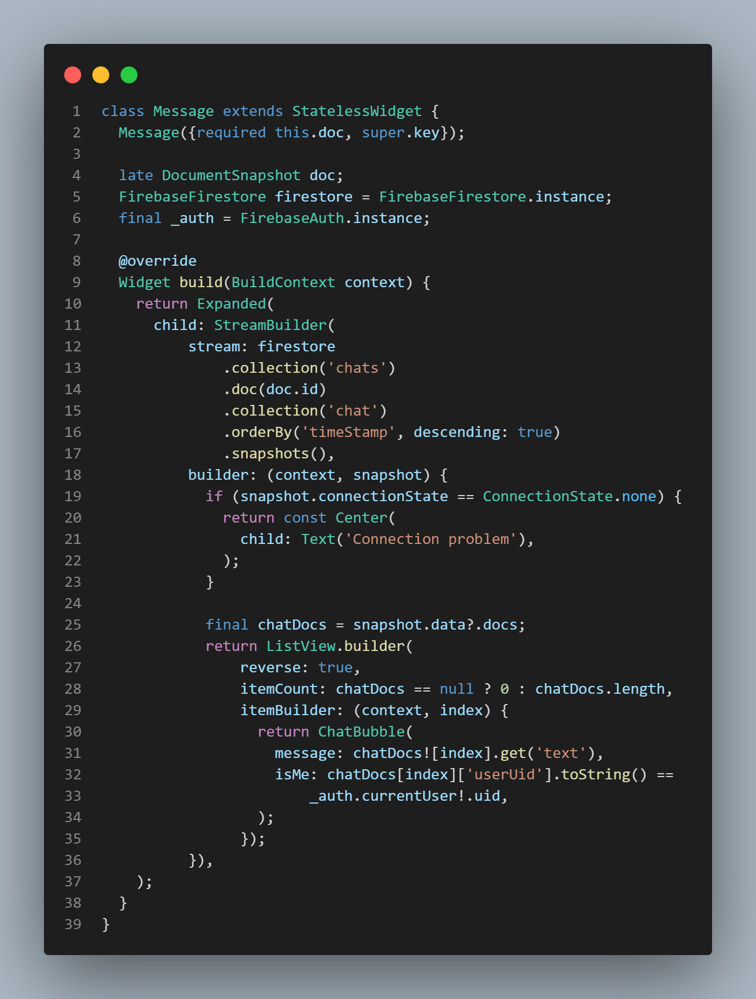 -->

The obtained snapshot is then fed into 'ListView.builder,' where the 'reverse' option is set to true. This configuration is essential for ensuring that messages appear at the bottom of the screen and move upwards. 

The 'ChatBubble' is a custom widget I developed, accepting 'text' and a boolean value generated from 'userUid' as parameters. The inclusion of the user's UID is crucial for distinguishing messages from different users. If the text message originates from the current user, the chat bubble is positioned on the right side of the screen, and its color is set to grey. Conversely, messages from the opponent are displayed on the left side with a blue color. This differentiation enhances the visual clarity of the chat interface.

Demonstration

Initially, the existing chat history was cleared. 

<!-- 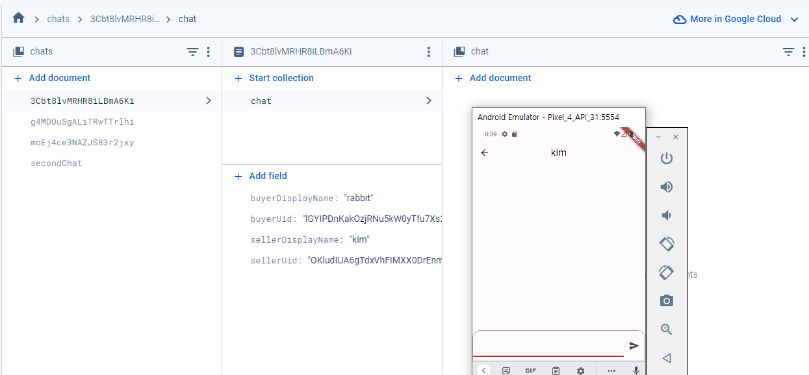 -->

Following this, I entered and sent the message 'hi,' resulting in the upload of this message to the database. 


<!-- 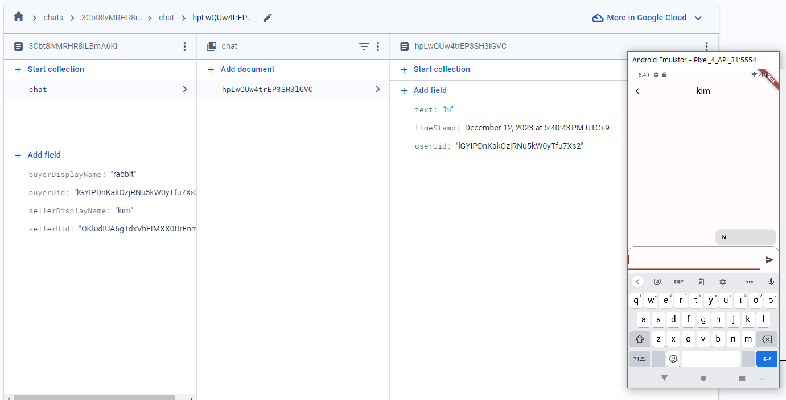 -->

Subsequently, to simulate a counterpart's response, I manually added text information directly to the database due to the unavailability of two Android simulators for real-time interaction. 


<!-- 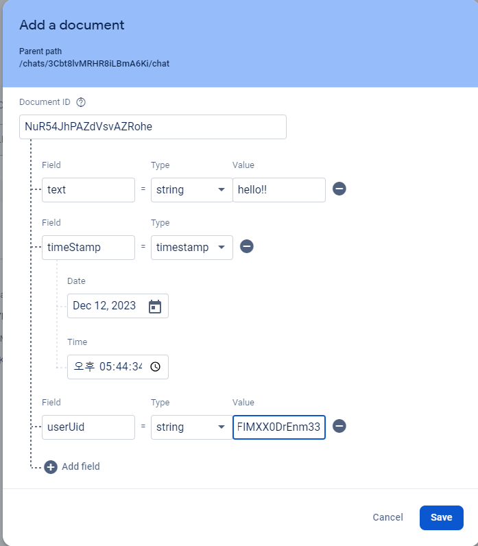 -->

The outcome was the immediate appearance of a new chat bubble, representing the simulated counterpart's message in the chat interface.


<!-- 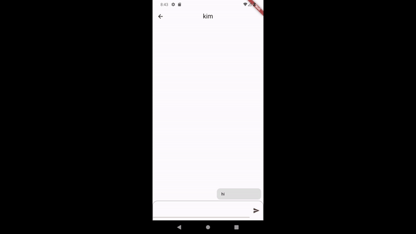 -->

&nbsp;

## Chat Page

This page serves as a display for open chat rooms of the current user, offering a preview of each ongoing conversation. The significance of this section lies in the utilization of two 'StreamBuilder' widgets.


<!-- 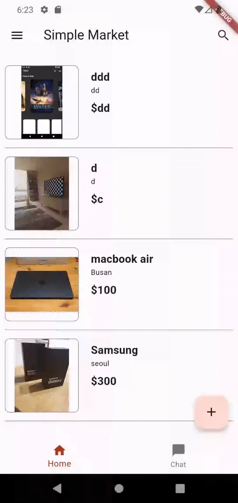 -->

In the first instance, obtaining information about the current user's chatting partner is crucial. As you recall, the 'chats' collection under the user's personal document contains documents named after the counterpart's UID, each with its associated chat ID. This data enables the determination of the existing chat rooms and their respective IDs.


<!-- 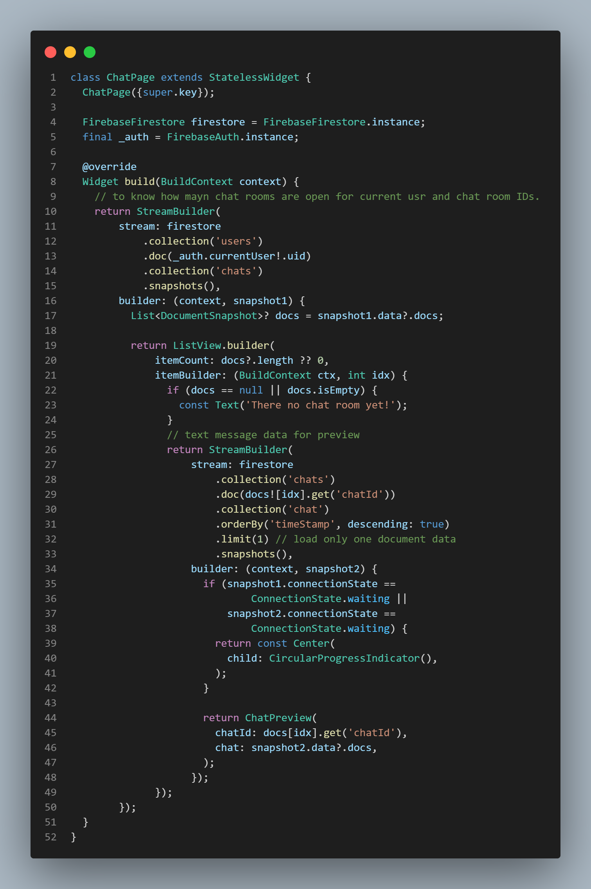 -->

Upon confirming the presence of any open chat rooms for the current user, the second 'StreamBuilder' comes into play. This second 'StreamBuilder' fetches data related to text messages, focusing on a single document containing message information. Notably, only one text message document is retrieved for preview, as there's no need to display the entire message content in the preview.

The loaded message document is then passed to the 'ChatPreview' custom widget. It's worth noting that loading the top-level (mother) collection does not automatically fetch all child collections and documents. Consequently, additional data loading with a specific path is necessary to pass the required information to the 'ChatRoom' widget.


<!-- 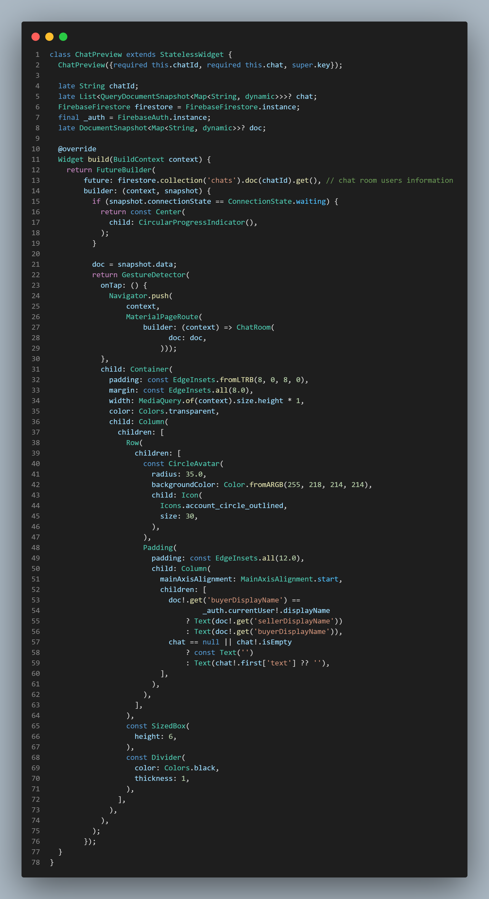 -->

&nbsp;

## Firebase rules

Unauthorized access to Firebase databases poses a potential security risk that must be mitigated. Firebase addresses this concern through the implementation of security rules. The initial rule, often encountered when first exploring Firebase rules, serves as a precautionary measure for testing purposes. Developers are advised to modify these rules within 30 days to ensure a more secure configuration.


<!-- 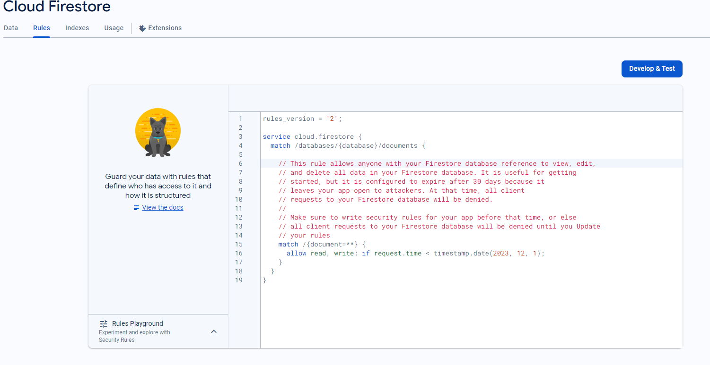 -->

The code provided serves as a default template. It is crucial to exercise caution when altering these lines, as doing so without a profound understanding of Firebase rules may lead to unintended consequences. In instances of uncertainty, seeking guidance, such as consulting ChatGPT, can be instrumental in navigating the intricacies of Firebase rules effectively.

```firebase
rules_version = '2';
service cloud.firestore {
  match /databases/{database}/documents {
```

1. **`rules_version = '2';`**: Specifies that these rules are using the version 2 syntax. This version introduces a more concise and expressive syntax for defining security rules compared to version 1.

2. **`service cloud.firestore {`**: Indicates that the rules following this line will be specific to the Cloud Firestore service.

3. **`match /databases/{database}/documents {`**: This line initiates the definition of rules for Firestore documents in the specified database.

   - `/databases/{database}`: Refers to the root level of the Firestore database.
   - `/documents`: Specifies that the rules will apply to documents within the database.

   The placeholder `{database}` is used to indicate that these rules are applicable to any Firestore database.


Basic structure
```firebase
match /chats/{document=**}{
   allow write: if request.auth.uid == request.resource.data.uid;
  }
```
specify document
```firebase
// 1. apply security rules on the specific document (doc1) uder chats collection
match /chats/doc1

// 2. apply rules on the whole documents uder chats collection. Only documents under chats collection. It does not apply to child collection.
match /chats/{anyName}

// 3. apply rules on the entire child collections and documents.
match /chats/{document=**}
```

Read
```
// get + list
allow read: if <condition>; 

// sigle doucument
allow get: if <condition>;

// query or the whole document in collection
allow list: if <condition>;

```
Write
```
// create + update + delete
allow write: if <condition>;

allow create: if <condition>;
allow update: if <condition>;
allow delete: if <condition>;
```

Security condition
```
// everyone can read and write
allow read, write: if true

// only authorized people can read and wirte
allow read, write: if request.auth.uid == request.resource.data.uid;

// no one can access
allow read, write: if false
```

Building upon these fundamental rules, I formulated specific rules for my project. As I utilize Firebase Storage in my application, I've also created the rules to cover Firebase Storage as well.


<!-- 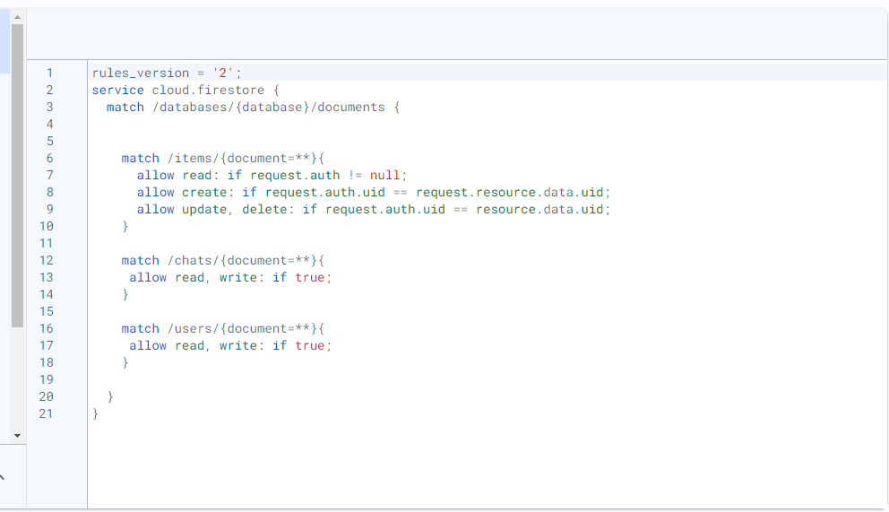 -->