# What is a Simple Movie app?

It's a straightforward movie information app called "Simple Movie." The app provides details about currently trending movies, as well as information about new releases. Users can access in-depth information about each movie and perform searches for specific titles they're interested in.


<!-- 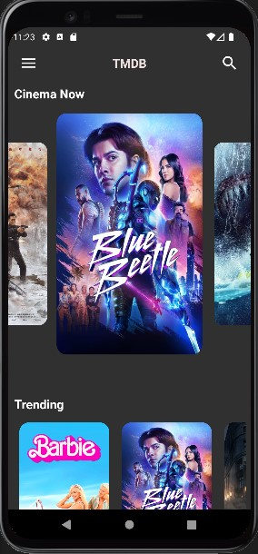 -->

sorce code for this project: https://github.com/Blackcode2/Flutter-Simple_Movie_App

&nbsp;

# Goal

* Using Provdier for state management
* Implementing a search function.

&nbsp;

# API

For this project, I utilized the TMDB API. TMDB, short for The Movie Database, is a community-driven database for movies and TV shows.


<!-- 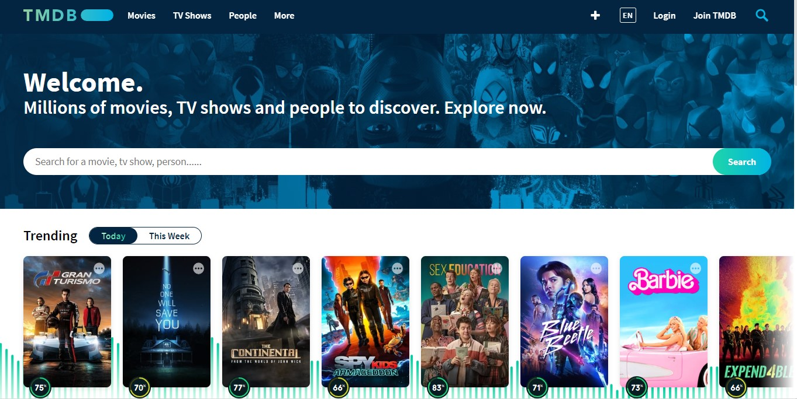 -->


After creating an account, you can generate an API key by clicking on your profile, selecting "Settings," and navigating to the "API" section.


<!-- 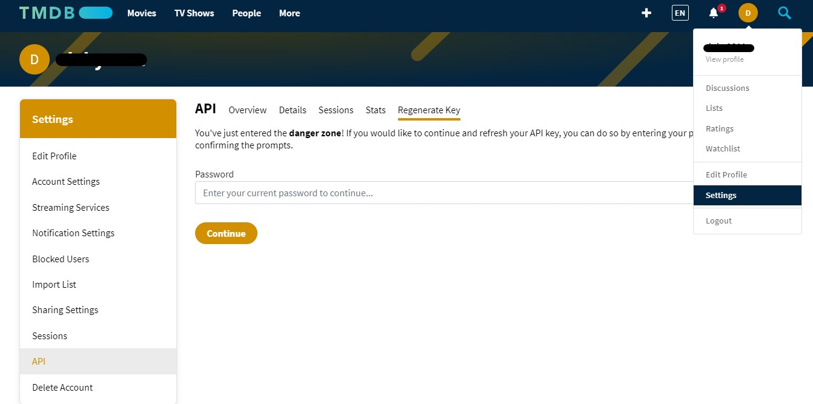 -->

There is offical document about how to use API.
https://developer.themoviedb.org/reference/intro/getting-started


<!-- 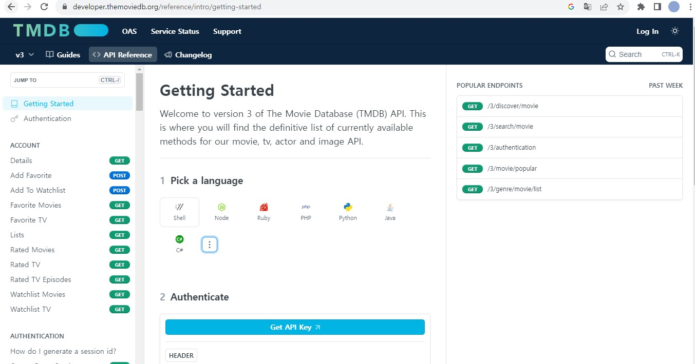 -->


# Home Screen

In the app bar, I added an IconButton for the menu icon and the search icon. I removed the default effect for the search IconButton. The body contains a SingleChildScrollView widget, which allows the screen to be scrolled. This widget has a "physics" parameter that adds animation when the screen reaches the end of the content.


<!--  -->


The home screen consists of two sections: a Carousel slider displaying current movies and a ListView showing trending movies. If there's data available, a custom carousel slider widget displaying movie posters will be returned. Otherwise, another custom carousel widget showing a loading indicator will be returned.

```dart
Column(
  crossAxisAlignment: CrossAxisAlignment.center,
  children: [
    Row(...),
    Padding(
      padding: const EdgeInsets.fromLTRB(0, 10, 0, 20),
      child: _movieProvider.movies != null
          ? MovieCarouselSlider()
          : const LoadingCarouselSlider(),
    ),
    SizedBox(...),
    Padding(
      ...
      child: Row(...),
    ),
    MoviePoster(provider: _trendingProvider),
    SizedBox(...),
  ],
),
```


The Carousel slider is a dynamic UI component that displays images, texts, and UI elements in a scrolling horizontal or vertical manner. It's particularly well-suited for showcasing important content. To implement this, I used the **carousel_slider** library.


<!--  -->

The items to be displayed are passed to the **items** parameter as a list. Then, it needs to use the **map** method to transform and return these items. The **map** method is employed when items in an iterable need to be transformed and returned. It returns an iterable, so it is nessary to use the **toList()** method to convert it to a list. Additionally, the **options** parameter can receive a **CarouselOptions** widget, allowing for various customization options such as size, effects, and more.


#### Example of usage
```dart
CarouselSlider(
  options: CarouselOptions(
    height: 400,
      aspectRatio: 16/9,
      viewportFraction: 0.8,
      initialPage: 0,
      enableInfiniteScroll: true,
      reverse: false,
      autoPlay: true,
      autoPlayInterval: Duration(seconds: 3),
      autoPlayAnimationDuration: Duration(milliseconds: 800),
      autoPlayCurve: Curves.fastOutSlowIn,
      enlargeCenterPage: true,
      enlargeFactor: 0.3,
      onPageChanged: callbackFunction,
      scrollDirection: Axis.horizontal,
  ),
  items: [1,2,3,4,5].map((i) {
    return Builder(
      builder: (BuildContext context) {
        return Container(
          width: MediaQuery.of(context).size.width,
          margin: EdgeInsets.symmetric(horizontal: 5.0),
          decoration: BoxDecoration(
            color: Colors.amber
          ),
          child: Text('text $i', style: TextStyle(fontSize: 16.0),)
        );
      },
    );
  }).toList(),
)
```

#### My custom carousel slider

```dart
class MovieCarouselSlider extends StatelessWidget {
  MovieCarouselSlider({Key? key}) : super(key: key);
  late MovieProvider _movieProvider;

  @override
  Widget build(BuildContext context) {
    Size size = MediaQuery.of(context).size;
    _movieProvider = Provider.of<MovieProvider>(context, listen: true);
    return CarouselSlider(
      options: CarouselOptions(
        height: MediaQuery.of(context).size.height * 0.5,
        viewportFraction: 0.60,
        enlargeCenterPage: true,
        enlargeFactor: 0.3,
      ),
      items: _movieProvider.movies!.map((item) {
        return Builder(
          builder: (BuildContext context) {
            return GestureDetector(
              onTap: () {
                Navigator.push(
                    context,
                    MaterialPageRoute(
                        builder: (context) => DetailPage(
                              movie: item,
                            )));
              },
              child: ClipRRect(
                borderRadius: BorderRadius.circular(16.0),
                child: Image.network(
                  item.postUrl,
                  fit: BoxFit.fill,
                ),
              ),
            );
          },
        );
      }).toList(),
    );
  }
}
```

I created a custom **MoviePoster** ListView widget to display trending movies horizontally.


<!--  -->

```dart
class MoviePoster extends StatelessWidget {
  var provider;

  MoviePoster({required this.provider, Key? key})
      : super(key: key);

  @override
  Widget build(BuildContext context) {
    Size size = MediaQuery.of(context).size;
    return Padding(
      padding: const EdgeInsets.all(8.0),
      child: SizedBox(
        height: MediaQuery.of(context).size.height * 0.28,
        width: MediaQuery.of(context).size.width,
        child: ListView.builder(
            scrollDirection: Axis.horizontal,
            physics: const BouncingScrollPhysics(),
            itemCount: provider.movies.length,
            itemBuilder: (BuildContext context, int idx) {
              return GestureDetector(
                onTap: (){
                  Navigator.push(context, MaterialPageRoute(builder: (context) => DetailPage(movie: provider.movies[idx])));
                },
                child: Container(
                  margin: const EdgeInsets.symmetric(horizontal: 10.0),
                  decoration: BoxDecoration(
                    color: Colors.transparent,
                    borderRadius: BorderRadius.circular(16.0),
                  ),
                  child: ClipRRect(
                    borderRadius: BorderRadius.circular(16.0),
                    child: Image.network(
                      provider.movies[idx].postUrl,
                    ),
                  ),
                ),
              );
            }),
      ),
    );
  }
}
```

&nbsp;

# How to load picture data with Provider?

To use provider, MVVM design pattern is necessary. Then, what is MVVM design pattern? and What is design pattern? I asked these questions to ChatGPT.

MVVM stands for Model-View-ViewModel, which is a design pattern used in software development. A design pattern is a general reusable solution to a commonly occurring problem within a given context in software design. It's like a template or blueprint for solving a particular problem in a structured and efficient way.


<!--  -->

MVVM, specifically, is a design pattern that separates the user interface (View) from the application's business logic (Model) with the help of an intermediate layer (ViewModel). Here's a brief explanation of each component:

1. **Model (M)**: The Model represents the application's data and business logic. It is responsible for retrieving data from various sources (like databases, APIs, etc.), processing that data, and providing it to the ViewModel. The Model should not contain any information about how the data is displayed.

2. **View (V)**: The View represents the user interface elements, such as buttons, labels, and screens. It is responsible for displaying data and capturing user input. In MVVM, the View is passive and should not contain any application logic. Instead, it binds to the ViewModel to display data and respond to user actions.

3. **ViewModel (VM)**: The ViewModel acts as an intermediary between the Model and the View. It contains the presentation logic and exposes data and commands that the View can bind to. The ViewModel transforms the raw data from the Model into a format that the View can easily display. It also handles user interactions and communicates with the Model to retrieve or update data.

MVVM promotes separation of concerns, making it easier to maintain and test code. It's particularly well-suited for applications with complex user interfaces, where the presentation logic can become intricate.

&nbsp;

## Let's make it

Firstly, I organized my project into four distinct folders: **model**, **view**, **view model**, and **repository**. The **repository** folder is specifically designated for handling API network requests using the HTTP protocol.


<!-- 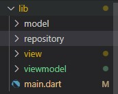 -->

I've already created the view, which is the carousel slider. Now, I need to work on developing the model, view model, and repository components.

### 1. Model
   
There is an easy way to generate models in Dart. You can search for a "Dart model generator" online and provide it with JSON data to automatically generate the corresponding Dart model classes.

 
<!-- 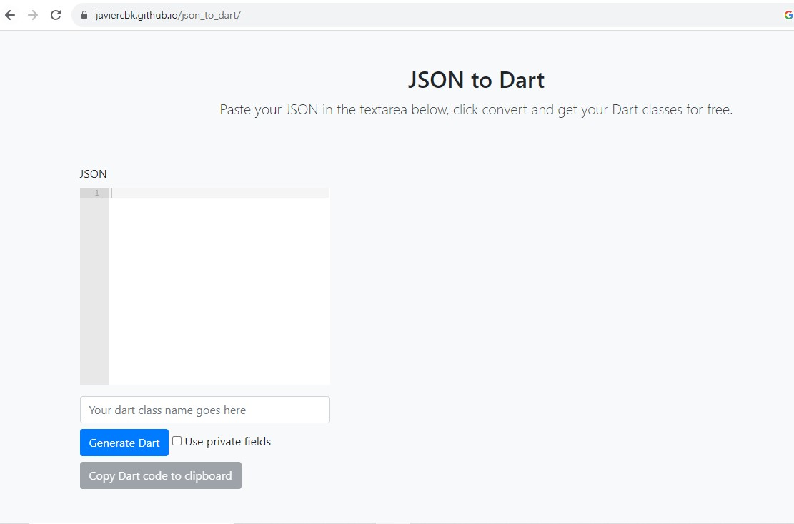 -->

I'd like to retrieve JSON data for "Now Playing." To do this, I'll append your API key after an equal sign and fetch the JSON data.

JSON data
```JSON
{
  "dates": {
    "maximum": "2023-09-30",
    "minimum": "2023-08-13"
  },
  "page": 1,
  "results": [
    {
      "adult": false,
      "backdrop_path": "/1syW9SNna38rSl9fnXwc9fP7POW.jpg",
      "genre_ids": [
        28,
        878,
        12
      ],
      "id": 565770,
      "original_language": "en",
      "original_title": "Blue Beetle",
      "overview": "Recent college grad Jaime Reyes returns home full of aspirations for his future, only to find that home is not quite as he left it. As he searches to find his purpose in the world, fate intervenes when Jaime unexpectedly finds himself in possession of an ancient relic of alien biotechnology: the Scarab.",
      "popularity": 3386.97,
      "poster_path": "/mXLOHHc1Zeuwsl4xYKjKh2280oL.jpg",
      "release_date": "2023-08-16",
      "title": "Blue Beetle",
      "video": false,
      "vote_average": 7.1,
      "vote_count": 1059
    },
    {
      "adult": false,
      "backdrop_path": "/jv4tiXAgaArMQo57jFMjvBEjmoa.jpg",
      "genre_ids": [
        28,
        18,
        12
      ],
      "id": 980489,
      "original_language": "en",
      "original_title": "Gran Turismo",
      "overview": "The ultimate wish-fulfillment tale of a teenage Gran Turismo player whose gaming skills won him a series of Nissan competitions to become an actual professional racecar driver.",
      "popularity": 2680.593,
      "poster_path": "/51tqzRtKMMZEYUpSYkrUE7v9ehm.jpg",
      "release_date": "2023-08-09",
      "title": "Gran Turismo",
      "video": false,
      "vote_average": 8.1,
      "vote_count": 680
    },
    {
      ...
    },
    {
      ...
    },
    {
      ...
    },
    {
      ...
    },
    {
      ...
    },
    {
      ...
    },
    {
      ...
    },
    {
      ...
    },
    {
      ...
    },
    {
      ...
    },
    {
      ...
    },
    {
      ...
    },
    {
      ...
    },
    {
      ...
    },
    {
      ...
    },
    {
      ...
    },
    {
      ...
    },
    {
      ...
    }
  ],
  "total_pages": 103,
  "total_results": 2045
}
```

https://api.themoviedb.org/3/movie/now_playing?api_key=$apiKey


<!-- 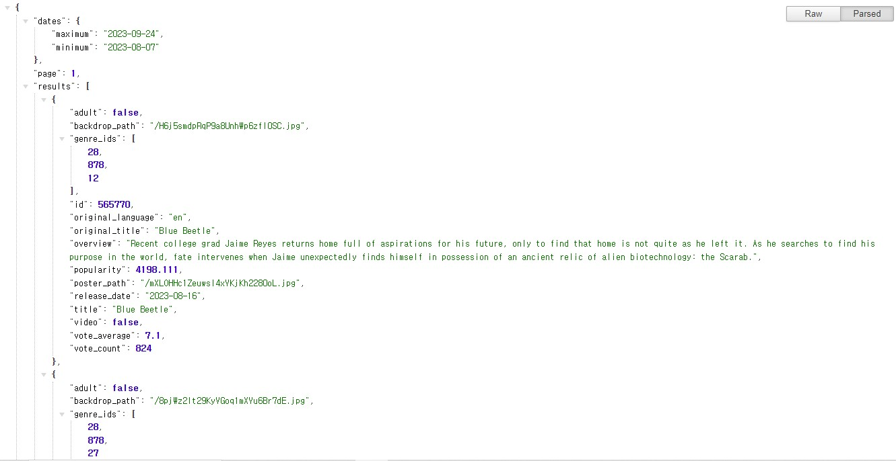 -->

Copy all of the JSON data and paste it into the model generator.


<!--  -->

Now, you can modify the generated class to suit your specific needs. I deleted unnecessary parts and added what I need.

```dart
class Movie {
  bool? adult;
  String? backdropPath;
  List<int>? genreIds;
  int? id;
  String? originalLanguage;
  String? originalTitle;
  String? overview;
  double? popularity;
  String? posterPath;
  String? releaseDate;
  String? title;
  bool? video;
  double? voteAverage;
  int? voteCount;

  Movie(
      {this.adult,
      this.backdropPath,
      this.genreIds,
      this.id,
      this.originalLanguage,
      this.originalTitle,
      this.overview,
      this.popularity,
      this.posterPath,
      this.releaseDate,
      this.title,
      this.video,
      this.voteAverage,
      this.voteCount});

  Movie.fromJson(Map<String, dynamic> json) {
    adult = json['adult'];
    backdropPath = json['backdrop_path'];
    genreIds = json['genre_ids'].cast<int>();
    id = json['id'];
    originalLanguage = json['original_language'];
    originalTitle = json['original_title'];
    overview = json['overview'];
    popularity = json['popularity'].toDouble();
    posterPath = json['poster_path'];
    releaseDate = json['release_date'];
    title = json['title'];
    video = json['video'];
    voteAverage = json['vote_average'].toDouble();
    voteCount = json['vote_count'];
  }

  String get postUrl => 'https://image.tmdb.org/t/p/w500/${posterPath}';

  Map<String, dynamic> toJson() {
    final Map<String, dynamic> data = <String, dynamic>{};
    data['adult'] = adult;
    data['backdrop_path'] = backdropPath;
    data['genre_ids'] = genreIds;
    data['id'] = id;
    data['original_language'] = originalLanguage;
    data['original_title'] = originalTitle;
    data['overview'] = overview;
    data['popularity'] = popularity;
    data['poster_path'] = posterPath;
    data['release_date'] = releaseDate;
    data['title'] = title;
    data['video'] = video;
    data['vote_average'] = voteAverage;
    data['vote_count'] = voteCount;
    return data;
  }
}
```

&nbsp;

### 2. View Model

Functions for making API requests are implemented within the repository class. However, the entity that triggers these HTTP requests is the View Model. I created an instance of the repository object and introduced a variable, **_movies**, to store the loaded data. To accommodate multiple instances of the "Movie" model, I used a List to store the Movie objects. In the **loadMovies** method, I invoke the **loadMovies** method from the **MovieRepository** class, which returns a **List<Movie>?**. The returned data is then assigned to the **_movies** variable, followed by a call to **notifyListeners** to trigger a rebuild of the UI.

```dart
import 'package:flutter/material.dart';
import 'package:simple_movie/repository/now_movie_repository.dart';
import '../model/movie.dart';

class MovieProvider extends ChangeNotifier {
  final MovieRepository _movieRepository = MovieRepository();
  List<Movie>? _movies = [];
  List<Movie>? get movies => _movies;

  loadMovies() async {
    List<Movie>? listMovies =
        await _movieRepository.loadMovies(); 
        //Store it in another variable for post-processing, such as exception handling.
    //_movies = await _movieRepository.loadMovies(); when do not need post-processing
    _movies = listMovies;
    notifyListeners();
  }
}

```

&nbsp;

### 3. Repository

```dart
import 'dart:convert';
import 'package:simple_movie/model/movie.dart';
import 'package:http/http.dart' as http;

class MovieRepository {
  var queryPram = {'api_key': ''};
  Future<List<Movie>?> loadMovies() async {
    var url =
        Uri.https('api.themoviedb.org', '/3/movie/now_playing', queryPram);

    var response = await http.get(url);
    if (response.statusCode == 200) {
      Map<String, dynamic> body = json.decode(response.body);
      List<dynamic> list = body['results'];
      //{results : [{JSON}, {JSON}]}
      // the elements in the "result" list is other JSON data so I need to creat each Movie model for each element by using .map and fromJson method.
      return list.map<Movie>((item) => Movie.fromJson(item)).toList();
    }
    return null;
  }
}
```

To create an instance of the Uri class, there are several ways to pass the URL as a parameter. In my previous project, I used the **parse** method to pass the entire URI. However, this time I'm using the **https** method. This approach makes it easier to handle API parameters.

```dart
final uri = Uri.parse(
    'https://dart.dev/guides/libraries/library-tour#utility-classes');
```

```dart
final httpsUri = Uri.https('example.com', 'api/fetch', {'limit': '10'});
print(httpsUri); // https://example.com/api/fetch?limit=10
```

When the **loadMovies()** method is invoked, it first decodes the JSON data after get the response. Then, only the necessary part is assigned to a List variable. For post-processing, each element in the list is transformed into a Movie model using the **map** method. Finally, the resulting list variable is returned.

&nbsp;

### 4. Put the provider

To enable multiple providers within the app, I should encapsulate the **ChangeNotifierProvider** with **MultiProvider** and position it at the highest level of the widget tree.

```dart
class MyApp extends StatelessWidget {
  const MyApp({super.key});
  static const seedColor = Color(0xffC0392B);

  // This widget is the root of your application.
  @override
  Widget build(BuildContext context) {
    return MultiProvider(
      providers: [
        ChangeNotifierProvider(
            create: (BuildContext context) => MovieProvider()),
      ],
      child: MaterialApp(
```

I designed the **MovieProvider** to load data as soon as the home screen is loaded.

```dart
class HomeScreen extends StatelessWidget {
  HomeScreen({Key? key}) : super(key: key);
  late MovieProvider _movieProvider;

  @override
  Widget build(BuildContext context) {
    _movieProvider = Provider.of<MovieProvider>(context, listen: false);
    _movieProvider.loadMovies();
```

Then, in the **MovieCarouselSlider**, I utilize the data provided by the **MovieProvider**. To display movie poster images, I customized the **Movie** model class to include image loading from the network.

```dart
// I added this line in the `Movie` model class to get a image of movie.
String get postUrl => 'https://image.tmdb.org/t/p/w500/${posterPath}';
```

```dart
class MovieCarouselSlider extends StatelessWidget {
  MovieCarouselSlider({Key? key}) : super(key: key);
  late MovieProvider _movieProvider;

  @override
  Widget build(BuildContext context) {
    _movieProvider = Provider.of<MovieProvider>(context, listen: true);
    return CarouselSlider(
      ...
      ),
      items: _movieProvider.movies!.map((item) {
        return Builder(
          builder: (BuildContext context) {
            return GestureDetector(
              onTap: () {
                Navigator.push(
                    context,
                    MaterialPageRoute(
                        builder: (context) => DetailPage(
                              movie: item, // passing for detail description
                            )));
              },
              child: ClipRRect(
                borderRadius: BorderRadius.circular(16.0),
                child: Image.network(
                  item.postUrl, // moive poster
                  fit: BoxFit.fill,
                ),
              ),
            );
          },
        );
      }).toList(),
    );
  }
}
```
I followed a similar process for the **MoviePoster** view.
MoviePoster view shares the same model and repository so that I do not need to create new ones.

&nbsp;

# Detail page


<!-- 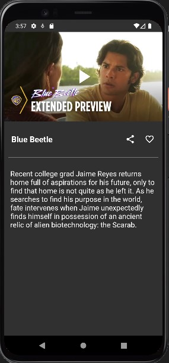 -->

 When users tap on a movie poster, they can access detailed descriptions and trailer videos. The title and description of the movie are extracted from an instance of the **Movie** class passed as a parameter. For playing the trailer video, I integrated the **youtube_player_flutter** library.


#### Using Youtube Player

```dart
YoutubePlayerController _controller = YoutubePlayerController(
    initialVideoId: 'iLnmTe5Q2Qw',
    flags: YoutubePlayerFlags(
        autoPlay: true,
        mute: true,
    ),
);

YoutubePlayer(
    controller: _controller,
    showVideoProgressIndicator: true,
    videoProgressIndicatorColor: Colors.amber,
    progressColors: ProgressColors(
        playedColor: Colors.amber,
        handleColor: Colors.amberAccent,
    ),
    onReady () {
        _controller.addListener(listener);
    },
),
```

I created a custom widget for the YoutubePlayer. The official documentation recommended using this widget within a StatefulWidget, so I designed a StatefulWidget accordingly. In the **initState** method, I created a controller for the **YoutubePlayerController** and configured it with the desired options. To ensure flexibility, I allowed the widget to receive the YouTube video key as a parameter. I also implemented the **dispose** method as required. Finally, I set up the custom widget to return a **YoutubePlayer** component.

```dart
import 'package:flutter/material.dart';
import 'package:youtube_player_flutter/youtube_player_flutter.dart';

class YoutubeVideoPlayer extends StatefulWidget {
  YoutubeVideoPlayer({required this.videoKey, super.key});
  late String videoKey;

  @override
  State<YoutubeVideoPlayer> createState() => _YoutubeVideoPlayerState();
}

class _YoutubeVideoPlayerState extends State<YoutubeVideoPlayer> {
  late YoutubePlayerController _controller;

  @override
  void initState() {
    _controller = YoutubePlayerController(
      initialVideoId: widget.videoKey,
      flags: const YoutubePlayerFlags(
        mute: false,
        autoPlay: true,
        disableDragSeek: false,
        loop: false,
        isLive: false,
        forceHD: false,
        enableCaption: true,
      ),
    );
    super.initState();
  }

  @override
  void dispose() {
    _controller.dispose();
    super.dispose();
  }

  @override
  Widget build(BuildContext context) {
    return AspectRatio(
      aspectRatio: 16 / 9,
      child: YoutubePlayer(
        controller: _controller,
      ),
    );
  }
}

```

Next, I proceeded to create model and repository files for handling video data. Unlike the **Movie** model, where I only required specific parts of the JSON data, for video data, I needed the entire dataset. Consequently, the structure of the model is somewhat different in this case. This is because I need to use **id** JSON data.

## Video Model

```dart
class Video {
  int? _id;
  List<Results>? _results;

  Video({int? id, List<Results>? results}) {
    if (id != null) {
      _id = id;
    }
    if (results != null) {
      _results = results;
    }
  }

  int? get id => _id;
  set id(int? id) => _id = id;
  List<Results>? get results => _results;
  set results(List<Results>? results) => _results = results;

  Video.fromJson(Map<String, dynamic> json) {
    _id = json['id'];
    if (json['results'] != null) {
      _results = <Results>[];

      json['results'].forEach((v) {
        _results!.add(Results.fromJson(v));
      });
    }
  }

  Map<String, dynamic> toJson() {
    final Map<String, dynamic> data = <String, dynamic>{};
    data['id'] = _id;
    if (_results != null) {
      data['results'] = _results!.map((v) => v.toJson()).toList();
    }
    return data;
  }
}

class Results {
  String? _key;

  Results({
    String? key,
  }) {
    if (key != null) {
      _key = key;
    }
  }

  String? get key => _key;
  set key(String? key) => _key = key;

  Results.fromJson(Map<String, dynamic> json) {
    _key = json['key'];
  }

  Map<String, dynamic> toJson() {
    final Map<String, dynamic> data = <String, dynamic>{};
    data['key'] = _key;
    return data;
  }
}

```

&nbsp;

## Repository

```dart
import 'dart:convert';
import '../model/video.dart';
import 'package:http/http.dart' as http;

class YoutubeVideoRepository {
  final String apiKey = '';

  Future<Video?> loadVideo(String id) async {
    var url = Uri.parse(
        'https://api.themoviedb.org/3/movie/$id/videos?api_key=$apiKey');

    var response = await http.get(url);
    if (response.statusCode == 200) {
      Map<String, dynamic> body = json.decode(response.body);
      return Video.fromJson(body);
    }
    return null;
  }
}
```

## View

While developing the video functionality, I encountered a problem. Before the HTTP network request was fully completed, the video provider was passing empty data, resulting in an error. Additionally, when I tapped on one movie and then returned back from the detail page, attempting to view another movie's details would sometimes display the previous movie's video trailer, indicating that the previous video model data was still present in the provider.

To address this issue, I implemented a solution. First, I ensured that a **CircularProgressIndicator** is displayed until the key data is fully loaded. Additionally, I implemented a check to compare the **id** data in the movie model and video model. When the **id** data matches, the video trailer is displayed.

```dart
import 'package:flutter/material.dart';
import 'package:simple_movie/model/video.dart';
import 'package:simple_movie/view/youtube_video_player_screen.dart';
import '../model/movie.dart';
import 'package:provider/provider.dart';
import '../viewmodel/youtube_video_provider.dart';

class DetailPage extends StatelessWidget {
  Movie movie;
  late YoutubeVideoProvider _youtubeVideoProvider;
  DetailPage({Key? key, required this.movie}) : super(key: key);

  @override
  Widget build(BuildContext context) {
    _youtubeVideoProvider =
        Provider.of<YoutubeVideoProvider>(context, listen: true);

    // passing id form movie model so that video repository can search video.
    _youtubeVideoProvider.id = movie.id.toString();
    _youtubeVideoProvider.loadVideo();

    String? key;
    // in case, the system still loadinig the data so there is no key yet, should let the program know
    if (_youtubeVideoProvider.video == null ||
        _youtubeVideoProvider.video!.results![0].key!.isEmpty) {
      key = null;
    } else {
      key = _youtubeVideoProvider.video!.results![0].key;
    }


    Size size = MediaQuery.of(context).size;
    return Scaffold(
      body: SafeArea(
        child: Column(
          children: [
            // if there is no key data yet or there is still previous vedio modle exists, we need to wait untill request is done.
            key != null &&
                    movie.id.toString() ==
                        _youtubeVideoProvider.video!.id.toString()
                ? YoutubeVideoPlayer(
                    videoKey: key,
                  )
                : const Center(
                    child: CircularProgressIndicator(),
                  ),
            Expanded(
              flex: 1,
              child: SingleChildScrollView(
                scrollDirection: Axis.vertical,
                physics: const BouncingScrollPhysics(),
                child: Column(
                  children: [
                    Padding(
                      padding: const EdgeInsets.fromLTRB(8, 20, 8, 20),
                      child: Row(
                        mainAxisAlignment: MainAxisAlignment.spaceBetween,
                        children: [
                          Padding(
                            padding: const EdgeInsets.all(10.0),
                            child: SizedBox(
                              width: size.width * 0.6,
                              child: Text(
                                movie.title!,
                                style: const TextStyle(
                                  fontSize: 20,
                                  fontWeight: FontWeight.bold,
                                ),
                              ),
                            ),
                          ),
                          const Row(
                            children: [
                              IconButton(
                                  onPressed: null,
                                  icon: Icon(
                                    Icons.share,
                                    color: Colors.white,
                                  )),
                              IconButton(
                                  onPressed: null,
                                  icon: Icon(
                                    Icons.favorite_border,
                                    color: Colors.white,
                                  )),
                            ],
                          ),
                        ],
                      ),
                    ),
                    const Divider(
                      height: 1,
                      thickness: 1,
                      indent: 10,
                      endIndent: 10,
                      color: Colors.white70,
                    ),
                    Padding(
                      padding: const EdgeInsets.fromLTRB(15, 30, 15, 30),
                      child: Text(
                        movie.overview!,
                        style: const TextStyle(
                          fontSize: 18,
                        ),
                      ),
                    ),
                  ],
                ),
              ),
            )
          ],
        ),
      ),
    );
  }
}

```

&nbsp;

# Search 

Finally, I implemented the search functionality. Flutter offers the SearchDelegate class, and I created a **Search** class by extending it. To complete this, I had to override four functions.


<!-- 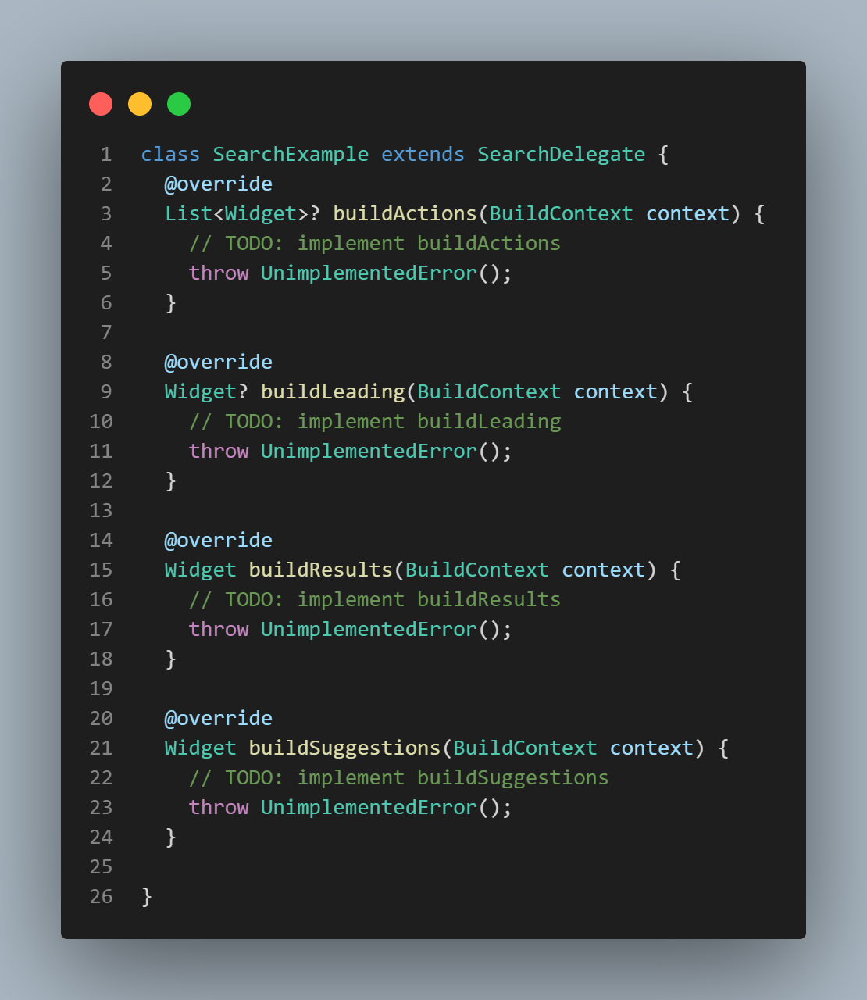 -->

&nbsp;

## buildActions

This method allows me to add widgets on the right side of the search query in the AppBar. I added a close icon(❌) that clears the entire search query when tapped. 

The **query** is a property inherited from the SearchDelegate class, representing the current query string displayed in the AppBar.


<!--  -->


<!-- 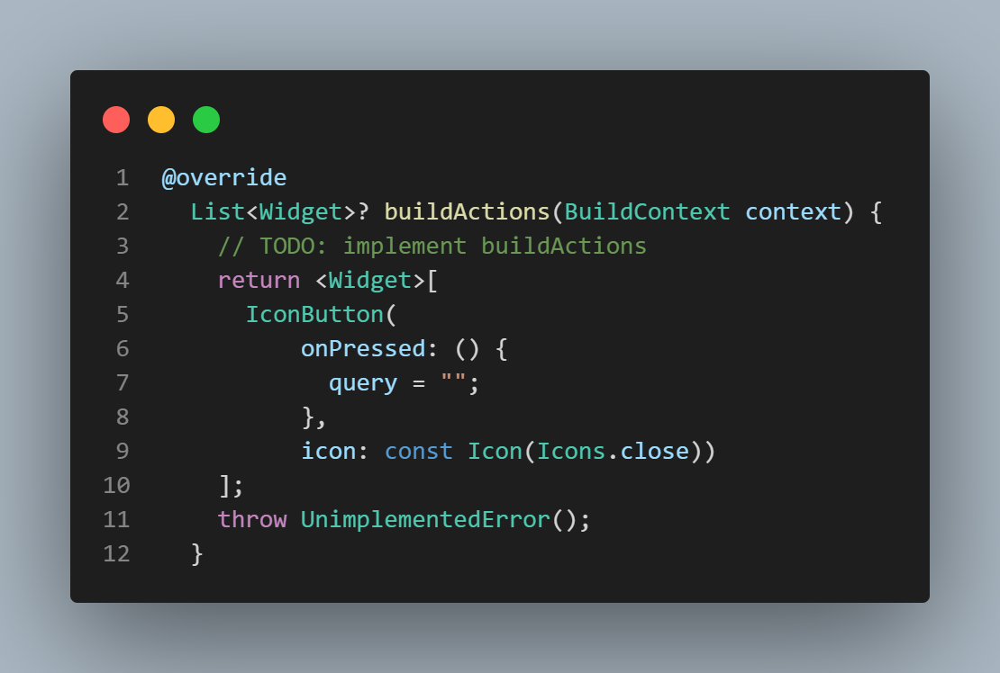 -->

&nbsp;

## buildLeading

This method allows me to add a widget on the left side of the current query in the AppBar. I added an arrow icon that navigates back to the previous screen.


<!--  -->


<!-- 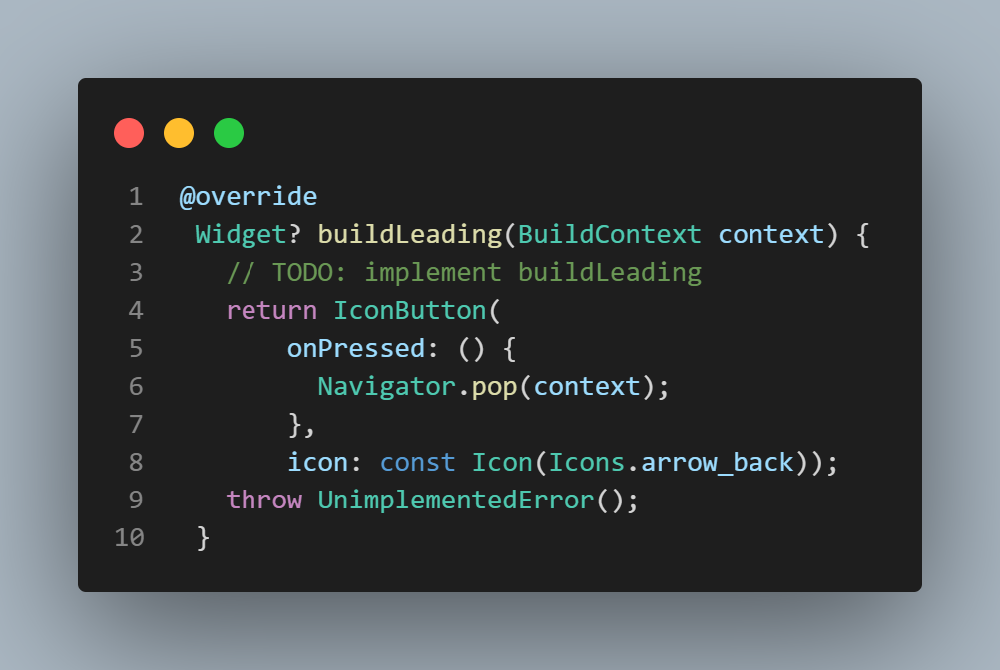 -->

&nbsp;

## buildResults

The **buildResults** method displays search results after the user submits a search from the search page. I've created a custom widget called **SearchWidget** that presents a list view of movie poster images and their corresponding titles. This custom widget takes the query as an argument, allowing it to display relevant results based on the user's search query.


<!--  -->


<!-- 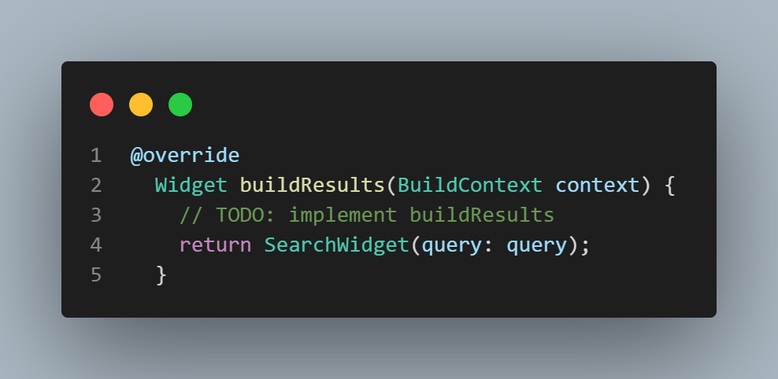 -->

To display the search results to the user, I once again applied the MVVM pattern. There was no need to create a new model since the API for search returns the exact same model as the **Movie** model.

In the **SearchWidget**, a provider for the search view model is created. Then, using the query that the user typed, the **loadSearch** method calls the API. If the query is not blank, the query string is added to the **recentList**, which is a set collection for displaying recent search queries. If the API call is successful, the returned values, which are instances of the **Movie** model class, are added to the **searchList**. These results are displayed using **ListView.separated** within a **SizedBox**, which shows movie poster images and titles in rows.

&nbsp;

### View


<!-- 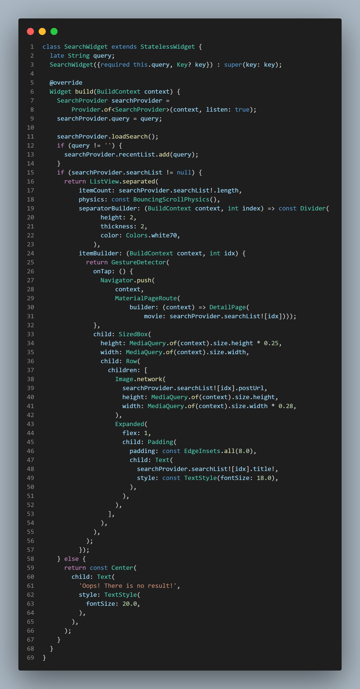 -->

&nbsp;

### View Model


<!-- 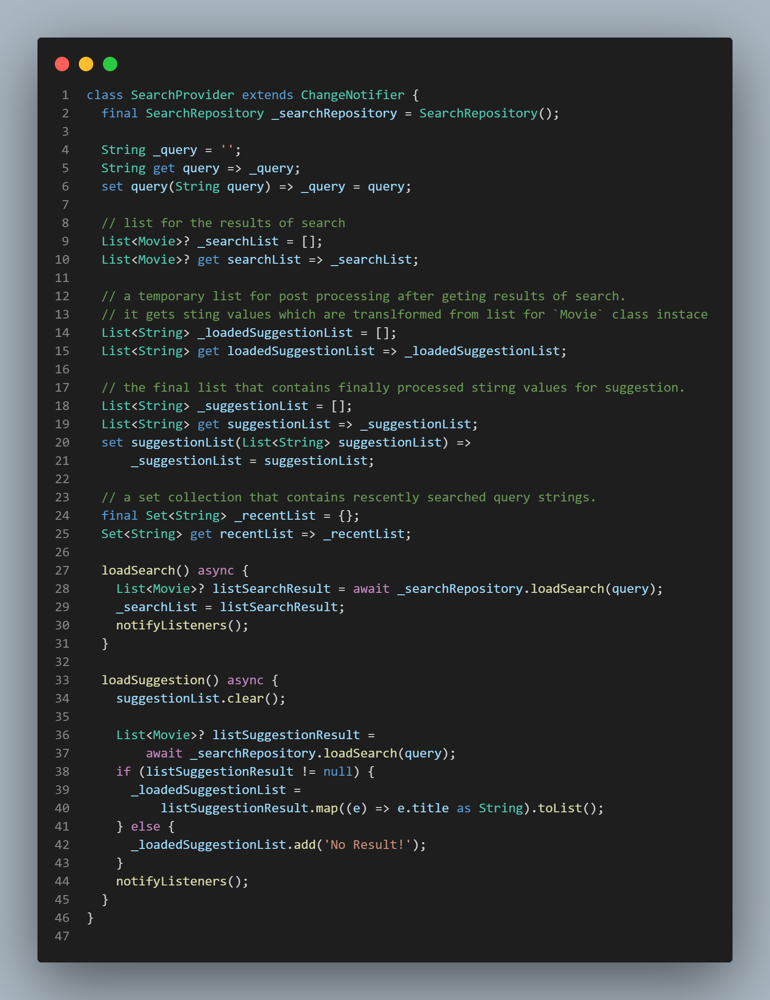 -->

&nbsp;

### Repository


<!-- 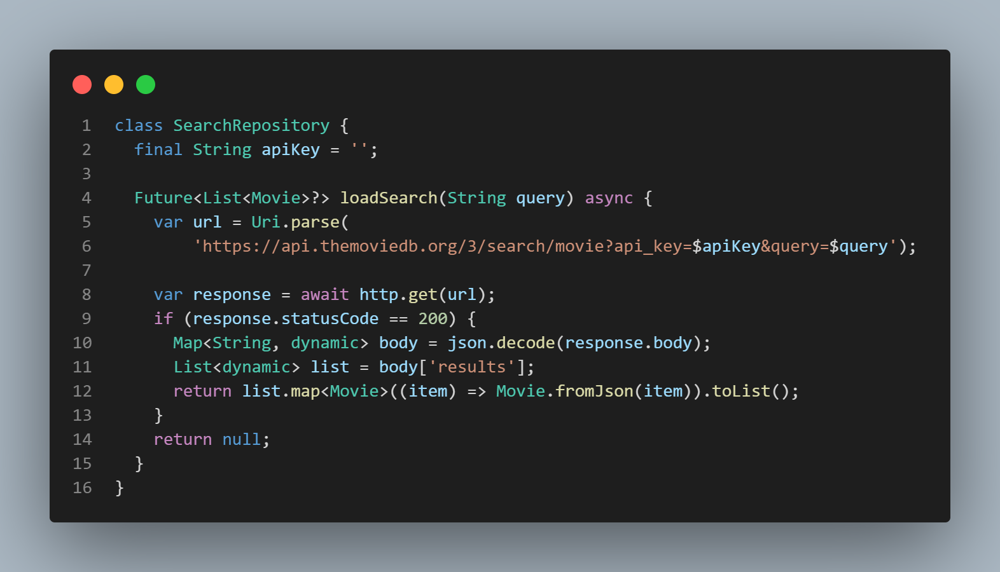 -->

&nbsp;

## buildSuggestions

In the **buildSuggestions** widget, I implemented the functionality for displaying suggestions in the body of the search page as the user types a query into the search field. This required careful consideration of the logical structure.


<!--  -->

In a nutshell, if the search field is empty, **suggestionList** displays recently searched queries. If there is a query, it contains data relevant to that query.

First, I initialized the provider for search. When there is no query in the search field, I converted the **recentList**, which is actually a set collection from the **SearchProvider**, into a temporary list using **toList()**. Then, this temporary list was reversed and placed into the **suggestionList**. 

The reason for reversing the list is to ensure that recently searched queries appear at the top of the **suggestionList**. When a query is added to the **recentList**, the recently searched query moves to the end of the list.


<!-- 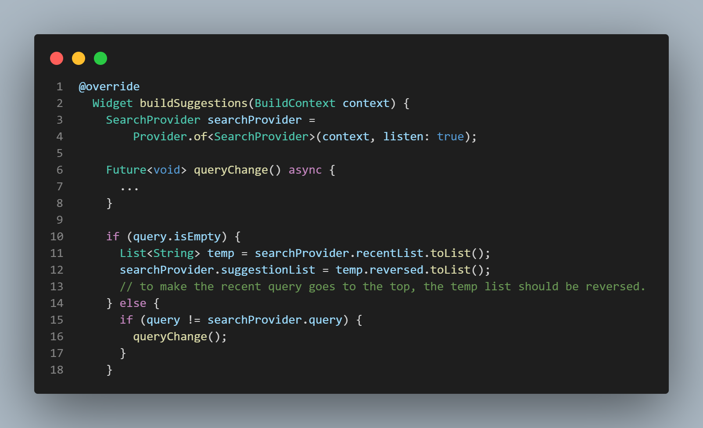 -->

On the other hand, if a query is typed in the search field, and the newly typed query is not the same as the existing query data in the provider, the **queryChange()** function is invoked. 


<!-- 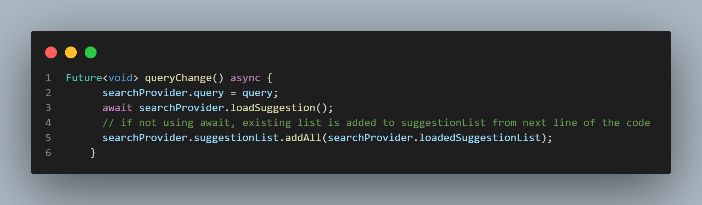 -->

This function first reinitializes the new query in the **query** variable in the provider. Then, it calls **loadSuggestion()**. The **loadSuggestion()** method is declared in the **SearchProvider**. 


<!-- 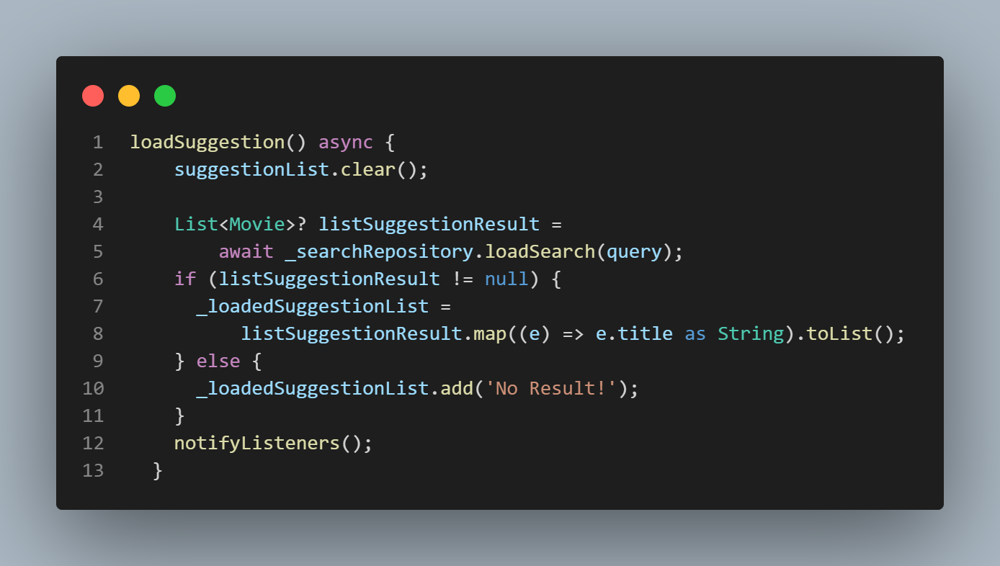 -->

This method initially clears the **suggestionList**, which contains recent searched queries. It then calls **loadSearch()** to retrieve search results. The results are stored in **listSuggestionResult**, which contains instances of the **Movie** class. However, what I need is only the titles of movies. So, by using the **map** method, I extract the titles from each **Movie** instances and store those string values in another list (**loadedSuggestionList**). 

Finally, I return to the **queryChange()** function, where the string list is added to the **suggestionList**.

This is how I processed the data for search suggestions. 

Now, I need to display this data to the user. The **ListView.builder** widget is a great fit for this purpose, and each item is represented by a **ListTile** widget. 

When there's no query in the search field, a clock icon is displayed on the leading side to let the user know it's a recent search query. 

If the user taps one of the suggestions, the title string is inserted into the query, and the query is added to the **recentList**. Furthermore, when a suggestion is tapped, it should lead to the corresponding suggestion and results page being shown by calling **showResults**. 

According to the official documentation, the **showResults** method is used to transition from the suggestions provided by **buildSuggestions** to the query results returned by **buildResults**.


<!-- 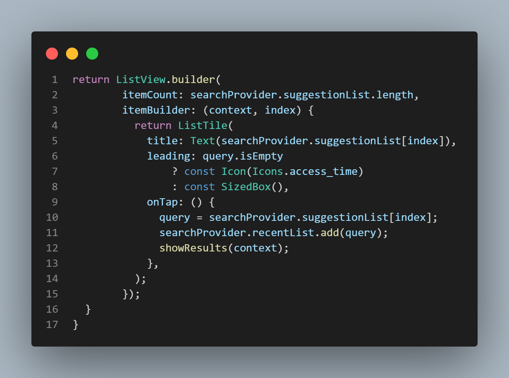 -->
