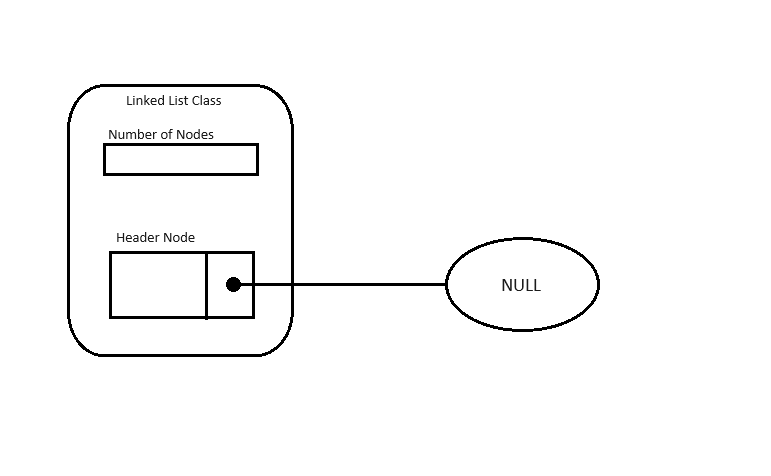
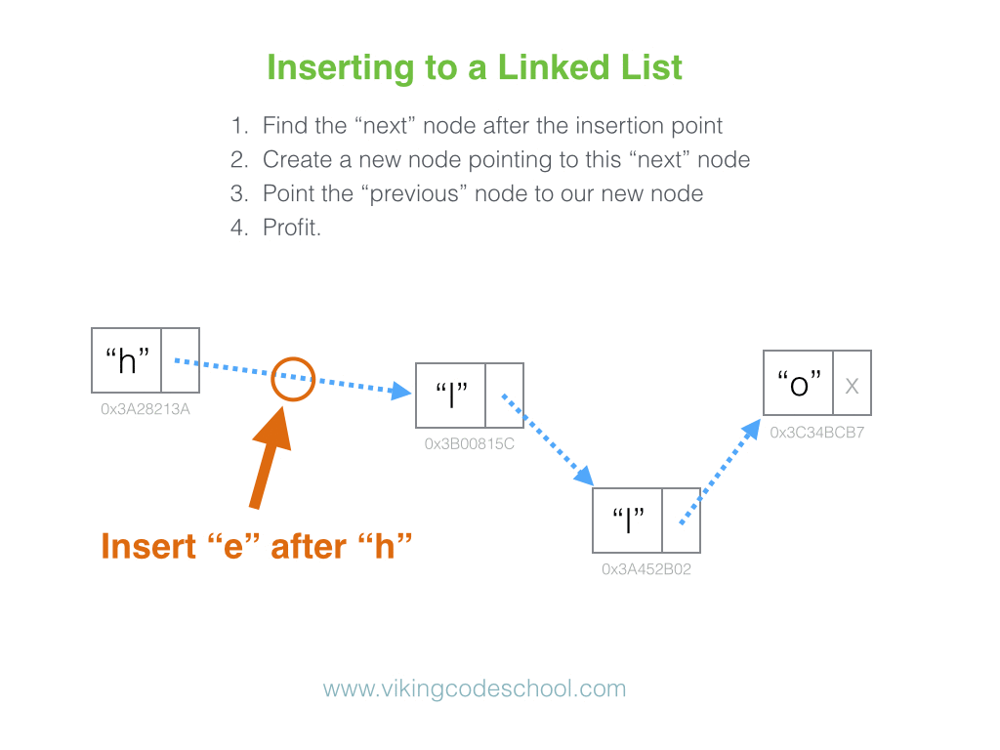

# Array VS Linked Lists

### Arrays

- Data is sequentially stored in memory.
- Fixed data size.
- Uses an index to access data.
- Adding new data is more difficult when additional memory is required compared to linked lists.
- May have empty spaces in memory.

### Linked Lists

- Data is sequentially stored but not physically connected in memory.
- Variable data size.
- Easy to add and delete data.
- Offers various methods.
- More efficient memory usage.

&nbsp;

# What is Singly Linked List?

**Singly Linked List**: Each node (containing data) is connected sequentially only to the next node, with the last node pointing to null.


<!--  -->

sorce: https://www.geeksforgeeks.org/linked-list-meaning-in-dsa/

&nbsp;

## Node

The Linked list consists of nodes, where each node contains data and links to the next node. I implemented the linked list with C++. The book I referred to teaches in C. However, as I aim to study C++, I converted the codes from the book to C++.

```cpp
template <typename T>
struct SingleLinkedListNode {
	T data= NULL;
	SingleLinkedListNode* pLink = nullptr;
};
```

With the use of templates, this node can contain any type of data. Additionally, there is a pointer variable. This pointer variable can hold the address of the next node. The crucial aspect is that it is initialized with "nullptr". This is because the last node points to nothing.

&nbsp;

### Singly Linked List Class

Now, let's implement the singly linked list with a class. The singly linked list class encapsulates the header node, which is a dummy node pointing to the next node.

Initially, I found it a bit confusing to grasp the structure of a linked list. I thought that a linked list consists solely of nodes. I didn't realize the necessity of a class. However, to add new data, establish connections to the next node, and implement various methods, a class is essential.


<!--  -->

```cpp
template <typename T>
class SingleLinkedList {

private:
	int currentCount = 0;
	SingleLinkedListNode<T> headerNode;
public:
}
```

This is the basic structure of the singly linked list class. The code from the book declares 'headerNode' as a static variable. However, I believe it would be more flexible to change it to a dynamic variable.

&nbsp;

### Get data

To gain a better understanding of the structure of the singly linked list, it's helpful to first implement the getData() method before proceeding with the addData() method.

The crucial aspect here is the declaration of a SingleLinkedListNode<T>\* variable and its initialization with the address of the header node. Subsequently, this variable is iteratively updated with the address of the next node as the loop progresses through the list until reaching the desired index.

```cpp
int getData(int index) {
	if (index < this->currentCount) {
		SingleLinkedListNode<T>* pCurrentNode = &(this->headerNode);
		for (int i = 0; i <= index; i++) {
			pCurrentNode = pCurrentNode->pLink;
		}
		return pCurrentNode->data;
	}
	else {
		std::cout << "invaild index\n";
		return NULL;
	}
}
```

```cpp
SingleLinkedList<int> a;
a.addData(0, 0);
a.addData(1, 1);
a.addData(2, 2);
std::cout << a.getData(1) << "\n"; // 1
```

&nbsp;

### addData

To incorporate new data into the linked list, a new node must be dynamically allocated in memory. Subsequently, the data is assigned to the 'data' variable of the newly created node. Additionally, the address of the previous node, which is just before the desired index, is necessary to establish the link for the new node. Hence, the process involves traversing the list until reaching an index before the desired index.


<!--  -->

Image sorce: https://kalkaprasad97.medium.com/linked-list-how-to-implements-singly-linked-list-in-c-language-4f30a8d83842

Once 'pPreNode' is updated with the node of the previous index, this node contains the link to the next node after the new node. Therefore, the link 'pPreNode' has should be copied to the 'pLink' variable of the new node. Finally, the previous node updates its 'pLink' variable with the address of the new node.

```cpp
void addData(int index, T data) {
	if (index <= currentCount) {
		SingleLinkedListNode<T>* pNewNode = new SingleLinkedListNode<T>; // heap area
		pNewNode->data = data;
		SingleLinkedListNode<T>* pPreNode = &(this->headerNode);

		for (int i = 0; i < index; i++) {
			pPreNode = pPreNode->pLink;
		}
		pNewNode->pLink = pPreNode->pLink;
		pPreNode->pLink = pNewNode;
		this->currentCount++;
	}
	else {
		std::cout << "invaild index\n";
	}
}
```

&nbsp;

### Remove data

To remove data from the linked list, we first locate the previous node before the node that needs to be removed. Similar to the process described above, we traverse the list until we reach the node just before the target index. Then, we copy the address stored in the 'pLink' variable of the previous node to the 'pDelNode'.

With the delete node ('pDelNode') and its preceding node ('pPreNode') identified, we update the 'pLink' value of the previous node with the 'pLink' value of the delete node. Subsequently, we free the memory occupied by the delete node using the 'delete' operator.

```cpp
void removeData(int index) {
	if (index < this->currentCount) {
		SingleLinkedListNode<T>* pDelNode = nullptr;
		SingleLinkedListNode<T>* pPreNode = &(this->headerNode);
		for (int i = 0; i < index; i++) {
			pPreNode = pPreNode->pLink;
		}

		pDelNode = pPreNode->pLink;
		pPreNode->pLink = pDelNode->pLink;
		delete pDelNode;
		this->currentCount--;

		return 0;
	}
	else {
		std::cout << "failed to remove data\n";
	}
}
```

```cpp
SingleLinkedList<int> a;
a.addData(0, 0);
a.addData(1, 1);
a.addData(2, 2);
a.print(); // 0 1 2

a.removeData(1);
a.print(); // 0 2
```

&nbsp;

### Delete List

This method is utilized to deallocate all memory associated with the linked list when it is no longer needed. It involves two distinct nodes: one to represent the node to be deleted ('pDelNode') and another to point to the next node in the list ('pNextNode').

Initially, 'pNextNode' is initialized with the node immediately following the header node, which corresponds to index 0. Then, 'pDelNode' is assigned the same address as 'pNextNode', and 'pNextNode' is updated to point to the next node in the list. This process continues iteratively until 'pNextNode' becomes 'nullptr', indicating the end of the list.

During each iteration, the memory occupied by 'pDelNode' is deallocated using the 'delete' operator.

```cpp
void deleteList() {
	SingleLinkedListNode<T>* pDelNode = nullptr;
	SingleLinkedListNode<T>* pNextNode = this->headerNode.pLink;
	while (pNextNode != nullptr) {
		pDelNode = pNextNode;
		pNextNode = pNextNode->pLink;

		delete pDelNode;
	}
}
```

&nbsp;

### Length and Print

Returns the lenght of the list.
Prints the every data of nodes.

```cpp
int length() {
	return this->currentCount;
}

void print() {
	SingleLinkedListNode<T>* pCurrentNode = this->headerNode.pLink;
	while (pCurrentNode != nullptr) {
		std::cout << pCurrentNode->data << " ";
		pCurrentNode = pCurrentNode->pLink;
	}
	printf("\n");
}
```

&nbsp;

### Contact Linked List

This method facilitates the merging of two distinct singly linked lists, simplifying the process of appending the elements of one list ('B') to the end of another list ('A').

1.  Initialization: If both lists 'A' and 'B' are non-empty (i.e., their 'currentCount' properties are not zero), the method proceeds to combine them.

2.  Traversal to End of List 'A': The method traverses through the elements of list 'A' to reach its end. This is achieved by iteratively updating the 'pCurrentNode' pointer until it reaches the last node in list 'A'.

3.  Connecting Lists: Once the end of list 'A' is reached, the 'pLink' pointer of the last node in list 'A' is updated to point to the first node of list 'B' (i.e., 'pList.headerNode.pLink'), effectively linking the two lists.

4.  Updating Counts: The 'currentCount' property of list 'A' is updated to reflect the combined size of both lists, while the 'currentCount' property of list 'B' is reset to zero to indicate an empty list.

5.  Resetting List 'B': Additionally, the 'pLink' pointer of list 'B' is set to 'nullptr', ensuring that it is detached from list 'A' and is now effectively an empty list.

```cpp
void contactLinkedList(SingleLinkedList& pList) {
	if (this->currentCount != 0 && pList.currentCount != 0) {
		SingleLinkedListNode<T>* pCurrentNode = &(this->headerNode);
		for (int i = 0; i < this->currentCount; i++) {
			pCurrentNode = pCurrentNode->pLink;
		}
		pCurrentNode->pLink = pList.headerNode.pLink;
		this->currentCount += pList.currentCount;
		pList.currentCount = 0;
		pList.headerNode.pLink = nullptr;
	}
}
```

```cpp
SingleLinkedList<int> a;
a.addData(0, 0);
a.addData(1, 1);
a.addData(2, 2);

SingleLinkedList<int> b;
b.addData(0, 3);
b.addData(1, 4);

a.contactLinkedList(b);
a.print(); // 0 1 2 3 4
```

&nbsp;

### Source Code

```cpp
#include <iostream>

template <typename T>
struct SingleLinkedListNode {
	T data= NULL;
	SingleLinkedListNode* pLink = nullptr;
};

template <typename T>
class SingleLinkedList {
private:
	int currentCount = 0;
	SingleLinkedListNode<T> headerNode;
public:


	void addData(int index, T data) {
		if (index <= currentCount) {
			SingleLinkedListNode<T>* pNewNode = new SingleLinkedListNode<T>; // heap area
			pNewNode->data = data;
			SingleLinkedListNode<T>* pPreNode = &(this->headerNode);

			for (int i = 0; i < index; i++) {
				pPreNode = pPreNode->pLink;
			}
			pNewNode->pLink = pPreNode->pLink;
			pPreNode->pLink = pNewNode;
			this->currentCount++;
		}
		else {
			std::cout << "invaild index\n";
		}
	}

	void removeData(int index) {
		if (index < this->currentCount) {
			SingleLinkedListNode<T>* pDelNode = nullptr;
			SingleLinkedListNode<T>* pPreNode = &(this->headerNode);
			for (int i = 0; i < index; i++) {
				pPreNode = pPreNode->pLink;
			}

			pDelNode = pPreNode->pLink;
			pPreNode->pLink = pDelNode->pLink;
			delete pDelNode;
			this->currentCount--;

			return 0;
		}
		else {
			std::cout << "failed to remove data\n";
		}
	}

	int getData(int index) {
		if (index < this->currentCount) {
			SingleLinkedListNode<T>* pCurrentNode = &(this->headerNode);
			for (int i = 0; i <= index; i++) {
				pCurrentNode = pCurrentNode->pLink;
			}
			return pCurrentNode->data;
		}
		else {
			std::cout << "invaild index\n";
			return NULL;
		}
	}

	void deleteList() {
		SingleLinkedListNode<T>* pDelNode = nullptr;
		SingleLinkedListNode<T>* pNextNode = this->headerNode.pLink;
		while (pNextNode != nullptr) {
			pDelNode = pNextNode;
			pNextNode = pNextNode->pLink;

			delete pDelNode;
		}
	}

	int length() {
		return this->currentCount;
	}

	void print() {
		SingleLinkedListNode<T>* pCurrentNode = this->headerNode.pLink;
		while (pCurrentNode != nullptr) {
			std::cout << pCurrentNode->data << " ";
			pCurrentNode = pCurrentNode->pLink;
		}
		printf("\n");
	}

	void contactLinkedList(SingleLinkedList& pList) {
		if (this->currentCount != 0 && pList.currentCount != 0) {
			SingleLinkedListNode<T>* pCurrentNode = &(this->headerNode);
			for (int i = 0; i < this->currentCount; i++) {
				pCurrentNode = pCurrentNode->pLink;
			}
			pCurrentNode->pLink = pList.headerNode.pLink;
			this->currentCount += pList.currentCount;
			pList.currentCount = 0;
			pList.headerNode.pLink = nullptr;
		}
	}

};

```
