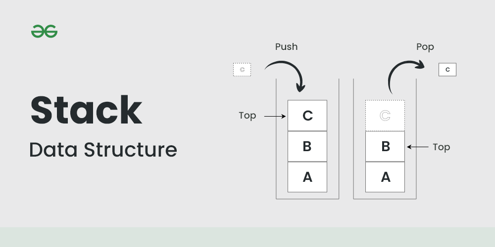

# What is a Stack?

A stack is easily understood when imagining a stack of books or plates. You can only remove the top book or plate, and to add, you can only place it on top. If you want to access data from the bottom, you must remove items one by one from the top. The key feature of a stack is that the most recently added data is the first to be removed. This concept is known as Last-In-First-Out (LIFO). Stacks are utilized to emulate real-world systems that operate on a LIFO structure.


<!--
 -->

sorce: https://www.geeksforgeeks.org/stack-data-structure/

&nbsp;

# Usage of a Stack

---

## Push & Pop

- **Push** means adding new data to the stack.
- **Pop** means remvoing data on the top of the stack


<!--  -->

&nbsp;

## Top or Peek

This is the access to the data on the top of the stack. However, this does not remove the data.

&nbsp;

# How to implement a stack in C++

In C++, there are two common implementations of a stack: the Array Stack and the Linked Stack. The Array Stack is straightforward, but it necessitates specifying the size of the stack upfront due to its use of an array. In contrast, the Linked Stack eliminates the need for specifying the stack size as it can dynamically link new nodes as required.

&nbsp;

## Array Stack

---

### Array Stack Node

A node serves as the fundamental unit for data storage. Since it doesn't require connections between nodes, it only contains a variable for data.

```cpp
template <typename T>
struct ArrayStackNode {
	T data;
};
```

&nbsp;

### Arrary Stack Class

- The 'maxCount' variable stores the maximum size of the stack.
- 'currentCount' maintains the current number of nodes, helping us identify the top data of the stack. The position of the top in the stack is 'currentCount - 1'.

```cpp
template <typename T>
class ArrayStack {
private:
	int maxCount;
	int currentCount = 0;
	ArrayStackNode<T>* pData = nullptr;
public:
...
}
```

&nbsp;

### Constructor

The Array Stack requires a constructor to initialize its array and variables. With parameters, you create an array for 'ArrayStackNode' using dynamic memory allocation.

```cpp
ArrayStack(int size)
	: maxCount{ size } {
	this->pData = new ArrayStackNode<T>[size];
}
```

&nbsp;

### isFull

Before implementing the 'Push()' method, it's crucial to determine whether the stack is already full. If the stack is already at its maximum capacity, attempting to add new data will result in an error known as a stack overflow. Therefore, it's necessary to have a method to check the available space in the stack.

```cpp
bool isFull() {
	bool ret = false;

	if (this->currentCount == this->maxCount) {
		ret = true;
	}
	return ret;
}
```

&nbsp;

### Push

Adding new data is straightforward. The index for the new data is simply the value of the 'currentCount' variable, as the top of the stack corresponds to 'currentCount - 1'.

```cpp
void push(T data) {

	if (isFull() == false) {
		this->pData[this->currentCount].data = data;
		this->currentCount++;
	}
	else {
		std::cout << "Stack is full\n";
	}
}
```

&nbsp;

### isEmpty

Pop() method also can cause an error known as a stack underflow if there is no more data. Therefore, attempting to remove data should check wether there is a remain data or not.

```cpp
bool isEmpty() {
	bool ret = false;
	if (this->currentCount == 0) {
		ret = true;
	}
	return ret;
}
```

&nbsp;

### Pop

The 'pop' method removes the data at the top of the stack. This process is straightforward. Since array indices start from 0, the index of the top data is 'currentCount - 1'.

```cpp
void pop() {
	if (isEmpty() == false) {
		this->pData[this->currentCount - 1].data = NULL;
		this->currentCount--;
	}
	else {
		std::cout << "Stack is emptyp\n";
	}
}
```

&nbsp;

### Peek or Top

This method retrieves and returns the value of the top data. However, it also needs to verify whether the stack is empty or not.

```cpp
T top() {
	T ret = NULL;

		if (isEmpty() == false) {
			ret = this->pData[this->currentCount - 1].data;
		}
		else {
			std::cout << "stack is empty. NULL is returned\n";
		}
		return ret;
}
```

&nbsp;

### Print

This method is designed to display data from the end of the stack, which might be a bit confusing. If there are empty spaces in the stack, it will display "Empty" for those spaces. This is achieved by looping from the index at the end of the stack down to right before the top data. Then, it displays the data in the stack by looping from the top index down to 0.

```cpp
void print() {

	int size = this->maxCount;
	int top = this->currentCount;

	std::cout << "Stack size: " << size << " Number of curretn nodes: " << top << std::endl;

	for (int i = size - 1; i >= top; i--) {
		std::cout << i << ": Empty\n";
	}
	for (int i = top - 1; i >= 0; i--) {
		std::cout << i << ": " << this->pData[i].data << std::endl;
	}
}
```

```sh
Stack size: 3 Number of curretn nodes: 3
2: 3
1: 2
0: 1
```

&nbsp;

### Destructor

It is essentional not to forget to free the memory for array.

```cpp
~ArrayStack() {
	delete []this->pData;
}
```

&nbsp;

## Linked Stack

---

### Linked Stack Node

The difference from the array stack node lies in the presence of a pointer variable for linking.

```cpp
template <typename T>
struct LinkedStackNode {
	T data;
	LinkedStackNode<T>* pLink;
};
```

&nbsp;

### Linked Stack Class

As mentioned earlier, no size variable is needed in a linked stack, as it dynamically adjusts to accommodate new nodes. Instead, the essential components are the count of nodes and a pointer variable pointing to the top node of the stack.

```cpp
template <typename T>
class LinkedStack {
private:
	int currentCount = 0;
	LinkedStackNode<T>* pTop = nullptr;
public:
...
}
```

&nbsp;

### Push

Due to the nature of a linked stack, there's no need for a constructor to initialize its size, and checking whether the stack is full is unnecessary. The 'isFull()' method is redundant, simplifying the process to just the 'push' method:

- Create a new node and initialize the data.
- Set the next node of the new node to the current top node.
- Update the top node pointer to point to the new node.
- Increment the 'currentCount'.

```cpp
void push(T data) {
	LinkedStackNode<T>* pNode = new LinkedStackNode<T>;

	pNode->data = data;
	pNode->pLink = this->pTop;
	this->pTop = pNode;

	this->currentCount++;
}
```

&nbsp;

### isEmpty

```cpp
bool isEmpty() {
	if (this->currentCount == 0) {
		return true;
	}
	else {
		return false;
	}
}
```

&nbsp;

### Pop

- Create a node pointer that will hold the address of the top node of the stack.
- Update the top node pointer (pTop) to point to the next node of the current top node.
- Remove the top node. The newly created node holds its address, allowing you to free the memory associated with pNode.
- Decrement the count.

```cpp
void pop(){

	if (!isEmpty()) {
		LinkedStackNode<T>* pNode = this->pTop;
		this->pTop = pNode->pLink;
		delete pNode;
		this->currentCount--;
	}
	else {
		std::cout << "Stack is empty!\n";
	}
}
```

&nbsp;

### Top

Returns the value of the top node.

```cpp
T top() {
	if (!isEmpty()) {
		return this->pTop->data;
	}
	else {
		std::cout << "Stack is empty. Null is returnd.\n";
		return NULL;
	}
}
```

&nbsp;

### Print

Display the value of nodes from the top.

```cpp
void print() {
	LinkedStackNode<T>* pNode = nullptr;
	std::cout << "Number of nodes: " << this->currentCount << std::endl;
	pNode = this->pTop;
	int i = 1;
	if (!isEmpty()) {
		while (pNode != nullptr) {
			std::cout << this->currentCount - i << ": " << pNode->data << "\n";
			pNode = pNode->pLink;
			i++;
		}
	}
}
```

```sh
Number of nodes: 3
2: 3
1: 2
0: 1
```

&nbsp;

### Destructor

Free the memory by looping the pop() method

```cpp
~LinkedStack() {
	while (!isEmpty()) {
		pop();
	}
}
```
